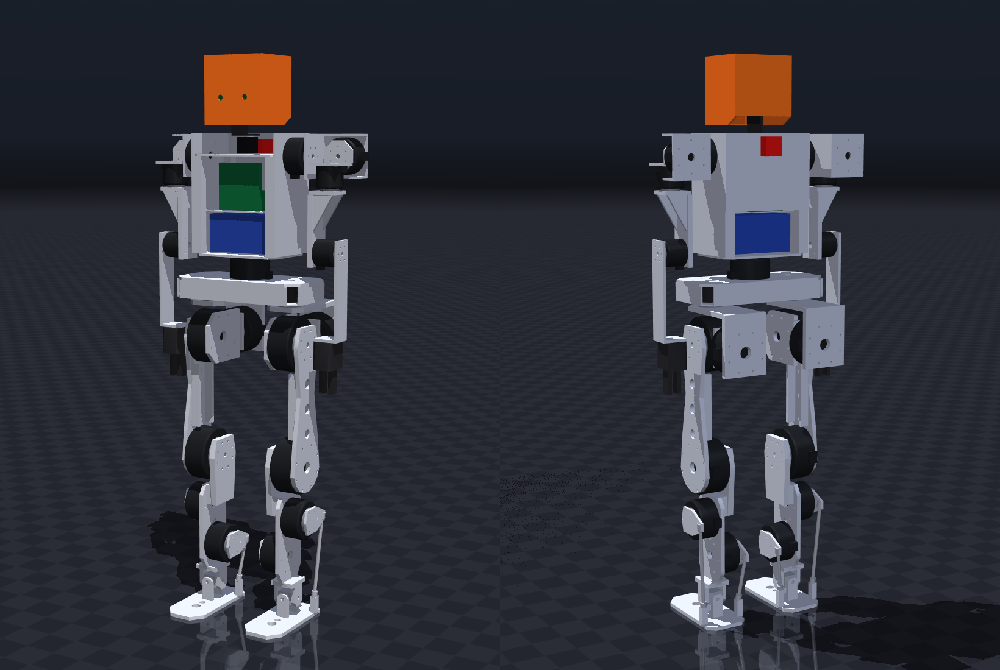
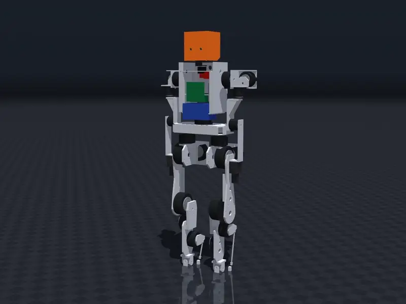
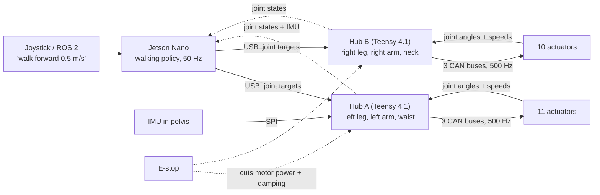
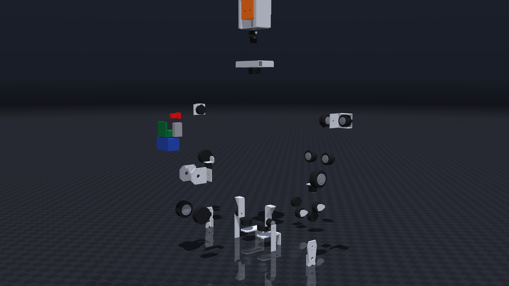
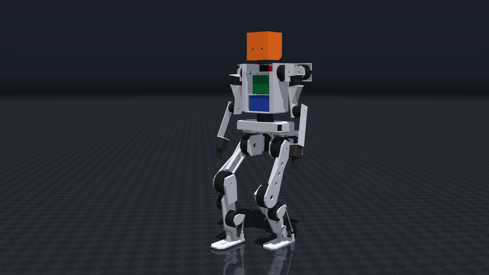

<p align="center">
  
</p>

<h1 align="center">JX1 — a humanoid robot you can build in India</h1>

<p align="center">
  <b>1.23 m tall · 33.6 kg · 23 joints · walks at 0.5–0.8 m/s in simulation · ≈ ₹7.1 lakh in parts</b><br>
  Full CAD, strength analysis, parts list with Indian suppliers, wiring, firmware, simulation and a trained walking
  controller, all in this repository.
</p>

<p align="center">
  <a href="docs/assembly_guide.md"><b>Assembly guide</b></a> ·
  <a href="docs/build_guide.md"><b>What to buy / machine / print</b></a> ·
  <a href="bom/cost_summary.md"><b>Cost</b></a> ·
  <a href="docs/final_robot_specification.md"><b>Specification</b></a> ·
  <a href="#try-it-in-simulation-free-no-hardware"><b>Try it in simulation</b></a> ·
  <a href="docs/open_issues.md"><b>Open issues</b></a>
</p>

---

## Watch it go together

<p align="center">
  <a href="media/jx1_assembly.mp4"></a><br>
  <sub>Time-lapse of the assembly film. <b><a href="https://github.com/nickthelegend/thenar-jx1/raw/main/media/jx1_assembly.mp4">Download the full 96-second film with step titles (MP4, 13 MB)</a></b>:
  all 87 CAD parts come together in 22 steps, then the robot walks (MuJoCo simulation of the same CAD).</sub>
</p>

The film is rendered from the real SolidWorks parts in their verified positions (`tools/media/assembly_film.py`,
MuJoCo renderer). The titles are a [HyperFrames](https://hyperframes.heygen.com) composition synced to it
(`media/assembly-film/`). Every step is also written out with a picture in the
**[step-by-step assembly guide](docs/assembly_guide.md)**.

---

## Contents

1. [What is JX1?](#what-is-jx1)
2. [Honest status](#honest-status)
3. [JX1 at a glance](#jx1-at-a-glance)
4. [How JX1 works, in plain words](#how-jx1-works-in-plain-words)
5. [What it costs](#what-it-costs)
6. [What is metal, what is 3D-printed](#what-is-metal-what-is-3d-printed)
7. [How to build one: the whole path](#how-to-build-one-the-whole-path)
8. [Try it in simulation (free, no hardware)](#try-it-in-simulation-free-no-hardware)
9. [How it was designed and checked](#how-it-was-designed-and-checked)
10. [Repository map](#repository-map)
11. [Reproduce everything](#reproduce-everything)
12. [Glossary](#glossary)
13. [FAQ](#faq)
14. [Open issues, safety, licence](#open-issues-safety-licence)

---

## What is JX1?

JX1 is a **full-size walking humanoid robot**, about as tall as a 7-year-old child. It was designed from scratch to
answer one question:

> *What is the cheapest practical humanoid that someone in India can actually build, with parts they can actually
> buy, in shops they can actually reach?*

So every choice here favours buying over inventing, where that's possible:

- **Motors:** off-the-shelf RobStride actuators, the same kind small commercial humanoids use. There is no custom
  gearbox to design.
- **Structure:** flat aluminium plates that any laser-cutting or CNC job shop in India can cut from a drawing.
- **Electronics:** boards you can order from Robu, Evelta and similar shops.
- **Software:** open tools (MuJoCo, ROS 2, PyTorch). A walking controller is already trained and included.

Everything a builder needs is in the repository: 3D CAD (SolidWorks), STEP files and PDF drawings for the job shop,
strength calculations for every structural part, a costed parts list with Indian suppliers and links, wiring diagrams,
firmware for the motor-control boards, a physics simulation, and the trained walking policy.

## Honest status

**JX1 has not been built yet.** It is complete **on the computer**:

| Done (on the computer) | Not done yet (needs a real robot) |
|---|---|
| ✅ All 87 parts designed in CAD; every joint moved through its range and checked for collisions | ⬜ Actuator bolt patterns confirmed on real motors ([OI-1](docs/open_issues.md)) |
| ✅ Every structural part strength-checked (FEA), all pass in aluminium | ⬜ Real job-shop quotes (the metal prices are estimates) |
| ✅ Costed parts list, India-sourced | ⬜ Assembly, wiring, first power-on |
| ✅ Physics simulation: stands, squats, walks, survives pushes | ⬜ Walking on a real floor |
| ✅ Walking controller trained (reinforcement learning), tested on the full CAD model, over ROS 2 and against an emulated motor-control board | ⬜ Tuning on real hardware |

Every number in this repository carries a label, so you always know how much to trust it:
**VERIFIED** (checked against a source or a CAD measurement), **MEASURED**, **CALCULATED** (from a model),
**ESTIMATED**, **ASSUMED**, **UNVERIFIED**.

## JX1 at a glance

| | |
|---|---|
| Height, mass | 1.23 m, 33.6 kg (CAD, all parts) |
| Joints (degrees of freedom) | **23**: legs 2 × 6, waist 1, arms 2 × 4, neck 2 |
| Legs | hip yaw, roll and pitch meet at one point; knee; **parallel ankle** (2 motors on the shin drive the foot through push-rods) |
| Motors | 21 × RobStride (RS04 120 N·m, RS03 60 N·m, RS06 36 N·m, RS02 17 N·m, RS00 14 N·m peak) + 2 bus servos in the neck |
| Brain | NVIDIA Jetson Nano 4 GB: runs the walking controller 50 times a second |
| Motor control | 2 × Teensy 4.1 "hub" boards, 6 CAN buses, 500 updates per second |
| Sensors | BNO085 IMU (balance) in the pelvis, IMX219-83 stereo camera in the head, encoders in every motor |
| Battery | 13S2P Li-ion, 48 V nominal, 468 Wh: ≈ 1.3 h walking, 2.3–4.1 h standing (CALCULATED) |
| Structure | 6061-T6 aluminium plates (7075-T6 for the hip-yaw brackets); head and grippers 3D-printed |
| Walking (simulation) | learned controller: 0.8 m/s forward, turns up to 0.84 rad/s, survives 16–44 N·s shoves; scripted gait: 0.3–0.52 m/s |
| Cost | ₹7,12,481 in parts (₹8,19,353 with 15 % contingency); the motors are 77 % of it |

Full details: the generated **[FINAL ROBOT SPECIFICATION](docs/final_robot_specification.md)**.

## How JX1 works, in plain words

Think of the robot like a body:

| Body part | In JX1 | What it does |
|---|---|---|
| **Skeleton** | aluminium plates and brackets | holds everything in place and carries the robot's weight |
| **Muscles** | 21 *actuators*: motor + gearbox + position sensor + driver in one round can | each one turns one joint to the angle it is told, with the stiffness it is told |
| **Nerves** | CAN bus: two twisted wires that daisy-chain from motor to motor | carries commands out and joint angles back, 500 times a second |
| **Spinal cord** | 2 × Teensy 4.1 hub boards | talk to the motors fast and safely, and stop everything if something goes wrong |
| **Brain** | Jetson Nano running a neural-network *policy* | decides where each leg joint should go next, 50 times a second |
| **Inner ear** | IMU in the pelvis | senses tilt and rotation, so the robot knows if it is falling |
| **Eyes** | stereo camera in the head | depth vision (for later: navigation and manipulation) |
| **Heart** | 468 Wh battery + BMS + fuses | feeds 48 V to the motors and 5 V to the computers |
| **Reflex** | red E-stop button | cuts motor power and makes every joint go soft |



**How it walks.** Nobody hand-wrote the walking. A neural network (the *policy*) learned to walk by trial and error in
a physics simulation of the exact CAD robot. The method is reinforcement learning (PPO), about 20,000 simulated steps
per second on one laptop. The policy was trained with random pushes, rough ground, small sensor delays, and randomised
friction and masses, so it doesn't depend on the simulation being perfect. Every 20 ms it reads the joint angles and the IMU and
outputs a target angle for each of the 12 leg joints. The motors then hold those angles like stiff springs. See
[rl/README.md](rl/README.md).

**Where the joints are.**

| Joint | Per side | Actuator | Range (left side) |
|---|---|---|---|
| Hip yaw (turn the leg) | 1 | RS06 | −40° … +45° |
| Hip roll (leg out to the side) | 1 | RS03 | −25° … +45° |
| Hip pitch (leg forward/back) | 1 | RS04 | −115° … +35° |
| Knee | 1 | RS04 | 0° … 120° |
| Ankle pitch + roll (parallel: 2 motors together) | 2 | 2 × RS06 | −55° … +30°, ±20° |
| Waist yaw | (1 total) | RS06 | ±90° |
| Shoulder pitch / roll | 2 | 2 × RS02 | −170° … +60° / −10° … +150° |
| Shoulder yaw / elbow | 2 | 2 × RS00 | ±90° / −135° … +5° |
| Neck yaw + pitch | (2 total) | 2 × ST3215 servo | — |

The single source of truth for joint names, axes, limits and motor directions is
[`simulation/joint_map.yaml`](simulation/joint_map.yaml). The CAD, simulation, ROS 2 and firmware are all generated
from it or checked against it.

## What it costs

Landed cost in India, including GST and import duty (from [`bom/master_bom.csv`](bom/master_bom.csv); prices checked
2026-09; metal parts ESTIMATED until quoted):

| Group | ₹ | What's in it |
|---|---:|---|
| Legs | 4,18,394 | 12 actuators + metal leg parts + ankle linkage |
| Arms | 1,52,688 | 8 actuators + arm plates |
| Electronics | 49,048 | Jetson Nano, 2 × Teensy 4.1, IMU, CAN parts, camera |
| Power | 31,606 | battery cells, BMS, switch, E-stop, fuses, DC-DC |
| Torso | 31,522 | waist actuator, torso frame |
| Head, pelvis, manufacturing | 29,223 | head shell + neck servos, pelvis box, filament and consumables |
| **Total** | **7,12,481** | + 15 % contingency = **₹8,19,353** |

- **Printable 9-page component list and cost estimate:** [bom/JX1_cost_estimate.pdf](bom/JX1_cost_estimate.pdf) (generated from the BOM by `bom/make_cost_report.py`).
- **Motors are 77 % of the cost** (₹5,45,998). Buying the same RobStride units through a China distributor would save
  about ₹1.87 lakh ([cost summary](bom/cost_summary.md)).
- **You can build it in two phases.** Phase 1 is the walking lower body (legs + pelvis + compute + power) for about
  ₹5.1 lakh. The upper body comes later.

## What is metal, what is 3D-printed

**Short answer: don't 3D-print the skeleton.** Every structural part was strength-checked both ways. Aluminium passes
everywhere. Printed carbon-fibre nylon (PA-CF) fails everywhere, and PETG would be worse.

| Printed PA-CF safety factor | Aluminium safety factor (needs ≥ 1.5) |
|---|---|
| hip-yaw bracket **0.08** ❌ | 7075-T6: **1.77** ✅ |
| shin **0.35** ❌ | 6061-T6: **3.37** ✅ |
| pelvis **0.90** ❌ | 6061-T6: **2.90** ✅ |
| upper arm **0.73–1.23** ❌ | 6061-T6: **5.99** ✅ |

What you **do** print:

1. **PETG fit-check copies** of every metal part (`manufacturing/fit_check/`). Bolt them to the real motors first to
   check the holes and clearances. Then order the metal. This is cheap insurance.
2. **Real printed parts** that carry little load: the head shell (PETG-CF), neck bracket and grippers (PA-CF, TPU
   pads), covers and battery box.

The full table (every part, material, process, file) is in the **[build guide](docs/build_guide.md)**. STEP files
and A3 PDF drawings for the job shop are in **[manufacturing/](manufacturing/index.md)**.

## How to build one: the whole path

You don't need to be an expert, but you need patience and care. The high-power parts (48 V, 468 Wh battery,
120 N·m motors) can hurt you. Go in this order:

| # | Stage | What you do | Guide |
|---|---|---|---|
| 0 | **Understand it** | read this page, watch the film, run the simulation | [simulation](#try-it-in-simulation-free-no-hardware) |
| 1 | **Lock the motor interfaces** | get the official RobStride drawings (or measure one of each size), put the bolt patterns into `tools/cad/params.py`, regenerate the CAD | [build guide §6](docs/build_guide.md#6-build-order), [OI-1](docs/open_issues.md) |
| 2 | **Bench electronics** | one motor on a USB-CAN adapter: set its ID, read feedback; flash the Teensy hub firmware; test the E-stop | [electrical wiring §6](docs/electrical_wiring.md#6-bring-up-checklist-electrical), [`firmware/`](firmware/) |
| 3 | **Fit-check prints** | print the PETG copies, bolt them to the real motors, fix anything that doesn't fit | [build guide §4](docs/build_guide.md#4-printing-notes) |
| 4 | **Order parts** | send the STEP + PDF set to a laser/CNC shop; buy the motors and electronics from the BOM | [manufacturing/](manufacturing/index.md), [BOM](bom/master_bom.csv) |
| 5 | **Assemble** | 22 steps: pelvis → hips → thighs → knees → shins → ankles → feet → waist → torso → electronics → arms → head | **[assembly guide](docs/assembly_guide.md)** |
| 6 | **Wire it** | power trunks with 58 V fuses, 6 CAN buses, E-stop with two independent paths | [electrical wiring](docs/electrical_wiring.md) |
| 7 | **First power-on** | on a gantry, feet off the ground: one joint at a time, zero offsets, limits, motor directions | [assembly guide, part E](docs/assembly_guide.md#part-e--after-the-assembly-first-power-on-the-safe-order), [safety](docs/safety_architecture.md) |
| 8 | **Stand, then walk** | still on the harness: damping → stand → weight shifts → the learned walking policy over ROS 2 | [rl/README.md](rl/README.md#real-robot-hardware-bridge-and-hardware-in-the-loop-ros2_wssrcjx1_hw) |

**The 22 assembly steps** (each one has a picture and instructions in the [assembly guide](docs/assembly_guide.md)):

| Lower body | | Torso, power, arms, head | |
|---|---|---|---|
| 1 | Pelvis torsion box | 13 | Waist actuator |
| 2 | Hip-yaw actuators | 14 | Torso frame |
| 3 | Hip-yaw brackets (7075) | 15 | Battery + electronics |
| 4 | Hip-roll actuators | 16 | Shoulder-pitch actuators |
| 5 | Hip-roll brackets | 17 | Shoulder brackets + roll actuators |
| 6 | Hip-pitch actuators | 18 | Shoulder-yaw actuators |
| 7 | Thighs | 19 | Upper arms + elbows |
| 8 | Knee actuators | 20 | Forearms + grippers |
| 9 | Shins | 21 | Neck |
| 10 | Ankle motors + cranks | 22 | Head + stereo camera |
| 11 | Ankle cross + feet | | |
| 12 | Push-rods | | |

<p align="center">
  
  
</p>

## Try it in simulation (free, no hardware)

You can drive the robot around with your keyboard in about five minutes. Any recent Windows, Linux or Mac computer
works. No GPU is needed to *run* the trained controller.

```bash
git clone https://github.com/nickthelegend/thenar-jx1.git
cd thenar-jx1
python -m venv rl/.venv
```

Then install and start it. On **Windows**:

```bash
rl/.venv/Scripts/python -m pip install -r rl/requirements.txt
rl/.venv/Scripts/python rl/play.py
```

On **Linux / macOS** (on macOS, use `mjpython` from the same venv instead of `python` for the viewer):

```bash
rl/.venv/bin/python -m pip install -r rl/requirements.txt
rl/.venv/bin/python rl/play.py
```

A MuJoCo window opens with the full CAD robot standing on the floor. Click the window, then:

| Key | Does |
|---|---|
| ↑ / ↓ | walk faster forward / backward (0.1 m/s per press) |
| ← / → | turn left / right |
| `,` / `.` | step sideways |
| Space | stop |
| Backspace | reset to standing |

Want more? `rl/sim2sim.py` runs the standard test scenarios. `rl/push_test.py` shoves the robot.
`rl/train.py` trains your own policy (a GPU helps). ROS 2 users: `ros2 launch jx1_bringup mujoco_sim.launch.py` and
drive `/cmd_vel`. All of it is in **[rl/README.md](rl/README.md)**.

## How it was designed and checked

The design went through the same loop a professional team would use. Each step leaves evidence files in the repo:

```text
requirements ─► reference robots (29 humanoids) ─► actuator selection ─► leg maths (IK, ZMP walking, dynamics)
     ─► parametric CAD (SolidWorks, driven from Python) ─► every joint moved through its range, collisions checked
     ─► strength (voxel FEA, every structural part, static + fatigue) ─► mass + cost roll-up ─► back to the start
     ─► simulation model generated from the CAD ─► walking, pushes ─► reinforcement-learning controller ─► ROS 2 + firmware
```

| Area | Result | Evidence |
|---|---|---|
| CAD | 46 native parametric parts, fully constrained sketches, global variables; `JX1_LowerBody`, `JX1_UpperBody`, `JX1_Robot` assemblies with limit-mated joints | `CAD/`, `verification/cad_build_*.json` |
| Motion verification (SolidWorks vs analytic kinematics) | legs 25/25 poses each at 0.0000 mm / 0.0000°, 24/24 collision-free inside the coupled ankle limits; upper body 36/36 exact and collision-free; whole robot 13/13 exact, 11/11 collision-free inside the controller limits (pre-arm-redesign, OI-25); overhead arm range checked in MuJoCo on the CAD shapes, 49/49 agreement with SolidWorks (OI-16) | `verification/*motion_verification.json`, `verification/mujoco_arm_range.json`, images |
| Structure (voxel FEA, actuator-capped loads) | every structural part passes in 6061/7075 (SF static 1.77–14.4, fatigue 1.58–24.7); every printed PA-CF variant fails (0.07–1.23) | [structural report](calculations/results/structural/report.md) |
| Actuator margins (CAD masses) | at 0.8 m/s the learned controller keeps hips and knees within the 1.5× peak-torque policy (ankle pitch at 71 % of its linkage capability); the scripted ZMP gait meets it up to 0.52 m/s, at 0.79 m/s its hip yaw needs 37 N·m vs 36 N·m (OI-2) | [final spec](docs/final_robot_specification.md), `calculations/results/iter2_C_cad_masses/` |
| Simulation | MuJoCo model from the CAD (33.61 kg, CoACD hulls): standing, squat, ZMP walking 4/4 gaits, push recovery; URDF + xacro | `verification/mujoco_*.json`, `verification/xacro_check.json` |
| Learned walking | `jx1_walk_rough`: 7/7 scenarios upright on flat and rough ground, 109/130 commands tracked with 0 falls, pushes 15.9–44.1 N·s, verified over ROS 2 and through the hub-firmware twin (HIL); Isaac Lab task offline-checked, not run (UNVERIFIED) | [rl/README.md](rl/README.md), `rl/policies/jx1_walk_rough/REPORT.md` |
| Manufacturing | 24 STEP files, 14 A3 drawings (PDF), 24 PETG fit-check STLs, 3 print STLs | [manufacturing/index.md](manufacturing/index.md) |
| Cost (India, landed) | ₹7,12,481; ₹8,19,353 with 15 % contingency; actuators 77 % | [bom/cost_summary.md](bom/cost_summary.md) |
| Power | 13S2P 468 Wh: ≈ 283 W walking at 0.5 m/s → ≈ 1.3 h; learned-controller standing 163 W → 2.3 h (a static stand needs 92 W → 4.1 h; stand mode in progress, OI-27) | `rl/policies/jx1_walk_rough/power.json`, `calculations/results/iter2_C_cad_masses/power_budget.json` |

## Repository map

| Folder | What's inside |
|---|---|
| [`docs/`](docs/) | **start here**: [assembly guide](docs/assembly_guide.md), [build guide](docs/build_guide.md), [final spec](docs/final_robot_specification.md), [architecture](docs/architecture.md), [electrical wiring](docs/electrical_wiring.md), [safety](docs/safety_architecture.md), [risk register](docs/risk_register.md), [open issues](docs/open_issues.md) |
| [`manufacturing/`](manufacturing/index.md) | files for the job shop: STEP, PDF drawings, PETG fit-check STLs, print STLs |
| [`bom/`](bom/) | [master_bom.csv](bom/master_bom.csv) (every part, supplier, link, price), [cost_summary.md](bom/cost_summary.md) |
| `CAD/` | native parametric SolidWorks parts and assemblies (`JX1_Robot`, `JX1_LowerBody`, `JX1_UpperBody`), drawings |
| `calculations/` | leg model, inverse kinematics, ZMP walking, dynamics, parallel ankle, power budget; `structural/` voxel FEA |
| [`actuators/`](actuators/actuator_selection.md) | why these motors: selection study, interface spec, catalogue |
| [`research/`](research/reference_robots.md) | 29 reference humanoids, Indian sourcing evidence |
| `requirements/` | [robot_requirements.yaml](requirements/robot_requirements.yaml): the living requirements |
| `simulation/` | [`joint_map.yaml`](simulation/joint_map.yaml) (kinematic contract), MuJoCo model and tests, Isaac Sim/Lab, meshes |
| [`rl/`](rl/README.md) | walking-controller training, export, tests, trained policies |
| `ros2_ws/` | ROS 2 packages: description (URDF/xacro), simulation node, policy node, bringup, hardware bridge |
| `firmware/` | Teensy 4.1 CAN-hub firmware: RobStride protocol, 500 Hz loop, watchdogs, E-stop |
| `tools/` | Python that drives SolidWorks (`swlib`, `cad`), builds the robot description (`sim`), renders the film (`media`) |
| `media/` | the assembly film ([jx1_assembly.mp4](media/jx1_assembly.mp4)) and its HyperFrames project |
| `verification/` | machine-readable evidence (JSON) and images for every check |

## Reproduce everything

Analysis (no SolidWorks needed):

```bash
python -m venv .venv
.venv/Scripts/python -m pip install -r requirements.txt
.venv/Scripts/python calculations/tests/test_kinematics.py
.venv/Scripts/python calculations/structural/test_voxel_fea.py
.venv/Scripts/python calculations/structural/run_structural.py
.venv/Scripts/python bom/build_bom.py
.venv/Scripts/python simulation/mujoco/validate_jx1.py
.venv/Scripts/python simulation/mujoco/walk_jx1.py
.venv/Scripts/python simulation/mujoco/push_jx1.py
.venv/Scripts/python tools/gen_final_spec.py
```

CAD (SolidWorks 2026 on Windows, driven through COM in a **dedicated session**, `tools/swlib/instance.py`, so other
SolidWorks work on the same machine is never touched; restart the JX1 session between the heavy steps, since the
whole-robot assembly needs ≈ 10 GB):

```bash
.venv/Scripts/python tools/cad/build_actuators.py XL L M S XS
.venv/Scripts/python tools/cad/build_leg_parts.py --side L
.venv/Scripts/python tools/cad/build_leg_parts.py --side R
.venv/Scripts/python tools/cad/build_upper_parts.py
.venv/Scripts/python tools/cad/build_upper_parts.py --side R
.venv/Scripts/python tools/cad/build_leg_assembly.py --sides LR
.venv/Scripts/python tools/cad/verify_leg_motion.py --side L --images
.venv/Scripts/python tools/cad/build_upper_assembly.py
.venv/Scripts/python tools/cad/verify_upper_motion.py --images
.venv/Scripts/python tools/cad/build_robot_assembly.py
.venv/Scripts/python tools/cad/verify_robot_motion.py --images
.venv/Scripts/python tools/cad/export_meshes.py
.venv/Scripts/python tools/cad/make_manufacturing.py
.venv/Scripts/python tools/sim/build_robot_description.py
.venv/Scripts/python tools/sim/check_xacro.py
```

The assembly film (MuJoCo render of the CAD, then the HyperFrames titles; needs ffmpeg and Node.js):

```bash
.venv/Scripts/python tools/media/assembly_film.py
.venv/Scripts/python tools/media/assembly_film.py --hero
.venv/Scripts/python tools/media/build_assembly_composition.py
cd media/assembly-film && npx hyperframes check && npx hyperframes render -o renders/jx1_assembly_master.mp4
```

RL training, export and the ROS 2 checks: [rl/README.md](rl/README.md).

## Glossary

| Word | Meaning |
|---|---|
| **Actuator** | a complete joint motor: brushless motor + planetary gearbox + position sensor (encoder) + driver electronics in one can. You send it a target angle and stiffness over CAN. |
| **DOF (degree of freedom)** | one way a joint can move. A human elbow has 1, a shoulder 3. JX1 has 23. |
| **Yaw / roll / pitch** | rotation about the vertical axis (turning), the forward axis (tilting sideways) and the sideways axis (nodding forward/back). |
| **Parallel ankle** | the ankle is moved by two motors mounted up on the shin, through two push-rods. The foot is light, and both motors share the load. |
| **N·m (newton-metre)** | torque, i.e. turning force. 120 N·m is like 12 kg hanging on a 1 m bar. |
| **FEA (finite element analysis)** | computer strength check: split a part into tiny cubes, apply the worst loads, find the highest stress. |
| **Safety factor (SF)** | strength ÷ worst stress. SF 2 means the part could take twice the worst load. JX1 requires ≥ 1.5 for aluminium, ≥ 2 for prints. |
| **Static / fatigue** | one big overload (a hard landing) / millions of small repeated loads (walking). Both have to pass. |
| **6061-T6 / 7075-T6** | common aerospace aluminium alloys. 7075 is about twice as strong and costs more. |
| **PETG, PA-CF, TPU** | 3D-printing plastics: everyday, carbon-fibre nylon (stiff and strong for a print), rubbery. |
| **STEP / STL / PDF drawing** | exact 3D model for machining / triangle mesh for 3D printing / 2D drawing with dimensions and tolerances. |
| **CAN bus** | a robust two-wire network used in cars. JX1 has 6 of them, each chaining 3–5 motors. |
| **BMS** | battery management system: protects the cells from over-charge, over-discharge and over-current. |
| **E-stop** | emergency stop: a big red button that cuts motor power and makes every joint go limp. |
| **IMU** | inertial measurement unit: senses rotation and acceleration, which is how the robot knows which way is down. |
| **ZMP** | zero-moment point: the classic way to plan a walking gait so the robot doesn't tip over. Used for the scripted gait. |
| **RL / PPO / policy** | reinforcement learning: the controller learns by trial and error in simulation. PPO is the algorithm. The result is a small neural network called the policy. |
| **Sim-to-sim** | testing the trained policy in a different, more detailed simulation than the one it was trained in: a check before trying it on hardware. |
| **HIL (hardware-in-the-loop)** | running the real control software against a software twin of the motor boards, to catch protocol and timing bugs early. |
| **URDF / xacro / MJCF** | robot description files (links, joints, masses, meshes) for ROS 2 / its macro form / MuJoCo. |
| **ROS 2** | Robot Operating System 2: the standard middleware robots use to pass messages between programs. |
| **MuJoCo** | a fast, accurate physics simulator, used here for testing and for training. |
| **Zero pose** | legs straight, feet flat, arms down: the reference where every joint angle is 0. |

## FAQ

**Can I build it with no engineering background?**
Yes, if you're careful and patient and have access to basic tools and a job shop for the metal. The assembly is
bolting parts together in the order of the [assembly guide](docs/assembly_guide.md). The hard engineering (sizing,
strength, kinematics, control) is already done and checked. The parts that can hurt you are the 48 V battery and
motors strong enough to pinch a finger badly. Read the [safety architecture](docs/safety_architecture.md) and always
test on a gantry.

**Can I 3D-print the whole thing to save money?**
No. The legs, pelvis, torso and arms fail the strength check as prints. A printed hip-yaw bracket would break at 8 % of
the worst load. See [what is metal, what is printed](#what-is-metal-what-is-3d-printed). Print the fit-check copies,
the head, the grippers and the covers.

**Why is it so expensive? Can I use cheaper motors?**
The 21 motors are 77 % of the cost. A walking humanoid's hips and knees need 60–120 N·m peak torque with
back-drivability and a built-in driver, which hobby servos can't give. The cheapest real saving is buying the same
RobStride units through a China distributor (≈ ₹1.87 lakh less). A cheaper actuator can go in: the CAD is
parametric, so you change the actuator class in `tools/cad/params.py` and regenerate, then re-run the checks.

**Do I need SolidWorks?**
Only to *change* the design. To build it, you use the STEP files and PDF drawings in `manufacturing/`, which any CAD
program or job shop can open. The simulation, strength checks, BOM and controller all run without SolidWorks.

**Where do I buy things in India?**
Every line of [`bom/master_bom.csv`](bom/master_bom.csv) has a supplier and a link: Robu, Evelta, IndustryBuying,
bearinghouse.in and others. Metal parts go to a laser/CNC job shop (e.g. Robocon CNC, Makenica, or a local shop) with
the STEP + PDF set.

**How fast does it walk? How long does the battery last?**
In simulation the learned controller walks at up to 0.8 m/s (1.08 m/s at the edge of its range) and turns at up to
0.84 rad/s. The battery gives about 1.3 hours of walking (CALCULATED). Real-world numbers will come from the first build.

**What is still unknown?**
Mainly the exact actuator bolt patterns (OI-1), real job-shop prices, and everything only a physical robot can show:
friction, backlash, cable wear, real walking. The full list is in [open issues](docs/open_issues.md) and the
[risk register](docs/risk_register.md).

**Can I help?**
Yes. Build parts of it, measure a RobStride actuator, get a job-shop quote, or try the controller. Anything that closes
an item in [open issues](docs/open_issues.md) moves the project forward.

## Open issues, safety, licence

- **Top open items:** actuator interface dimensions (OI-1); hip-yaw actuator vs top walking speed for the scripted gait
  (OI-2); bolted plate joints: CAD fastener geometry and prototype strain check (OI-17); drawings made under a
  SolidWorks Educational licence carry its "For Instructional Use Only" stamp (OI-19); whole-robot SolidWorks assembly
  re-check after the arm redesign (OI-25); a quieter stand mode for the learned controller (OI-27). All of them are in
  [open issues](docs/open_issues.md).
- **Safety:** this is a 34 kg machine with 120 N·m joints and a 468 Wh lithium battery. Always use the E-stop, a
  gantry or harness, and current-limited power for bring-up. See [safety architecture](docs/safety_architecture.md).
- **Licence:** not chosen yet. Until a licence file is added, ask the author before reusing the design commercially
  (OI-19).
