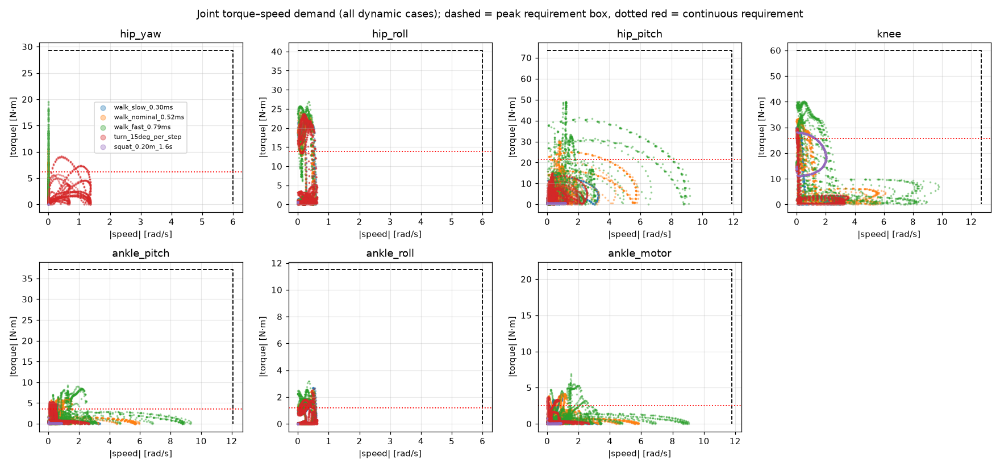
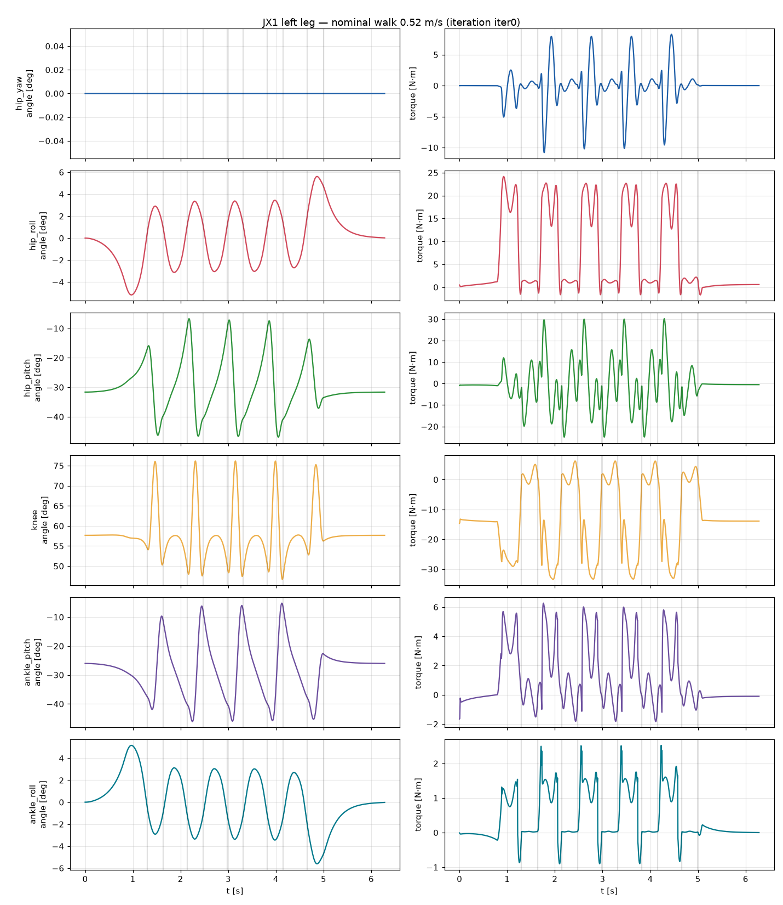
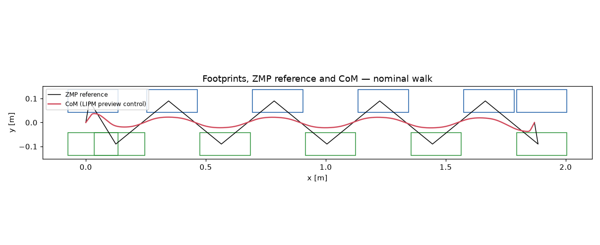

# JX1 leg torque/speed analysis — iteration `iter0`

Generated by `calculations/run_leg_analysis.py` from `calculations\design_point.yaml`. Label: **CALCULATED** from a parametric rigid-body model with ASSUMED masses; not measured.

Total modelled mass: **25.00 kg**.

## Mass model

| Link | Count | Mass each [kg] | COM [m] |
|---|---:|---:|---|
| pelvis | 1 | 2.000 | [np.float64(0.0), np.float64(0.0), np.float64(0.0638)] |
| upper_body | 1 | 12.000 | [np.float64(0.0), np.float64(0.0), np.float64(0.26)] |
| hip_yaw_link | 2 | 1.100 | [np.float64(-0.0468), np.float64(0.0), np.float64(0.0036)] |
| hip_roll_link | 2 | 1.100 | [np.float64(0.0), np.float64(0.0532), np.float64(0.0)] |
| thigh | 2 | 1.350 | [np.float64(0.0), np.float64(0.0), np.float64(-0.255)] |
| shin | 2 | 1.550 | [np.float64(-0.0142), np.float64(0.0), np.float64(-0.0844)] |
| ankle_cross | 2 | 0.050 | [np.float64(0.0), np.float64(0.0), np.float64(0.0)] |
| foot | 2 | 0.350 | [np.float64(0.03), np.float64(0.0), np.float64(-0.035)] |

## Dynamic scenarios

| Scenario | Speed [m/s] | CoP in feet | max total friction ratio | mean +mech power [W] | limit violations |
|---|---:|---|---:|---:|---|
| walk_slow_0.30ms | 0.30 | True | 0.15 | 6.7 | none |
| walk_nominal_0.52ms | 0.52 | True | 0.20 | 17.3 | none |
| walk_fast_0.79ms | 0.79 | True | 0.43 | 37.4 | none |
| turn_15deg_per_step | 0.18 | True | 0.15 | 5.9 | none |
| squat_0.20m_1.6s | 0.00 | True | 0.02 | 13.4 | none |

Peak |torque| [N·m] / peak |speed| [rad/s] per joint:

| Scenario | hip_yaw | hip_roll | hip_pitch | knee | ankle_pitch | ankle_roll | ankle motor |
|---|---:|---:|---:|---:|---:|---:|---:|
| walk_slow_0.30ms | 4.6 / 0.0 | 23.1 / 0.6 | 15.4 / 3.3 | 30.1 / 3.3 | 4.8 / 3.4 | 2.7 / 0.6 | 3.5 / 3.4 |
| walk_nominal_0.52ms | 10.8 / 0.0 | 24.2 / 0.6 | 30.2 / 5.9 | 33.4 / 6.1 | 6.3 / 6.0 | 2.5 / 0.6 | 4.2 / 5.8 |
| walk_fast_0.79ms | 19.6 / 0.0 | 26.9 / 0.6 | 49.0 / 9.2 | 40.0 / 9.8 | 9.3 / 9.3 | 3.2 / 0.6 | 6.9 / 9.0 |
| turn_15deg_per_step | 9.2 / 1.4 | 23.7 / 0.6 | 14.9 / 2.6 | 29.8 / 3.5 | 5.3 / 2.7 | 2.6 / 0.6 | 3.8 / 2.6 |
| squat_0.20m_1.6s | 0.0 / 0.0 | 0.7 / 0.0 | 0.9 / 1.2 | 28.0 / 2.0 | 1.6 / 0.9 | 0.0 / 0.0 | 0.8 / 0.9 |

## Static scenarios (|torque| N·m)

| case                            | stance   |   hip_height_m |   com_x |   com_y |   hip_yaw_Nm |   hip_yaw_deg |   hip_roll_Nm |   hip_roll_deg |   hip_pitch_Nm |   hip_pitch_deg |   knee_Nm |   knee_deg |   ankle_pitch_Nm |   ankle_pitch_deg |   ankle_roll_Nm |   ankle_roll_deg |   ankle_motor_Nm |
|:--------------------------------|:---------|---------------:|--------:|--------:|-------------:|--------------:|--------------:|---------------:|---------------:|----------------:|----------:|-----------:|-----------------:|------------------:|----------------:|-----------------:|-----------------:|
| stand_double_nominal            | both     |           0.54 |   0.015 |  0      |            0 |            -0 |         0.574 |           0    |          0.505 |          -29.68 |    13.181 |      57.89 |            1.736 |            -28.22 |           0     |             0    |            0.868 |
| stand_double_deep_squat         | both     |           0.34 |   0.015 |  0      |            0 |            -0 |         0.574 |           0    |          0.505 |          -64.43 |    23.599 |     117.27 |            1.736 |            -52.84 |           0     |             0    |            0.868 |
| single_leg_nominal              | l        |           0.54 |   0.015 |  0.09   |            0 |            -0 |        24.689 |         -12.31 |          3.206 |          -27.57 |    23.901 |      52.78 |            3.494 |            -25.21 |           0     |            12.31 |            1.851 |
| single_leg_bent_knee90          | l        |           0.44 |   0.015 |  0.09   |            0 |            -0 |        24.549 |         -15.21 |          4.384 |          -46.97 |    37.893 |      87.42 |            3.451 |            -40.45 |           0     |            15.21 |            1.96  |
| single_leg_cop_toe              | l        |           0.5  |   0.125 |  0.09   |            0 |            -0 |        25.111 |         -13.69 |          0.827 |          -17.08 |    16.274 |      62.79 |           29.685 |            -45.71 |           0     |            13.69 |           17.077 |
| single_leg_cop_heel             | l        |           0.5  |  -0.065 |  0.09   |            0 |            -0 |        24.345 |         -13.1  |          5.202 |          -45.28 |    36.279 |      64.12 |           15.627 |            -18.84 |           0     |            13.1  |            8.147 |
| single_leg_cop_outer_edge       | l        |           0.5  |   0.015 |  0.1275 |            0 |            -0 |        25.488 |         -18.57 |          3.473 |          -33.74 |    28.087 |      63.99 |            3.39  |            -30.25 |           9.197 |            18.57 |            7.769 |
| single_leg_cop_inner_edge       | l        |           0.5  |   0.015 |  0.0525 |            0 |            -0 |        23.81  |          -7.86 |          3.957 |          -37.93 |    32.543 |      71.46 |            3.542 |            -33.52 |           9.197 |             7.86 |            8.336 |
| single_leg_cop_toe_outer_corner | l        |           0.5  |   0.125 |  0.1275 |            0 |            -0 |        26.074 |         -19    |          0.596 |          -14.58 |    13.668 |      57.53 |           28.889 |            -42.95 |           9.197 |            19    |           16.161 |

## Requirements (policy applied)

Peak = max(1.5 × dynamic peak, 1.25 × static peak); continuous = 1.3 × max(walking RMS, nominal standing); speed = max(1.3 × peak, floor).

| Joint | dyn peak | static peak | RMS walk | stand | peak speed | **REQ peak** | **REQ cont.** | **REQ speed** |
|---|---:|---:|---:|---:|---:|---:|---:|---:|
| hip_yaw | 19.56 | 0.0 | 4.78 | 0.0 | 1.36 | **29.3** | **6.2** | **6.0** |
| hip_roll | 26.87 | 26.07 | 10.63 | 0.57 | 0.63 | **40.3** | **13.8** | **6.0** |
| hip_pitch | 48.99 | 5.2 | 16.49 | 0.51 | 9.17 | **73.5** | **21.4** | **11.9** |
| knee | 40.03 | 37.89 | 19.81 | 13.18 | 9.78 | **60.0** | **25.7** | **12.7** |
| ankle_pitch | 9.27 | 29.68 | 2.76 | 1.74 | 9.34 | **37.1** | **3.6** | **12.1** |
| ankle_roll | 3.19 | 9.2 | 0.94 | 0.0 | 0.63 | **11.5** | **1.2** | **6.0** |
| ankle_motor | 6.91 | 17.08 | 1.93 | 0.87 | 9.04 | **21.3** | **2.5** | **11.8** |

