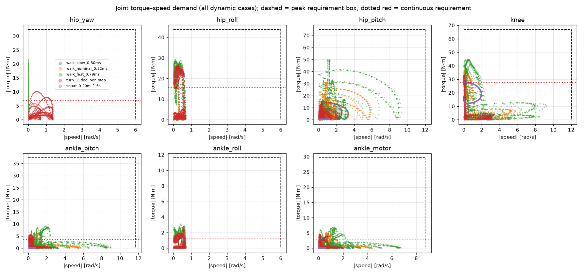
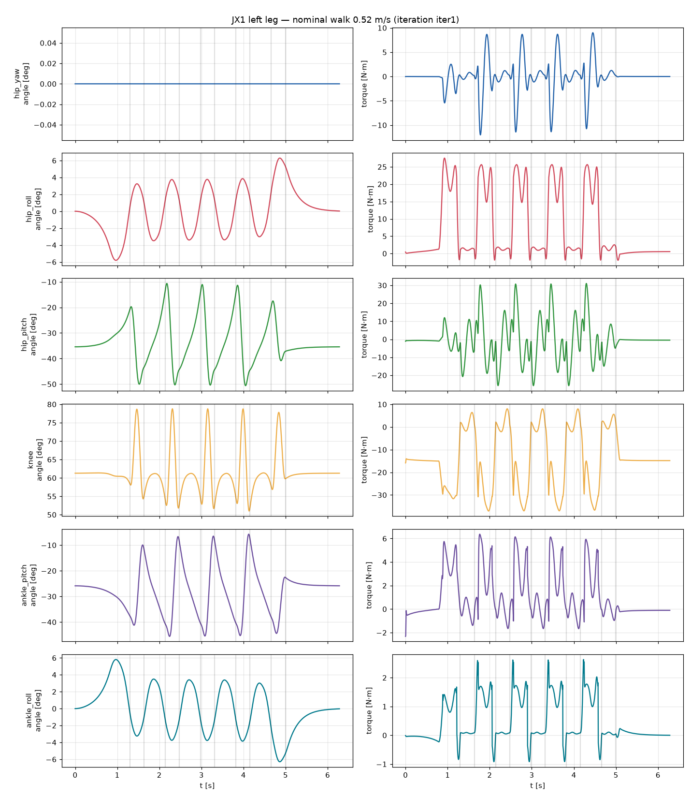
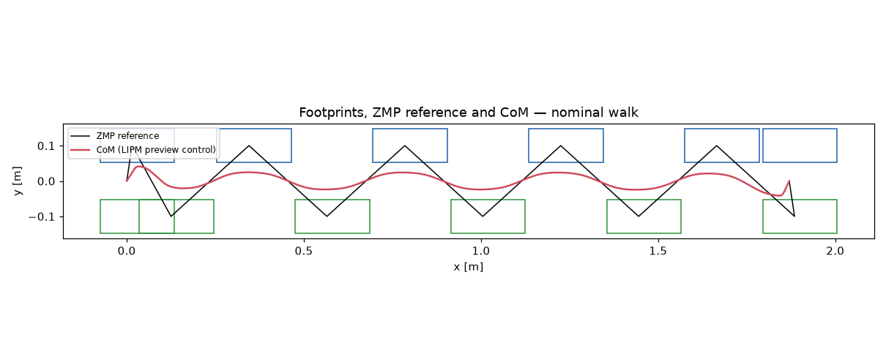

# JX1 leg torque/speed analysis — iteration `iter1`

Generated by `calculations/run_leg_analysis.py` from `calculations\design_point.yaml`. Label: **CALCULATED** from a parametric rigid-body model with ASSUMED masses; not measured.

Total modelled mass: **25.31 kg**.

## Mass model

| Link | Count | Mass each [kg] | COM [m] |
|---|---:|---:|---|
| pelvis | 1 | 2.142 | [np.float64(0.0), np.float64(0.0), np.float64(0.0645)] |
| upper_body | 1 | 12.000 | [np.float64(0.0), np.float64(0.0), np.float64(0.26)] |
| hip_yaw_link | 2 | 1.080 | [np.float64(-0.0467), np.float64(0.0), np.float64(0.0037)] |
| hip_roll_link | 2 | 1.080 | [np.float64(0.0), np.float64(0.0531), np.float64(0.0)] |
| thigh | 2 | 1.330 | [np.float64(0.0), np.float64(0.0), np.float64(-0.248)] |
| shin | 2 | 1.692 | [np.float64(0.0), np.float64(0.0), np.float64(-0.139)] |
| ankle_cross | 2 | 0.050 | [np.float64(0.0), np.float64(0.0), np.float64(0.0)] |
| foot | 2 | 0.350 | [np.float64(0.03), np.float64(0.0), np.float64(-0.035)] |

## Dynamic scenarios

| Scenario | Speed [m/s] | CoP in feet | max total friction ratio | mean +mech power [W] | limit violations |
|---|---:|---|---:|---:|---|
| walk_slow_0.30ms | 0.30 | True | 0.16 | 7.4 | none |
| walk_nominal_0.52ms | 0.52 | True | 0.20 | 18.6 | none |
| walk_fast_0.79ms | 0.79 | True | 0.40 | 40.0 | none |
| turn_15deg_per_step | 0.18 | True | 0.16 | 6.6 | none |
| squat_0.20m_1.6s | 0.00 | True | 0.03 | 13.2 | none |

Peak |torque| [N·m] / peak |speed| [rad/s] per joint:

| Scenario | hip_yaw | hip_roll | hip_pitch | knee | ankle_pitch | ankle_roll | ankle motor |
|---|---:|---:|---:|---:|---:|---:|---:|
| walk_slow_0.30ms | 5.2 / 0.0 | 26.2 / 0.7 | 15.9 / 3.3 | 32.9 / 3.1 | 4.9 / 3.2 | 2.8 / 0.7 | 4.3 / 2.6 |
| walk_nominal_0.52ms | 12.0 / 0.0 | 27.5 / 0.6 | 31.1 / 5.9 | 37.1 / 5.7 | 6.4 / 5.7 | 2.6 / 0.6 | 5.1 / 4.4 |
| walk_fast_0.79ms | 21.5 / 0.0 | 29.2 / 0.6 | 49.9 / 9.3 | 44.6 / 9.2 | 9.2 / 9.0 | 3.1 / 0.6 | 6.9 / 6.7 |
| turn_15deg_per_step | 10.2 / 1.4 | 26.3 / 0.7 | 15.1 / 2.6 | 32.3 / 3.4 | 5.5 / 2.5 | 2.9 / 0.7 | 4.6 / 2.0 |
| squat_0.20m_1.6s | 0.0 / 0.0 | 0.7 / 0.0 | 1.0 / 1.2 | 28.0 / 1.9 | 2.2 / 0.7 | 0.0 / 0.0 | 1.5 / 0.6 |

## Static scenarios (|torque| N·m)

| case                            | stance   |   hip_height_m |   com_x |   com_y |   hip_yaw_Nm |   hip_yaw_deg |   hip_roll_Nm |   hip_roll_deg |   hip_pitch_Nm |   hip_pitch_deg |   knee_Nm |   knee_deg |   ankle_pitch_Nm |   ankle_pitch_deg |   ankle_roll_Nm |   ankle_roll_deg |   ankle_motor_Nm |
|:--------------------------------|:---------|---------------:|--------:|--------:|-------------:|--------------:|--------------:|---------------:|---------------:|----------------:|----------:|-----------:|-----------------:|------------------:|----------------:|-----------------:|-----------------:|
| stand_double_nominal            | both     |           0.54 |   0.015 |  0      |            0 |            -0 |         0.563 |           0    |          0.494 |          -33.44 |    14.126 |      61.52 |            1.759 |            -28.08 |           0     |             0    |            1.146 |
| stand_double_deep_squat         | both     |           0.34 |   0.015 |  0      |            0 |            -0 |         0.563 |           0    |          0.494 |          -69.82 |    23.712 |     118.81 |            1.759 |            -48.99 |           0     |             0    |            1.297 |
| single_leg_nominal              | l        |           0.54 |   0.015 |  0.1    |            0 |            -0 |        27.876 |         -13.8  |          3.171 |          -30.53 |    25.564 |      55.48 |            3.516 |            -24.95 |           0     |            13.8  |            2.399 |
| single_leg_bent_knee90          | l        |           0.44 |   0.015 |  0.1    |            0 |            -0 |        27.676 |         -16.99 |          4.166 |          -50.27 |    38.679 |      88.64 |            3.463 |            -38.37 |           0     |            16.99 |            2.616 |
| single_leg_cop_toe              | l        |           0.5  |   0.125 |  0.1    |            0 |            -0 |        28.336 |         -15.33 |          0.53  |          -19.79 |    18.488 |      64.67 |           29.828 |            -44.89 |           0     |            15.33 |           23.651 |
| single_leg_cop_heel             | l        |           0.5  |  -0.065 |  0.1    |            0 |            -0 |        27.488 |         -14.68 |          5.267 |          -48.28 |    36.794 |      66.16 |           15.709 |            -17.88 |           0     |            14.68 |           10.357 |
| single_leg_cop_outer_edge       | l        |           0.5  |   0.015 |  0.1375 |            0 |            -0 |        28.746 |         -20.16 |          3.358 |          -36.38 |    29.073 |      65.54 |            3.399 |            -29.16 |           9.309 |            20.16 |            7.344 |
| single_leg_cop_inner_edge       | l        |           0.5  |   0.015 |  0.0625 |            0 |            -0 |        26.897 |          -9.45 |          3.852 |          -41.23 |    34.016 |      73.69 |            3.572 |            -32.46 |           9.309 |             9.45 |            7.727 |
| single_leg_cop_toe_outer_corner | l        |           0.5  |   0.125 |  0.1375 |            0 |            -0 |        29.379 |         -20.62 |          0.306 |          -16.97 |    15.609 |      59.08 |           28.948 |            -42.11 |           9.309 |            20.62 |           20.361 |

## Requirements (policy applied)

Peak = max(1.5 × dynamic peak, 1.25 × static peak); continuous = 1.3 × max(walking RMS, nominal standing); speed = max(1.3 × peak, floor).

| Joint | dyn peak | static peak | RMS walk | stand | peak speed | **REQ peak** | **REQ cont.** | **REQ speed** |
|---|---:|---:|---:|---:|---:|---:|---:|---:|
| hip_yaw | 21.52 | 0.0 | 5.33 | 0.0 | 1.36 | **32.3** | **6.9** | **6.0** |
| hip_roll | 29.17 | 29.38 | 11.92 | 0.56 | 0.69 | **43.8** | **15.5** | **6.0** |
| hip_pitch | 49.95 | 5.27 | 17.03 | 0.49 | 9.31 | **74.9** | **22.1** | **12.1** |
| knee | 44.63 | 38.68 | 21.09 | 14.13 | 9.21 | **66.9** | **27.4** | **12.0** |
| ankle_pitch | 9.16 | 29.83 | 2.75 | 1.76 | 8.97 | **37.3** | **3.6** | **11.7** |
| ankle_roll | 3.11 | 9.31 | 1.02 | 0.0 | 0.69 | **11.6** | **1.3** | **6.0** |
| ankle_motor | 6.9 | 23.65 | 2.32 | 1.15 | 6.73 | **29.6** | **3.0** | **8.8** |

