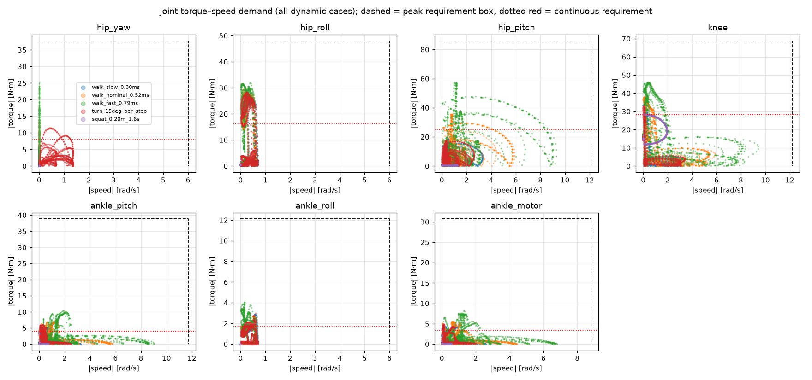
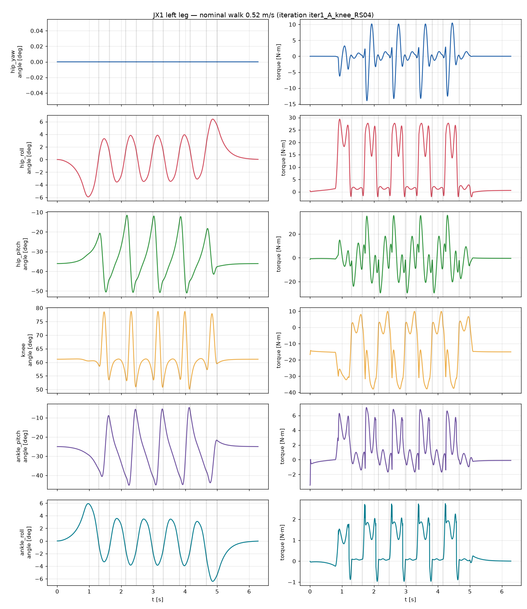
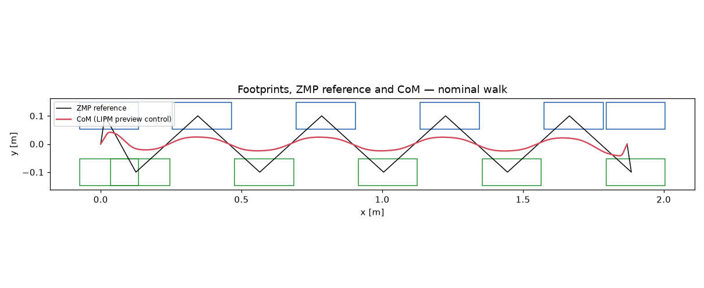

# JX1 leg torque/speed analysis — iteration `iter1_A_knee_RS04`

Generated by `calculations/run_leg_analysis.py` from `calculations\results\variant_A_knee_RS04.yaml`. Label: **CALCULATED** from a parametric rigid-body model with ASSUMED masses; not measured.

Total modelled mass: **26.39 kg**.

## Mass model

| Link | Count | Mass each [kg] | COM [m] |
|---|---:|---:|---|
| pelvis | 1 | 2.142 | [np.float64(0.0), np.float64(0.0), np.float64(0.0645)] |
| upper_body | 1 | 12.000 | [np.float64(0.0), np.float64(0.0), np.float64(0.26)] |
| hip_yaw_link | 2 | 1.080 | [np.float64(-0.0467), np.float64(0.0), np.float64(0.0037)] |
| hip_roll_link | 2 | 1.080 | [np.float64(0.0), np.float64(0.0531), np.float64(0.0)] |
| thigh | 2 | 1.870 | [np.float64(0.0), np.float64(0.0), np.float64(-0.2544)] |
| shin | 2 | 1.692 | [np.float64(0.0), np.float64(0.0), np.float64(-0.139)] |
| ankle_cross | 2 | 0.050 | [np.float64(0.0), np.float64(0.0), np.float64(0.0)] |
| foot | 2 | 0.350 | [np.float64(0.03), np.float64(0.0), np.float64(-0.035)] |

## Dynamic scenarios

| Scenario | Speed [m/s] | CoP in feet | max total friction ratio | mean +mech power [W] | limit violations |
|---|---:|---|---:|---:|---|
| walk_slow_0.30ms | 0.30 | True | 0.17 | 8.2 | none |
| walk_nominal_0.52ms | 0.52 | True | 0.21 | 20.4 | none |
| walk_fast_0.79ms | 0.79 | True | 0.51 | 44.3 | none |
| turn_15deg_per_step | 0.18 | True | 0.16 | 7.5 | none |
| squat_0.20m_1.6s | 0.00 | True | 0.04 | 13.4 | none |

Peak |torque| [N·m] / peak |speed| [rad/s] per joint:

| Scenario | hip_yaw | hip_roll | hip_pitch | knee | ankle_pitch | ankle_roll | ankle motor |
|---|---:|---:|---:|---:|---:|---:|---:|
| walk_slow_0.30ms | 6.0 / 0.0 | 27.8 / 0.7 | 18.6 / 3.3 | 33.5 / 3.2 | 5.1 / 3.3 | 2.9 / 0.7 | 4.5 / 2.6 |
| walk_nominal_0.52ms | 14.0 / 0.0 | 29.4 / 0.6 | 35.7 / 5.9 | 38.0 / 5.9 | 7.1 / 5.8 | 2.7 / 0.6 | 5.6 / 4.4 |
| walk_fast_0.79ms | 25.1 / 0.0 | 32.0 / 0.6 | 57.3 / 9.3 | 45.9 / 9.4 | 10.4 / 9.0 | 4.1 / 0.6 | 8.3 / 6.8 |
| turn_15deg_per_step | 11.5 / 1.4 | 28.3 / 0.7 | 17.7 / 2.6 | 33.0 / 3.4 | 6.0 / 2.5 | 3.0 / 0.7 | 4.9 / 2.0 |
| squat_0.20m_1.6s | 0.0 / 0.0 | 0.7 / 0.0 | 1.3 / 1.2 | 28.4 / 1.9 | 3.4 / 0.7 | 0.0 / 0.0 | 2.2 / 0.5 |

## Static scenarios (|torque| N·m)

| case                            | stance   |   hip_height_m |   com_x |   com_y |   hip_yaw_Nm |   hip_yaw_deg |   hip_roll_Nm |   hip_roll_deg |   hip_pitch_Nm |   hip_pitch_deg |   knee_Nm |   knee_deg |   ankle_pitch_Nm |   ankle_pitch_deg |   ankle_roll_Nm |   ankle_roll_deg |   ankle_motor_Nm |
|:--------------------------------|:---------|---------------:|--------:|--------:|-------------:|--------------:|--------------:|---------------:|---------------:|----------------:|----------:|-----------:|-----------------:|------------------:|----------------:|-----------------:|-----------------:|
| stand_double_nominal            | both     |           0.54 |   0.015 |  0      |            0 |            -0 |         0.563 |           0    |          0.494 |          -34.15 |    14.38  |      61.46 |            1.838 |            -27.32 |           0     |             0    |            1.194 |
| stand_double_deep_squat         | both     |           0.34 |   0.015 |  0      |            0 |            -0 |         0.563 |           0    |          0.494 |          -71.64 |    23.972 |     118.55 |            1.838 |            -46.91 |           0     |             0    |            1.33  |
| single_leg_nominal              | l        |           0.54 |   0.015 |  0.1    |            0 |            -0 |        29.231 |         -13.97 |          4.304 |          -31.18 |    25.676 |      55.24 |            3.668 |            -24.06 |           0     |            13.97 |            2.491 |
| single_leg_bent_knee90          | l        |           0.44 |   0.015 |  0.1    |            0 |            -0 |        28.938 |         -17.12 |          5.55  |          -51.4  |    39.028 |      88.39 |            3.612 |            -36.98 |           0     |            17.12 |            2.701 |
| single_leg_cop_toe              | l        |           0.5  |   0.125 |  0.1    |            0 |            -0 |        29.824 |         -15.6  |          1.383 |          -20.63 |    18.872 |      64.98 |           31.065 |            -44.35 |           0     |            15.6  |           24.544 |
| single_leg_cop_heel             | l        |           0.5  |  -0.065 |  0.1    |            0 |            -0 |        28.733 |         -14.79 |          6.635 |          -48.8  |    36.783 |      65.34 |           16.367 |            -16.54 |           0     |            14.79 |           10.724 |
| single_leg_cop_outer_edge       | l        |           0.5  |   0.015 |  0.1375 |            0 |            -0 |        30.189 |         -20.38 |          4.523 |          -37.08 |    29.205 |      65.18 |            3.543 |            -28.1  |           9.707 |            20.38 |            7.627 |
| single_leg_cop_inner_edge       | l        |           0.5  |   0.015 |  0.0625 |            0 |            -0 |        28.115 |          -9.55 |          5.174 |          -42.16 |    34.33  |      73.52 |            3.727 |            -31.35 |           9.707 |             9.55 |            8.031 |
| single_leg_cop_toe_outer_corner | l        |           0.5  |   0.125 |  0.1375 |            0 |            -0 |        31.019 |         -20.96 |          1.061 |          -17.62 |    15.812 |      59.16 |           30.119 |            -41.54 |           9.707 |            20.96 |           21.043 |

## Requirements (policy applied)

Peak = max(1.5 × dynamic peak, 1.25 × static peak); continuous = 1.3 × max(walking RMS, nominal standing); speed = max(1.3 × peak, floor).

| Joint | dyn peak | static peak | RMS walk | stand | peak speed | **REQ peak** | **REQ cont.** | **REQ speed** |
|---|---:|---:|---:|---:|---:|---:|---:|---:|
| hip_yaw | 25.12 | 0.0 | 6.19 | 0.0 | 1.36 | **37.7** | **8.0** | **6.0** |
| hip_roll | 31.99 | 31.02 | 12.61 | 0.56 | 0.71 | **48.0** | **16.4** | **6.0** |
| hip_pitch | 57.26 | 6.63 | 19.4 | 0.49 | 9.29 | **85.9** | **25.2** | **12.1** |
| knee | 45.89 | 39.03 | 21.75 | 14.38 | 9.41 | **68.8** | **28.3** | **12.2** |
| ankle_pitch | 10.4 | 31.07 | 3.09 | 1.84 | 9.02 | **38.8** | **4.0** | **11.7** |
| ankle_roll | 4.06 | 9.71 | 1.31 | 0.0 | 0.71 | **12.1** | **1.7** | **6.0** |
| ankle_motor | 8.34 | 24.54 | 2.64 | 1.19 | 6.79 | **30.7** | **3.4** | **8.8** |

