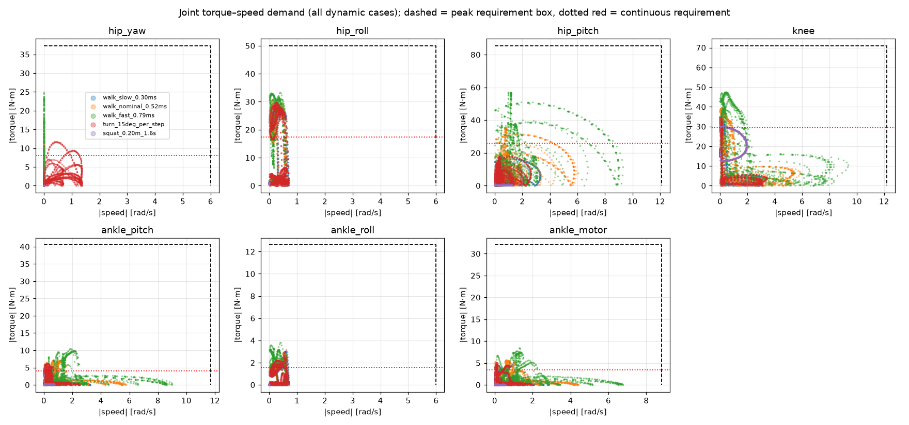
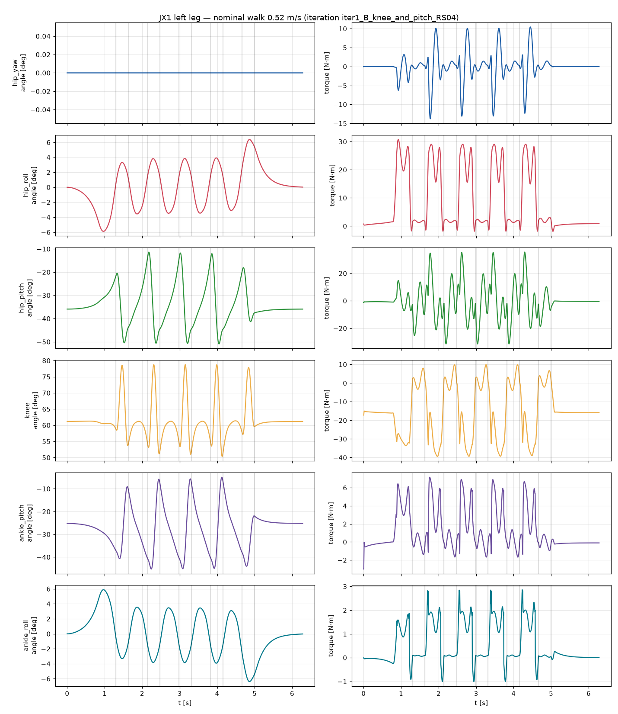
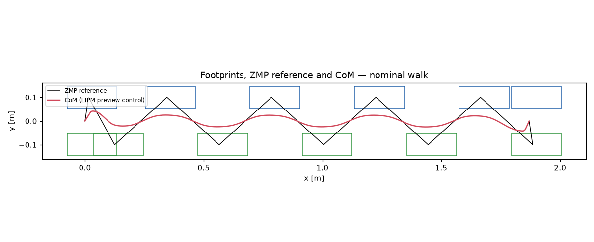

# JX1 leg torque/speed analysis — iteration `iter1_B_knee_and_pitch_RS04`

Generated by `calculations/run_leg_analysis.py` from `calculations\results\variant_B_knee_and_pitch_RS04.yaml`. Label: **CALCULATED** from a parametric rigid-body model with ASSUMED masses; not measured.

Total modelled mass: **27.47 kg**.

## Mass model

| Link | Count | Mass each [kg] | COM [m] |
|---|---:|---:|---|
| pelvis | 1 | 2.142 | [np.float64(0.0), np.float64(0.0), np.float64(0.0645)] |
| upper_body | 1 | 12.000 | [np.float64(0.0), np.float64(0.0), np.float64(0.26)] |
| hip_yaw_link | 2 | 1.080 | [np.float64(-0.0467), np.float64(0.0), np.float64(0.0037)] |
| hip_roll_link | 2 | 1.620 | [np.float64(0.0), np.float64(0.0538), np.float64(0.0)] |
| thigh | 2 | 1.870 | [np.float64(0.0), np.float64(0.0), np.float64(-0.2544)] |
| shin | 2 | 1.692 | [np.float64(0.0), np.float64(0.0), np.float64(-0.139)] |
| ankle_cross | 2 | 0.050 | [np.float64(0.0), np.float64(0.0), np.float64(0.0)] |
| foot | 2 | 0.350 | [np.float64(0.03), np.float64(0.0), np.float64(-0.035)] |

## Dynamic scenarios

| Scenario | Speed [m/s] | CoP in feet | max total friction ratio | mean +mech power [W] | limit violations |
|---|---:|---|---:|---:|---|
| walk_slow_0.30ms | 0.30 | True | 0.17 | 8.5 | none |
| walk_nominal_0.52ms | 0.52 | True | 0.21 | 21.2 | none |
| walk_fast_0.79ms | 0.79 | True | 0.47 | 46.1 | none |
| turn_15deg_per_step | 0.18 | True | 0.16 | 7.7 | none |
| squat_0.20m_1.6s | 0.00 | True | 0.03 | 14.1 | none |

Peak |torque| [N·m] / peak |speed| [rad/s] per joint:

| Scenario | hip_yaw | hip_roll | hip_pitch | knee | ankle_pitch | ankle_roll | ankle motor |
|---|---:|---:|---:|---:|---:|---:|---:|
| walk_slow_0.30ms | 5.9 / 0.0 | 29.2 / 0.7 | 18.4 / 3.3 | 34.9 / 3.1 | 5.4 / 3.2 | 3.0 / 0.7 | 4.7 / 2.6 |
| walk_nominal_0.52ms | 13.8 / 0.0 | 30.7 / 0.6 | 35.5 / 5.9 | 39.4 / 5.8 | 7.2 / 5.7 | 2.9 / 0.6 | 5.7 / 4.4 |
| walk_fast_0.79ms | 24.9 / 0.0 | 33.3 / 0.6 | 56.9 / 9.3 | 47.4 / 9.4 | 10.5 / 9.0 | 3.8 / 0.6 | 8.5 / 6.8 |
| turn_15deg_per_step | 11.8 / 1.4 | 29.7 / 0.7 | 17.8 / 2.6 | 34.6 / 3.4 | 6.1 / 2.5 | 3.1 / 0.7 | 5.0 / 2.0 |
| squat_0.20m_1.6s | 0.0 / 0.0 | 1.0 / 0.0 | 1.1 / 1.2 | 29.9 / 1.9 | 2.9 / 0.7 | 0.0 / 0.0 | 1.9 / 0.6 |

## Static scenarios (|torque| N·m)

| case                            | stance   |   hip_height_m |   com_x |   com_y |   hip_yaw_Nm |   hip_yaw_deg |   hip_roll_Nm |   hip_roll_deg |   hip_pitch_Nm |   hip_pitch_deg |   knee_Nm |   knee_deg |   ankle_pitch_Nm |   ankle_pitch_deg |   ankle_roll_Nm |   ankle_roll_deg |   ankle_motor_Nm |
|:--------------------------------|:---------|---------------:|--------:|--------:|-------------:|--------------:|--------------:|---------------:|---------------:|----------------:|----------:|-----------:|-----------------:|------------------:|----------------:|-----------------:|-----------------:|
| stand_double_nominal            | both     |           0.54 |   0.015 |  0      |            0 |            -0 |         0.854 |           0    |          0.494 |          -33.99 |    15.125 |      61.48 |            1.918 |            -27.48 |           0     |             0    |            1.247 |
| stand_double_deep_squat         | both     |           0.34 |   0.015 |  0      |            0 |            -0 |         0.854 |           0    |          0.494 |          -71.21 |    25.268 |     118.62 |            1.918 |            -47.4  |           0     |             0    |            1.394 |
| single_leg_nominal              | l        |           0.54 |   0.015 |  0.1    |            0 |            -0 |        30.551 |         -13.86 |          4.278 |          -31.08 |    27.065 |      55.36 |            3.824 |            -24.29 |           0     |            13.86 |            2.6   |
| single_leg_bent_knee90          | l        |           0.44 |   0.015 |  0.1    |            0 |            -0 |        30.263 |         -17    |          5.515 |          -51.18 |    41.083 |      88.5  |            3.767 |            -37.33 |           0     |            17    |            2.823 |
| single_leg_cop_toe              | l        |           0.5  |   0.125 |  0.1    |            0 |            -0 |        31.129 |         -15.45 |          1.374 |          -20.61 |    19.845 |      65.06 |           32.364 |            -44.45 |           0     |            15.45 |           25.574 |
| single_leg_cop_heel             | l        |           0.5  |  -0.065 |  0.1    |            0 |            -0 |        30.059 |         -14.69 |          6.604 |          -48.69 |    38.841 |      65.63 |           17.041 |            -16.94 |           0     |            14.69 |           11.185 |
| single_leg_cop_outer_edge       | l        |           0.5  |   0.015 |  0.1375 |            0 |            -0 |        31.491 |         -20.23 |          4.5   |          -36.99 |    30.812 |      65.38 |            3.696 |            -28.39 |          10.104 |            20.23 |            7.955 |
| single_leg_cop_inner_edge       | l        |           0.5  |   0.015 |  0.0625 |            0 |            -0 |        29.452 |          -9.48 |          5.136 |          -41.96 |    36.112 |      73.58 |            3.885 |            -31.62 |          10.104 |             9.48 |            8.371 |
| single_leg_cop_toe_outer_corner | l        |           0.5  |   0.125 |  0.1375 |            0 |            -0 |        32.301 |         -20.77 |          1.063 |          -17.69 |    16.705 |      59.38 |           31.396 |            -41.69 |          10.104 |            20.77 |           22.011 |

## Requirements (policy applied)

Peak = max(1.5 × dynamic peak, 1.25 × static peak); continuous = 1.3 × max(walking RMS, nominal standing); speed = max(1.3 × peak, floor).

| Joint | dyn peak | static peak | RMS walk | stand | peak speed | **REQ peak** | **REQ cont.** | **REQ speed** |
|---|---:|---:|---:|---:|---:|---:|---:|---:|
| hip_yaw | 24.85 | 0.0 | 6.14 | 0.0 | 1.36 | **37.3** | **8.0** | **6.0** |
| hip_roll | 33.33 | 32.3 | 13.29 | 0.85 | 0.71 | **50.0** | **17.3** | **6.0** |
| hip_pitch | 56.92 | 6.6 | 19.92 | 0.49 | 9.29 | **85.4** | **25.9** | **12.1** |
| knee | 47.35 | 41.08 | 22.72 | 15.12 | 9.35 | **71.0** | **29.5** | **12.2** |
| ankle_pitch | 10.46 | 32.36 | 3.11 | 1.92 | 9.0 | **40.5** | **4.0** | **11.7** |
| ankle_roll | 3.82 | 10.1 | 1.26 | 0.0 | 0.71 | **12.6** | **1.6** | **6.0** |
| ankle_motor | 8.51 | 25.57 | 2.65 | 1.25 | 6.77 | **32.0** | **3.4** | **8.8** |

