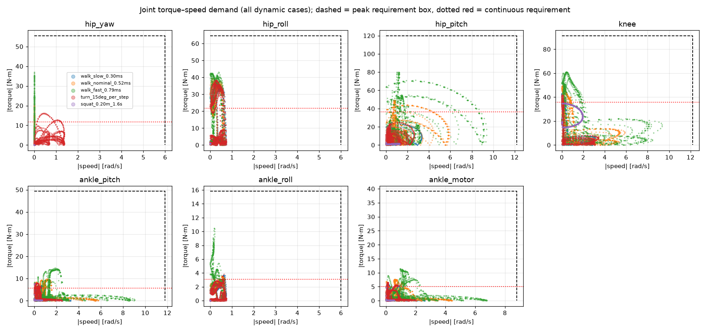
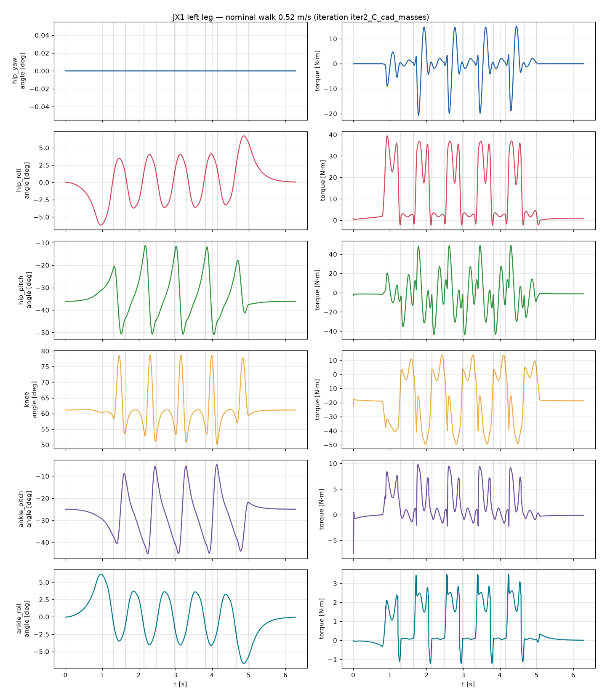
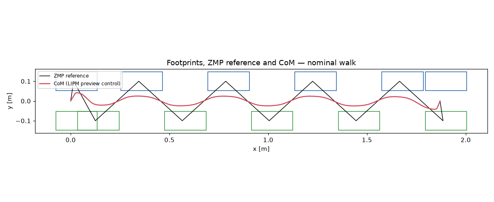

# JX1 leg torque/speed analysis — iteration `iter2_C_cad_masses`

Generated by `calculations/run_leg_analysis.py` from `calculations/results/variant_C_cad_masses.yaml`. Label: **CALCULATED** from a parametric rigid-body model with ASSUMED masses; not measured.

Total modelled mass: **33.61 kg**.

## Mass model

| Link | Count | Mass each [kg] | COM [m] |
|---|---:|---:|---|
| pelvis | 1 | 2.636 | [np.float64(0.0), np.float64(0.0), np.float64(0.0618)] |
| upper_body | 1 | 12.015 | [np.float64(-0.0108), np.float64(0.0005), np.float64(0.2898)] |
| hip_yaw_link | 2 | 1.781 | [np.float64(-0.0322), np.float64(0.0), np.float64(0.0101)] |
| hip_roll_link | 2 | 1.895 | [np.float64(0.0), np.float64(0.0525), np.float64(0.0)] |
| thigh | 2 | 2.331 | [np.float64(0.0), np.float64(0.0), np.float64(-0.2446)] |
| shin | 2 | 2.746 | [np.float64(0.0), np.float64(0.0), np.float64(-0.1253)] |
| ankle_cross | 2 | 0.202 | [np.float64(0.0), np.float64(0.0), np.float64(0.0)] |
| foot | 2 | 0.523 | [np.float64(0.03), np.float64(0.0), np.float64(-0.035)] |

## Dynamic scenarios

| Scenario | Speed [m/s] | CoP in feet | max total friction ratio | mean +mech power [W] | limit violations |
|---|---:|---|---:|---:|---|
| walk_slow_0.30ms | 0.30 | True | 0.17 | 11.3 | none |
| walk_nominal_0.52ms | 0.52 | True | 0.24 | 28.6 | none |
| walk_fast_0.79ms | 0.79 | False | 0.66 | 62.6 | none |
| turn_15deg_per_step | 0.18 | True | 0.17 | 10.4 | none |
| squat_0.20m_1.6s | 0.00 | True | 0.08 | 16.7 | none |

Peak |torque| [N·m] / peak |speed| [rad/s] per joint:

| Scenario | hip_yaw | hip_roll | hip_pitch | knee | ankle_pitch | ankle_roll | ankle motor |
|---|---:|---:|---:|---:|---:|---:|---:|
| walk_slow_0.30ms | 9.1 / 0.0 | 37.0 / 0.7 | 24.9 / 3.3 | 42.9 / 3.2 | 7.9 / 3.3 | 3.7 / 0.7 | 5.8 / 2.6 |
| walk_nominal_0.52ms | 20.8 / 0.0 | 39.5 / 0.7 | 49.2 / 5.9 | 49.6 / 5.9 | 9.8 / 5.8 | 3.5 / 0.7 | 7.7 / 4.4 |
| walk_fast_0.79ms | 37.0 / 0.0 | 43.1 / 0.7 | 80.0 / 9.4 | 60.9 / 9.4 | 14.7 / 9.0 | 10.5 / 0.7 | 11.4 / 6.8 |
| turn_15deg_per_step | 16.2 / 1.4 | 38.3 / 0.7 | 24.7 / 2.6 | 41.9 / 3.4 | 8.0 / 2.5 | 3.9 / 0.7 | 6.5 / 2.0 |
| squat_0.20m_1.6s | 0.1 / 0.0 | 1.2 / 0.0 | 2.9 / 1.2 | 34.8 / 1.9 | 7.7 / 0.7 | 0.0 / 0.0 | 4.9 / 0.5 |

## Static scenarios (|torque| N·m)

| case                            | stance   |   hip_height_m |   com_x |   com_y |   hip_yaw_Nm |   hip_yaw_deg |   hip_roll_Nm |   hip_roll_deg |   hip_pitch_Nm |   hip_pitch_deg |   knee_Nm |   knee_deg |   ankle_pitch_Nm |   ankle_pitch_deg |   ankle_roll_Nm |   ankle_roll_deg |   ankle_motor_Nm |
|:--------------------------------|:---------|---------------:|--------:|--------:|-------------:|--------------:|--------------:|---------------:|---------------:|----------------:|----------:|-----------:|-----------------:|------------------:|----------------:|-----------------:|-----------------:|
| stand_double_nominal            | both     |           0.54 |   0.015 |  0      |            0 |            -0 |         1.005 |           0.03 |          1.2   |          -34.12 |    17.869 |      61.47 |            2.319 |            -27.35 |           0     |            -0.03 |            1.506 |
| stand_double_deep_squat         | both     |           0.34 |   0.015 | -0      |            0 |            -0 |         1.005 |           0.04 |          1.2   |          -72.11 |    29.483 |     118.47 |            2.319 |            -46.36 |           0     |            -0.04 |            1.668 |
| single_leg_nominal              | l        |           0.54 |   0.015 |  0.1    |            0 |            -0 |        38.167 |         -14.46 |          5     |          -30.92 |    31.93  |      54.77 |            4.64  |            -23.85 |           0     |            14.46 |            3.152 |
| single_leg_bent_knee90          | l        |           0.44 |   0.015 |  0.1    |            0 |            -0 |        37.712 |         -17.65 |          6.824 |          -51.42 |    48.472 |      88    |            4.566 |            -36.58 |           0     |            17.65 |            3.41  |
| single_leg_cop_toe              | l        |           0.5  |   0.125 |  0.1    |            0 |            -0 |        39.069 |         -16.21 |          0.445 |          -19.53 |    23.382 |      63.98 |           39.425 |            -44.45 |           0     |            16.21 |           31.248 |
| single_leg_cop_heel             | l        |           0.5  |  -0.065 |  0.1    |            0 |            -0 |        37.414 |         -15.24 |          8.553 |          -48.83 |    45.357 |      64.63 |           20.824 |            -15.8  |           0     |            15.24 |           13.61  |
| single_leg_cop_outer_edge       | l        |           0.5  |   0.015 |  0.1375 |            0 |            -0 |        39.642 |         -21.05 |          5.324 |          -36.67 |    36.044 |      64.37 |            4.471 |            -27.7  |          12.363 |            21.05 |            9.63  |
| single_leg_cop_inner_edge       | l        |           0.5  |   0.015 |  0.0625 |            0 |            -0 |        36.446 |          -9.87 |          6.268 |          -42.21 |    42.864 |      73.35 |            4.721 |            -31.14 |          12.363 |             9.87 |           10.197 |
| single_leg_cop_toe_outer_corner | l        |           0.5  |   0.125 |  0.1375 |            0 |            -0 |        40.896 |         -21.73 |          0.016 |          -16.16 |    19.21  |      57.54 |           38.137 |            -41.38 |          12.363 |            21.73 |           26.18  |

## Requirements (policy applied)

Peak = max(1.5 × dynamic peak, 1.25 × static peak); continuous = 1.3 × max(walking RMS, nominal standing); speed = max(1.3 × peak, floor).

| Joint | dyn peak | static peak | RMS walk | stand | peak speed | **REQ peak** | **REQ cont.** | **REQ speed** |
|---|---:|---:|---:|---:|---:|---:|---:|---:|
| hip_yaw | 37.02 | 0.0 | 9.1 | 0.0 | 1.36 | **55.5** | **11.8** | **6.0** |
| hip_roll | 43.05 | 40.9 | 16.74 | 1.0 | 0.74 | **64.6** | **21.8** | **6.0** |
| hip_pitch | 79.95 | 8.55 | 27.86 | 1.2 | 9.39 | **119.9** | **36.2** | **12.2** |
| knee | 60.88 | 48.47 | 27.49 | 17.87 | 9.35 | **91.3** | **35.7** | **12.2** |
| ankle_pitch | 14.7 | 39.42 | 4.32 | 2.32 | 9.04 | **49.3** | **5.6** | **11.8** |
| ankle_roll | 10.5 | 12.36 | 2.42 | 0.0 | 0.74 | **15.8** | **3.1** | **6.0** |
| ankle_motor | 11.4 | 31.25 | 3.88 | 1.51 | 6.8 | **39.1** | **5.0** | **8.8** |

