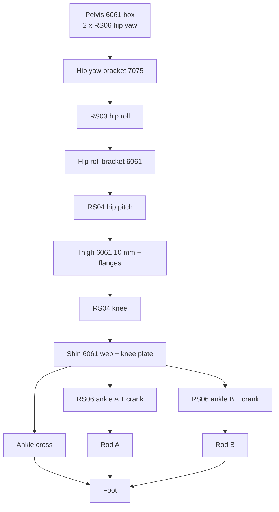
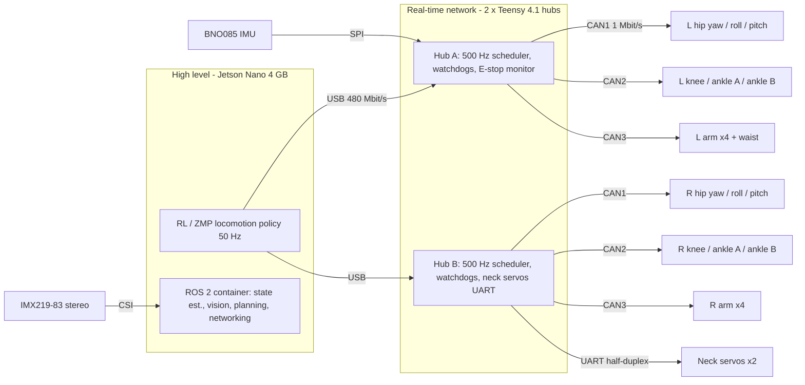
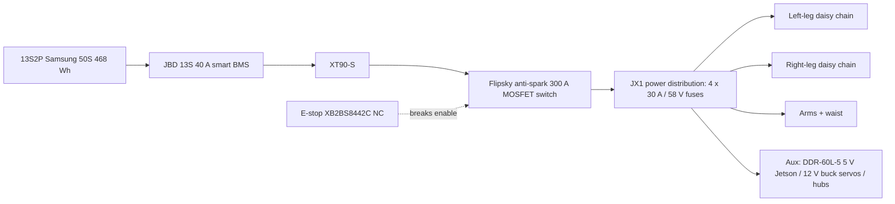

# JX1 system architecture (v0.5)

JX1 is a 1.23 m, 33.6 kg (CAD), 23-DOF humanoid designed for the lowest practical build cost in India. This document ties together
the mechanical, electrical, computing and software architecture; details live in the linked documents.

## 1. Mechanical architecture

| Area | Decision | Evidence |
|---|---|---|
| Leg kinematics | 6 DOF/leg: hip **yaw → roll → pitch** (axes intersect at the hip centre), knee pitch, **parallel two-motor ankle** (virtual pitch → roll) | `simulation/joint_map.yaml`, `research/reference_robots.md` |
| Dimensions | thigh 0.270 m, shin 0.300 m, ankle→sole 0.050 m, hip spacing 0.200 m, foot 0.210 × 0.095 m | `calculations/design_point.yaml` (v0.3) |
| Actuators | 5 classes, all RobStride 48 V CAN: RS04 (hip pitch, knee), RS03 (hip roll), RS06 (hip yaw, ankle A/B, waist), RS02 (shoulder pitch/roll), RS00 (shoulder yaw, elbow); neck = bus servos | `actuators/actuator_selection.md` |
| Actuator interface | Modular Actuator Interface: stator rear face → parent link, output face + pilot → child link; connector zones face backwards | `actuators/modular_actuator_interface.md` |
| Hip packaging | yaw actuator vertical in the pelvis; roll actuator behind the hip (axis +X, output forward); pitch actuator centred on the hip (output lateral); output faces coplanar with the next mounting face → **the thigh is one 10 mm 6061 plate with run-out flanges** | `CAD/Hip`, `CAD/Thigh` |
| Knee / shin | knee actuator on the thigh plate, output medial; shin = 14 mm medial knee plate + deep joggle block + 10 mm central web carrying ankle motor A (upper, output lateral) and B (lower, output medial) — every bolt stays reachable | `CAD/Shin` |
| Ankle | U-joint cross on HK0810 needle bearings; cranks r = 50 mm; Ø8 steel push rods (M5-tapped ends, POS5 rod ends) to posts 40 mm behind the ankle, ±45 mm lateral; reach −55°…+30° pitch, ±20° roll; collision-free pitch/roll polygon in `joint_map.yaml` | `calculations/jx1calc/ankle.py`, `verification/ankle_workspace_L.json` |
| Materials | **all structure in aluminium** after FEA (every printed PA-CF version failed, SF 0.07–1.23): hip-yaw bracket 7075-T6; hip-roll bracket, thigh, shin, foot, pelvis box, cranks, torso frame, shoulder brackets, upper arms (10/8 mm + gussets), forearms 6061-T6 (laser-cut plates + CNC); ankle cross EN8/EN24; printed PA-CF/PETG-CF only for the neck bracket, head, grippers and covers | `calculations/results/structural/report.md`, [build guide](build_guide.md) |
| Upper body | torso = 6061 plate frame on the waist RS06 + four 2020 posts; battery bay (13S2P) at the bottom, Jetson + hub board + DC-DC above; shoulders RS02 pitch (housing on the torso side plate) → RS02 roll (behind the shoulder, U-bracket) → RS00 yaw → RS00 elbow; ST3215 neck yaw/pitch; head shell with IMX219-83 stereo camera | `tools/cad/build_upper_parts.py`, `CAD/Assemblies/JX1_UpperBody.SLDASM` |

## 2. Electrical and computing architecture

| Layer | Responsibility | Hardware | Rate |
|---|---|---|---|
| Jetson Nano | perception, ROS 2, locomotion policy inference, planning, logging, networking | Jetson Nano 4 GB dev kit (JetPack 4.6.x); ROS 2 Humble in Docker | policy 50 Hz |
| CAN hubs | deterministic bus schedule, command interpolation 50 → 500 Hz, state aggregation, **watchdogs**, soft limits, E-stop monitoring, fault latching | 2 × Teensy 4.1 (3 CAN each) + TJA1462 transceivers on a JX1 carrier PCB | 500 Hz exchange |
| Joint controllers | FOC current loop, MIT-mode PD (position, velocity, torque feed-forward), encoder acquisition, thermal & over-current protection | RobStride on-board drivers (STM32-class, 14-bit abs. encoder) | ≥ 1 kHz internal |
| Sensors | IMU (400 Hz rotation vector) on hub A; foot FSRs (phase 2) on hub ADCs; stereo camera on Jetson CSI | BNO085, FSR406, IMX219-83 | — |

**Why not CAN-FD / why 6 buses:** RobStride speaks classic CAN 1 Mbit/s with 29-bit IDs (≈ 150 bits/frame with stuffing). One
command + one reply per joint every 2 ms = 150 µs per joint → 3 joints per bus = **45 % load at 500 Hz**; 6 joints would be ≈ 90 %
(`research/raw/india_electronics_compute_raw.md` Part C). Teensy 4.1 offers 3 controllers, so two hubs give 6 buses for 21 joints.

**Command interpolation and ankle control (found in the hardware-in-the-loop twin, `ros2_ws/src/jx1_hw`):** the hub ramps
each 50 Hz host target linearly over the next 20 ms (`command_for()` in `firmware/hub/jx1_hub`). This first-order hold
adds ≈ 10 ms of effective lag; it is kept (smooth motor commands) and modelled in RL training, sim-to-sim, `jx1_sim` and
Isaac. The parallel ankle is driven as two independent per-motor MIT loops, so its joint-space pitch/roll stiffness ratio
is fixed by the linkage Jacobian (≈ 1.27); exact joint-space ankle PD would need the hub to add the coupling torques at
500 Hz (optional firmware improvement, OI-20). Hub torque caps are 80 % of the actuator peak (e.g. hip yaw 28.8 of 36 N·m).

**Jetson Nano feasibility:** a 0.1–0.75 MFLOP MLP policy at 50 Hz is < 0.1 % of the Nano's 472 GFLOPS (ESTIMATED). Constraints:
JetPack 4.6.6 is the final release (Ubuntu 18.04, kernel 4.9, CUDA 10.2) and the Nano has **no CAN controller** — hence the
USB-attached hubs, which also make the computer swappable (**Orin Nano**: same 69.6 × 45 mm module, native CAN, supported to 2032).

## 3. Power architecture (48 V)

| Quantity | Value | Label |
|---|---|---|
| Bus | 13S, 41.6–54.6 V | CALCULATED |
| Average power | 92 W standing, 285 W walking 0.52 m/s, 435 W at 0.79 m/s (CAD masses, iteration 2) | CALCULATED |
| Peak power | 1682 W (40 A at 41.6 V) in the fast gait: pack 50 A cont. (1.24×), but equal to the 40 A BMS rating (OI-26) | CALCULATED |
| Runtime | 1.3 h walking, 4.1 h standing (80 % DoD) | CALCULATED |
| Pack | 26 × Samsung 50S (+2 spare), 1.8 kg cells, ₹20/Wh | VERIFIED prices |

## 4. Software architecture

- `ros2_ws/src/jx1_description` — URDF + xacro generated from the CAD (`tools/sim/build_robot_description.py`, checked by `tools/sim/check_xacro.py`).
- `ros2_ws/src/jx1_hw` — Jetson ↔ CAN-hub bridge speaking the hub USB protocol (50 Hz targets, 500 Hz state) + a firmware digital twin for HIL tests; `jx1_policy` (ONNX policy node), `jx1_sim` (MuJoCo node), `jx1_bringup`; ros2_control xacro.
- Simulation: MuJoCo MJCF (`simulation/mujoco`: validation, ZMP walking, push tests), Isaac Sim import + Isaac Lab task (`simulation/isaac`, UNVERIFIED); RL training and sim-to-sim in `rl/`.
- Firmware: `firmware/hub/` (Teensy): bus scheduler, RobStride MIT-mode driver, watchdogs, limits, E-stop logic.

## 5. Service and repair

- Every actuator is replaceable from its two bolt circles; connectors face backwards with service loops.
- Legs detach from the pelvis at the hip-yaw rear face (6 bolts + 2 connectors per leg).
- Battery slides out of the torso bay through one XT90-S connector.
- Hub PCB is accessible behind the torso back cover; all buses have test points and a spare USB-CAN port.
