# How to assemble JX1 — step by step (v0.5, 2026-09-24)

This guide puts the 87 parts of JX1 together in 22 steps, in the order a real build would go. Every picture is rendered
from the actual CAD parts in their verified positions (`tools/media/assembly_film.py`). The same sequence is animated in
the **[assembly film](../media/jx1_assembly.mp4)** (96 s).

> **Honest status.** Nobody has built JX1 yet. This sequence comes from the CAD, where every joint and clearance was
> checked. It has not been tried on a real bench. Two things are still open. First, the actuator bolt patterns (hole
> circle, thread, pilot) are **ASSUMED** until the official RobStride drawings or a measured unit are in the CAD (open
> issue [OI-1](open_issues.md)). Second, the bolt torques are not specified yet. Do the fit-check prints first
> ([build guide §4](build_guide.md#4-printing-notes)).

**New to this?** Read the [README](../README.md) first ("How JX1 works" and the glossary). It explains every word used
here: actuator, output flange, pilot, dowel, CAN ID, zero pose.

---

## Before you start

### Words you will see

- **Actuator**: a motor, gearbox, encoder and motor driver in one round can. JX1 uses 21 of them from RobStride in five
  sizes. Each one has a **housing** (the body, fixed) and an **output flange** (the face that turns). Parts bolt to both.
- **Pilot**: a shallow round step on the flange. The mating part has a matching recess, which centres the part so the
  bolts don't have to.
- **Dowel pin**: a hardened steel pin pressed into two plates. It stops the plates sliding past each other. Bolts clamp
  the plates; dowels locate them.
- **Left / right** always means the **robot's** left and right, as if you were standing inside it.
- **Zero pose**: legs straight, feet flat and parallel, arms hanging straight down, head looking forward. Every joint
  angle in the software is measured from this pose.

### Tools

Hex keys 2 / 2.5 / 3 / 4 mm (ball-end and straight), a torque screwdriver (0.5–5 N·m) and a small torque wrench,
medium-strength thread-locker (blue, e.g. Loctite 243), a digital caliper, taps and drills for M3/M4/M5, Ø5 and Ø8 H7
reamers, a deburring tool, a small hammer and pin punch for the dowels, a multimeter, a soldering iron, heat-shrink, an
XT30 crimp/solder kit, cable ties, and spiral wrap. For the steps after assembly you need a lifting gantry or harness
([safety architecture §6](safety_architecture.md)).

### Fasteners (from `tools/cad/params.py`; patterns ASSUMED, OI-1)

| Actuator (joints) | Size | Output flange | Housing (rear) | Bolt |
|---|---|---|---|---|
| RS04 (hip pitch, knee) | Ø120 × 50 mm, 1.42 kg | 8 holes on Ø64, pilot Ø50 | 8 holes on Ø100 | M5 |
| RS03 (hip roll) | Ø106 × 50 mm, 0.88 kg | 8 holes on Ø56, pilot Ø44 | 8 holes on Ø86 | M4 |
| RS06 (hip yaw, ankle ×2, waist) | Ø88 × 44 mm, 0.62 kg | 6 holes on Ø46, pilot Ø34 | 6 holes on Ø74 | M3 |
| RS02 (shoulder pitch, shoulder roll) | Ø78.5 × 40.5 mm, 0.41 kg | 6 holes on Ø40, pilot Ø30 | 6 holes on Ø66 | M3 |
| RS00 (shoulder yaw, elbow) | Ø57 × 46 mm, 0.31 kg | 6 holes on Ø32, pilot Ø24 | 4 holes on Ø46 | M3 |

- Use **12.9-grade socket-head cap screws** (Unbrako or equivalent, BOM JX1-020). Put blue thread-locker on every bolt
  that goes into metal. Keep it away from plastic parts: thread-locker cracks many plastics.
- Bolt length: the actuator manual gives the maximum thread depth into the flange. Never bottom out a screw in an
  actuator. Check each length against the manual before you order.
- **Bolted plate joints** (hip-roll bracket corner, shin joggle block, pelvis box): M5 12.9 bolts tightened to about
  70 % of their proof load, plus Ø5 steel dowels. On the hip-roll corner the two dowels go at the two ends of the joint,
  at least 70 mm apart. M5 threads in the 20 × 20 corner bar need at least 10 mm of engagement or a helicoil
  (open issue [OI-17](open_issues.md): design loads and hand sizing done; checking with strain gauges on the prototype
  comes next).

### Prepare every actuator first (do this on the bench, not in the robot)

1. Connect one actuator at a time to the USB-CAN adapter (Waveshare USB-CAN-A) and a current-limited bench supply.
2. **Set its CAN ID** from the table in [electrical wiring §2](electrical_wiring.md#2-can-harness-6-buses-classic-can-1-mbits-29-bit-ids).
   Left leg 11–16, left arm 21–24, waist 31, right leg 41–46, right arm 51–54. Read its feedback and fault flags.
3. **Label it**: CAN ID and joint name, on tape on the housing (for example "13 L_HIP_PITCH").
4. Check that the output turns smoothly by hand when the actuator is unpowered.

A wrong CAN ID in a finished robot means taking a leg apart. Five minutes on the bench saves an evening.

### Connector direction matters

Each actuator has one XT30 power socket and one small JST-GH CAN socket on its housing. The CAD sets which way each
connector points, and the cable routes in [electrical wiring §5](electrical_wiring.md#5-routing-through-joints) depend
on it. Before you tighten a housing, compare it with the step picture. If you mount a housing one bolt hole round, the
connector ends up where a joint can pinch the cable.

---

## Part A — Lower body (the walking part: 12 joints)

Build both legs at the same time, step by step, so they come out as exact mirrors. Right-hand parts are mirror images
of the left-hand ones. Their STEP files and drawings are separate, so don't mix them up.

### Step 1 — Pelvis torsion box

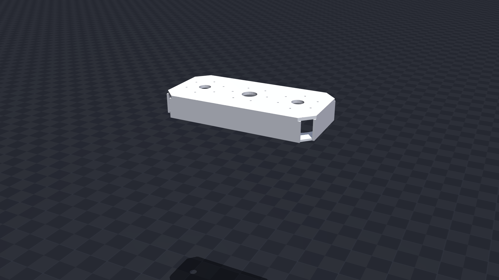

**What it is:** the robot's hip bone. It is a closed aluminium box, and the closed box makes it very stiff in twist.
Both legs hang from it and the torso sits on top of it.

- **Parts:** pelvis top plate (6 mm), walls and bottom (4 mm), tapped 8 × 8 corner bars, all 6061-T6 (laser-cut).
- **Do:** bolt the walls to the corner bars, then fit the top and bottom plates. Check that the box is square on a flat
  surface before you do the last bolts up tight. Fit the IMU (BNO085) inside the box on the centre line, with its axes
  square to the box. The simulation model puts it 50 mm above the pelvis origin (`simulation/mujoco/jx1.xml`, site `imu`),
  and the walking policy expects its axes to line up with the pelvis.
- **Check:** the Ø24 cable holes above each hip and the Ø30 waist hole in the centre of the top plate are clean and
  deburred. The cables pass through these later.
- *FEA safety factor 2.90 static / 3.44 fatigue (needs ≥ 1.5).*

### Step 2 — Hip-yaw actuators (L 11, R 41)

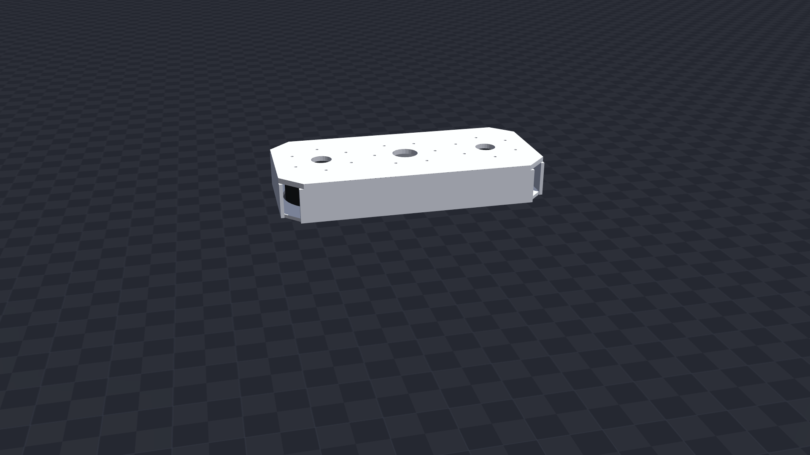

**What they do:** turn each leg left and right about a vertical axis, for turning and toe-in/out.

- **Parts:** 2 × RobStride RS06.
- **Do:** bolt each housing under the pelvis top plate with the output flange facing **down** and the axis vertical.
  The hip centres are 0.20 m apart (100 mm either side of the middle).
- **Check:** the connector points to where the CAD shows it, so the cable can go straight up through the Ø24 hole.

### Step 3 — Hip-yaw brackets

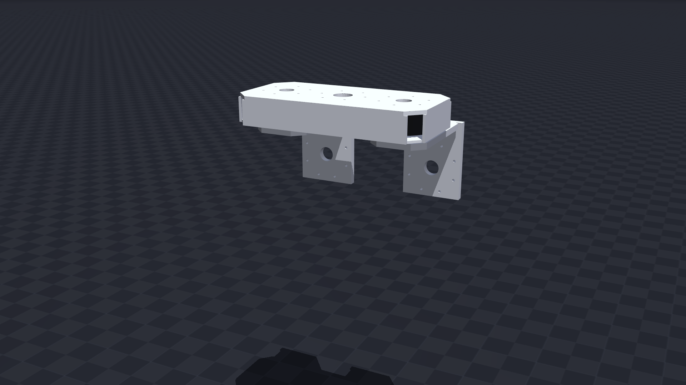

**What they are:** the most critical parts in the robot: they have the lowest safety factor of any structural part.
Each one hangs from its hip-yaw actuator and carries the whole leg below it.

- **Parts:** 2 × hip-yaw bracket, **7075-T6** (stronger than 6061), CNC-machined from 25 mm plate. Don't substitute
  6061 here: 7075 was needed to pass the FEA.
- **Do:** seat the bracket's recess on the hip-yaw output pilot and bolt it to the output flange (6 × M3).
- **Check:** turn each bracket by hand from −40° to +45° (left) or −45° to +40° (right). Nothing touches. **Toe-out
  limit:** the two bracket tails touch if both hips toe out by about 21° each at the same time. The software keeps
  (left toe-out + right toe-out) ≤ 40° (open issue [OI-24](open_issues.md)).
- *FEA safety factor 1.77 / 1.58.*

### Step 4 — Hip-roll actuators (L 12, R 42)

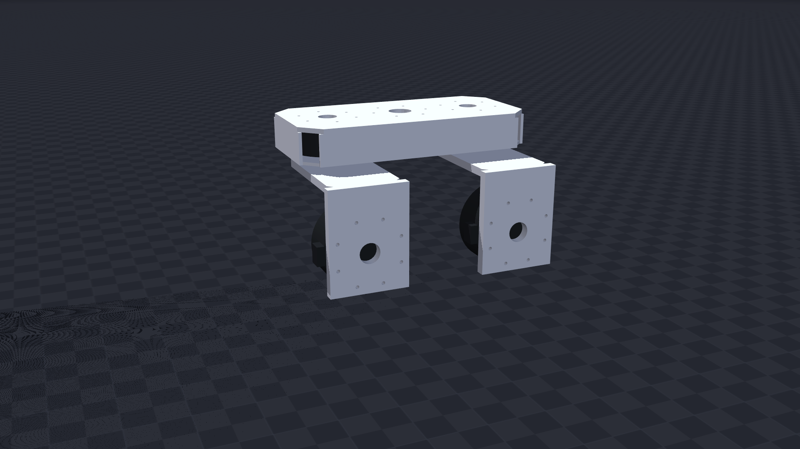

**What they do:** swing each leg out to the side. This is how the robot shifts its weight from foot to foot.

- **Parts:** 2 × RobStride RS03 (60 N·m).
- **Do:** bolt each housing into its hip-yaw bracket with the axis pointing **forward** (8 × M4).

### Step 5 — Hip-roll brackets

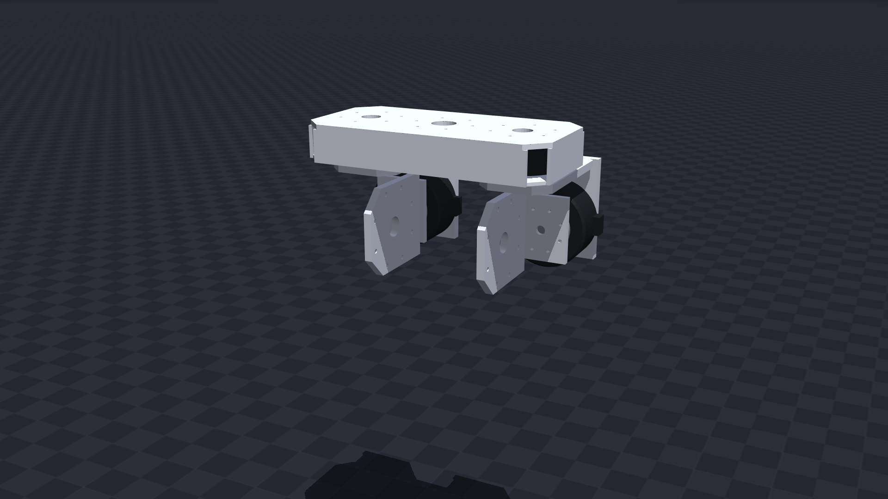

**What they are:** L-shaped brackets that turn with hip roll and hold the hip-pitch motor.

- **Parts:** 2 × hip-roll bracket, 6061-T6 8 mm + 10 mm plates dowelled to a 20 × 20 corner bar.
- **Do:** first assemble each bracket: press the dowels in, then bolt it up (M5 12.9, see *Fasteners*). Then bolt it to
  the hip-roll output flange (8 × M4).
- **Check:** the lower edge of the back plate is 40 mm below the axis. It was shortened from 45 mm because the thigh
  touched it at full hip extension. Check the part matches the drawing.
- *FEA safety factor 2.76 / 3.80.*

### Step 6 — Hip-pitch actuators (L 13, R 43)

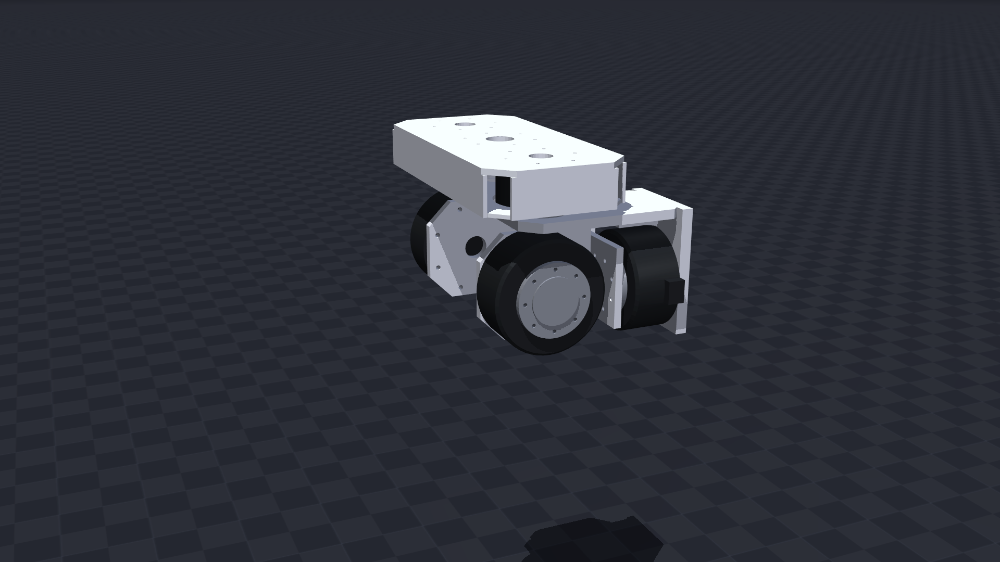

**What they do:** swing each leg forwards and backwards. These are the walking muscles, and they are among the
strongest joints in the robot.

- **Parts:** 2 × RobStride RS04 (120 N·m).
- **Do:** bolt each housing to its hip-roll bracket with the axis pointing **sideways** (8 × M5). The three hip axes
  (yaw, roll, pitch) meet at one point. This is what makes the leg maths simple.

### Step 7 — Thighs

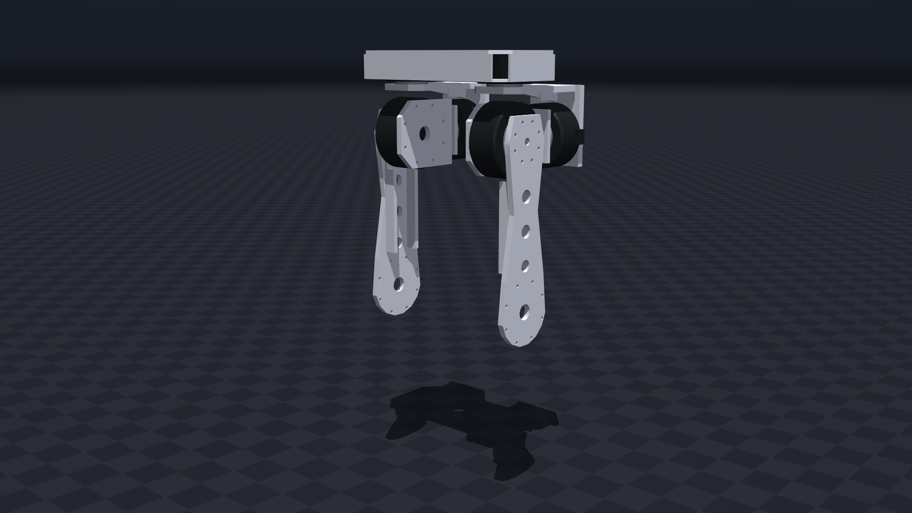

- **Parts:** 2 × thigh, 6061-T6, 0.27 m from hip axis to knee axis. It is a 10 mm plate with run-out flanges, CNC-cut
  from 30 mm plate (or 10 mm plate with bolted flange bars).
- **Do:** bolt the thigh to the hip-pitch output flange (8 × M5, on the pilot).
- **Check:** swing the thigh through −115° (knee up in front) to +35° (leg back). The back flange clears the hip-roll
  back plate.
- *FEA safety factor 2.31 / 2.78.*

### Step 8 — Knee actuators (L 14, R 44)

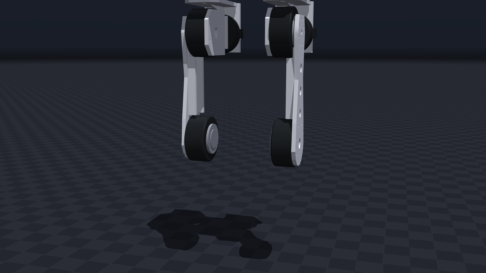

- **Parts:** 2 × RobStride RS04 (120 N·m). The knee works hardest when the robot crouches.
- **Do:** bolt each knee housing's back face to the lower end of the thigh (8 × M5). Point the connector **backwards**:
  the cable loops behind the knee, away from the pinch zone.
- **Knee range:** 0° (straight) to 120° (bent). It never bends backwards.

### Step 9 — Shins

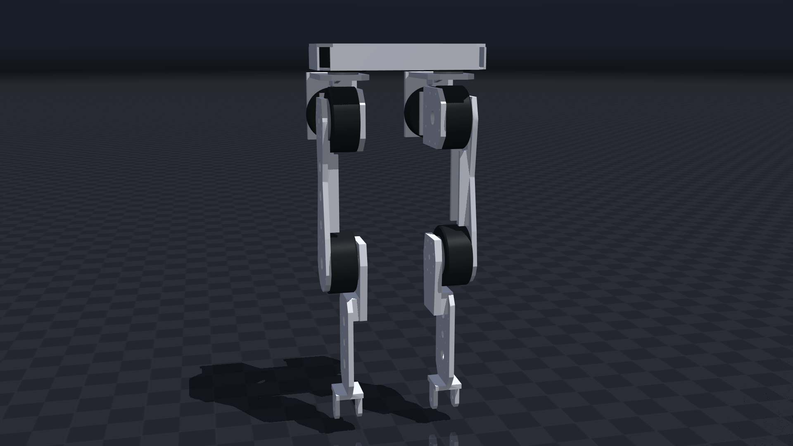

- **Parts:** 2 × shin, 6061-T6, 0.30 m. Each has a 14 mm knee plate, a machined joggle block, a 10 mm central web and
  9 mm fork tines at the bottom.
- **Do:** assemble the shin first (knee plate, joggle block, web; 4 × M5 12.9 per interface). Then bolt it to
  the knee output flange (8 × M5).
- *FEA safety factor 3.37 / 4.17.*

### Step 10 — Ankle motors and cranks (L 15/16, R 45/46)

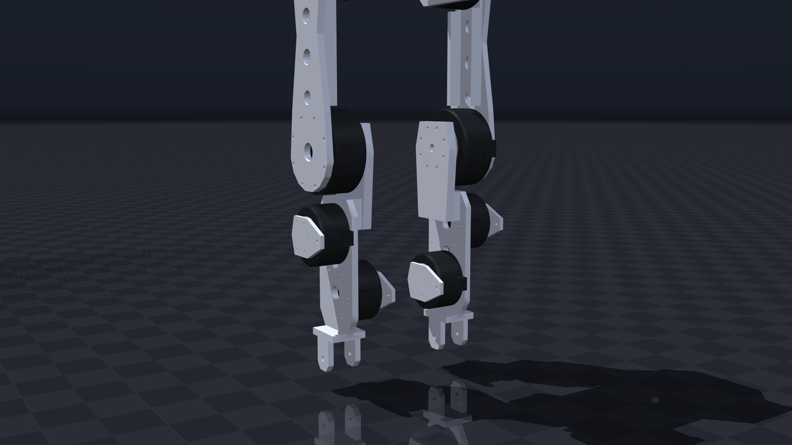

**How the ankle works:** there is no motor at the ankle itself. **Two motors sit high on the shin**, one on each side
of the web. Each drives a 50 mm crank, and each crank pushes a rod down to the foot (Step 12). Both motors turning the
same way tip the foot up and down (pitch). Opposite ways, it tilts sideways (roll). This is a **parallel ankle**. It
keeps the heavy motors near the knee, which makes the leg light at the bottom and quicker to swing.

- **Parts:** 4 × RobStride RS06 (motor A and motor B per leg), 4 × 6 mm 6061-T6 cranks.
- **Do:** bolt motor A to one side of the shin web and motor B to the other side, back faces against the web
  (6 × M3 each). Bolt a crank onto each output flange, on its pilot. Set each crank at the angle the CAD shows at the
  zero pose.

### Step 11 — Ankle cross and feet

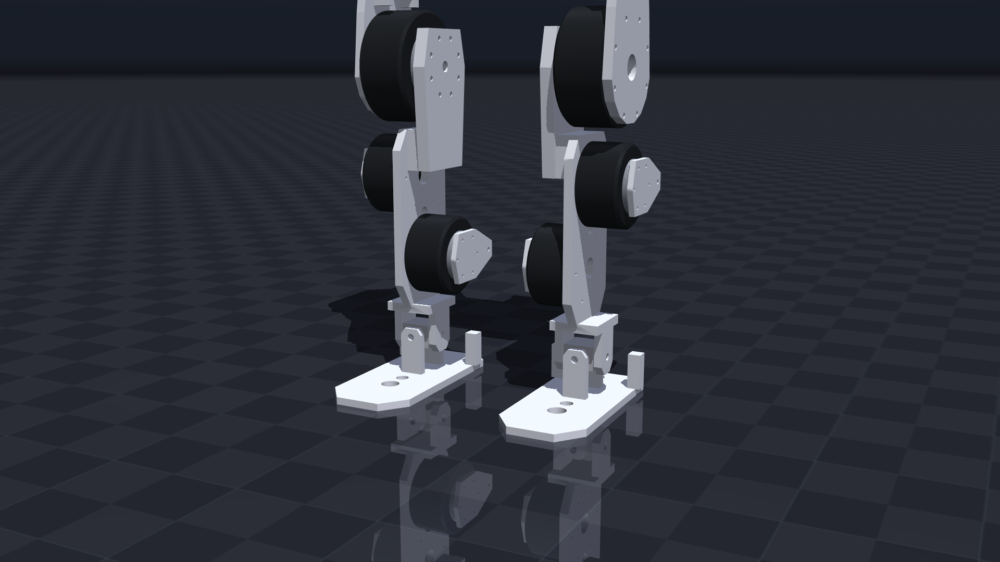

- **Parts:** 2 × ankle cross (EN8/EN24 steel, turned and cross-drilled Ø8 H7). This is a small universal joint. Needle
  bearings go in the fork and foot bores. Also 2 × foot, 6061-T6 8 mm sole with bolted clevis tines and rod posts,
  210 × 95 mm, and 4 mm rubber sole pads.
- **Do:** press the needle bearings into their bores (see the ankle-cross and foot drawings). Fit the cross between the shin fork tines (pitch axis), then fit the foot clevis
  onto the cross (roll axis). Stick the rubber pad on the sole.
- **Check:** the foot swings freely in both directions with no play you can feel.
- *FEA safety factor 3.50 / 2.03.*

### Step 12 — Push-rods

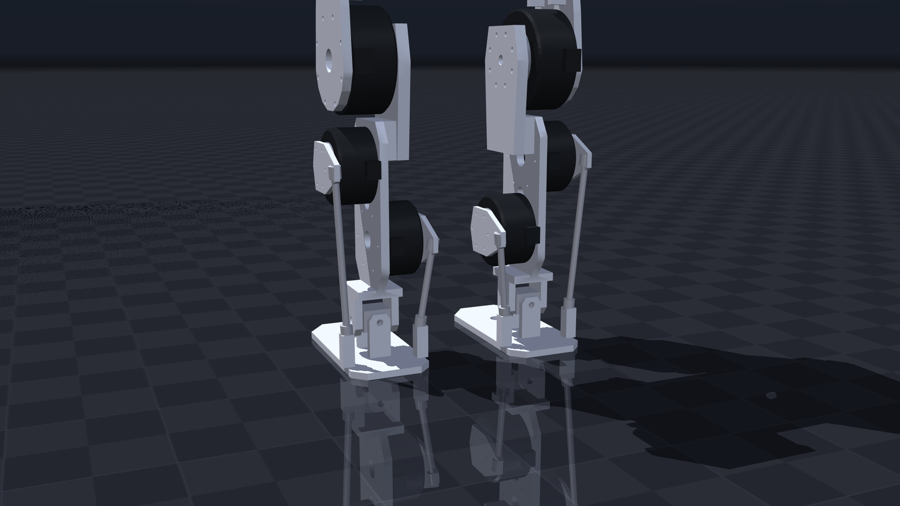

- **Parts:** 4 push-rods (Ø8 steel, two long and two short, cut to the lengths on the push-rod drawings and tapped
  M5 at both ends), 8 × M5 rod ends (POS5/PHS5 type), lock nuts.
- **Do:** screw the rod ends in, connect each rod from its crank ball stud to its foot post, and adjust the lengths
  until the foot sits **flat and square at the zero pose** with both motors at zero. Then tighten the lock nuts.
- **Check:** by hand, the foot reaches −55° to +30° pitch and ±20° roll. The ankle corner (full toe-down plus full
  tilt) is limited in software by a *coupled limit polygon*, because one rod touches motor B's housing out there
  (open issue [OI-3](open_issues.md), resolved in the controller).

**The legs are done: 12 joints.** Now is the time to route and test the leg harness (Part E, steps 1–3). Access is
much easier before the torso is on.

---

## Part B — Torso and power

### Step 13 — Waist actuator (ID 31)

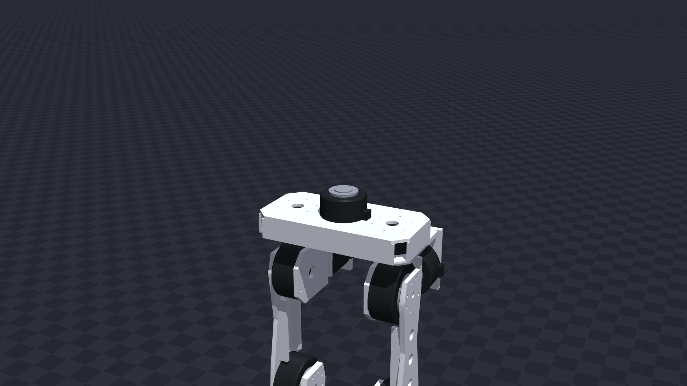

- **Parts:** 1 × RobStride RS06. It turns the whole upper body (±90°).
- **Do:** bolt the housing on top of the pelvis, over the Ø30 centre hole, with the output facing up (6 × M3). The
  waist cable goes down through the hole with 1.5 turns of slack (a "clock-spring loop"), so the waist can turn without
  pulling on it.

### Step 14 — Torso frame

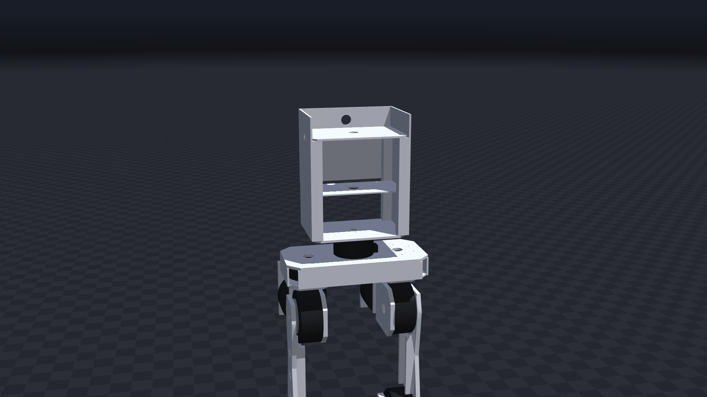

- **Parts:** 6061-T6 plates (5 / 4 / 3 mm, laser-cut, tapped) and 4 × 2020 aluminium extrusion posts.
- **Do:** build the frame on the bench: bolt the plates to the four posts and check it is square. Then bolt the bottom
  plate to the waist output flange.
- *FEA safety factor 4.44 / 3.59.*

### Step 15 — Battery and electronics

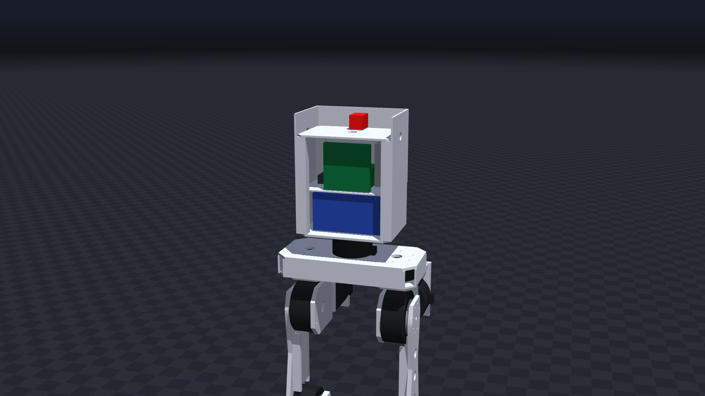

- **Parts:** 13S2P battery pack (28 × Samsung 50S cells, 41.6–54.6 V, 468 Wh) with a JBD 40 A smart BMS, Jetson Nano
  (the "brain", runs the walking policy at 50 Hz), hub board (2 × Teensy 4.1 — they talk to all the actuators over
  6 CAN buses, 500 times a second), 5 V DC-DC supply, anti-spark power switch, and the **E-stop** button on the back.
- **Do:** follow [electrical wiring](electrical_wiring.md). Battery in its bay (low, in the middle). Jetson and hub
  board above it. E-stop where you can reach it from behind the robot.
- ⚠ **Battery safety:** a 468 Wh lithium pack can start a fire if shorted. Keep the XT90-S service disconnect out
  until the wiring is checked, and never work on live 48 V wiring.

---

## Part C — Arms (4 joints each)

### Step 16 — Shoulder-pitch actuators (L 21, R 51)

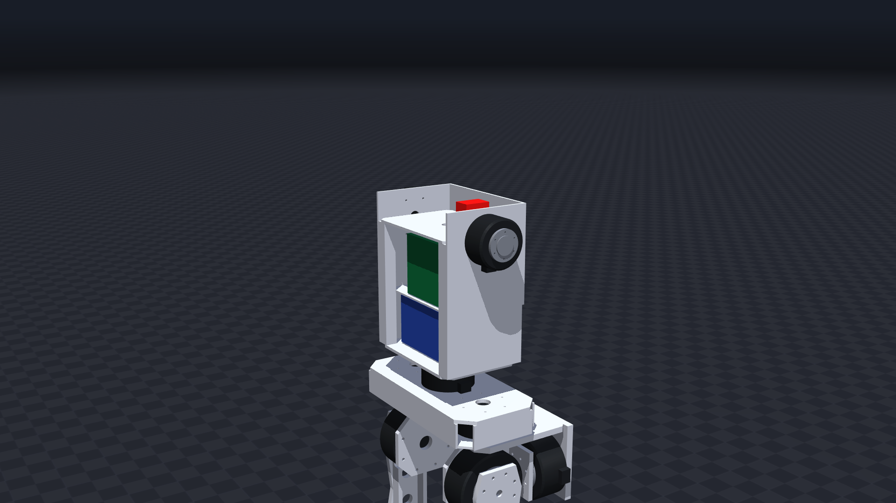

- **Parts:** 2 × RobStride RS02 (17 N·m). They swing the arms forward and back, from −170° (overhead) to +60°.
- **Do:** bolt each housing into the side of the torso frame, axis pointing sideways (6 × M3). Point the connector as
  the CAD shows: its orientation ("clocking") was corrected during verification so the cable clears the torso.

### Step 17 — Shoulder brackets and roll actuators (L 22, R 52)

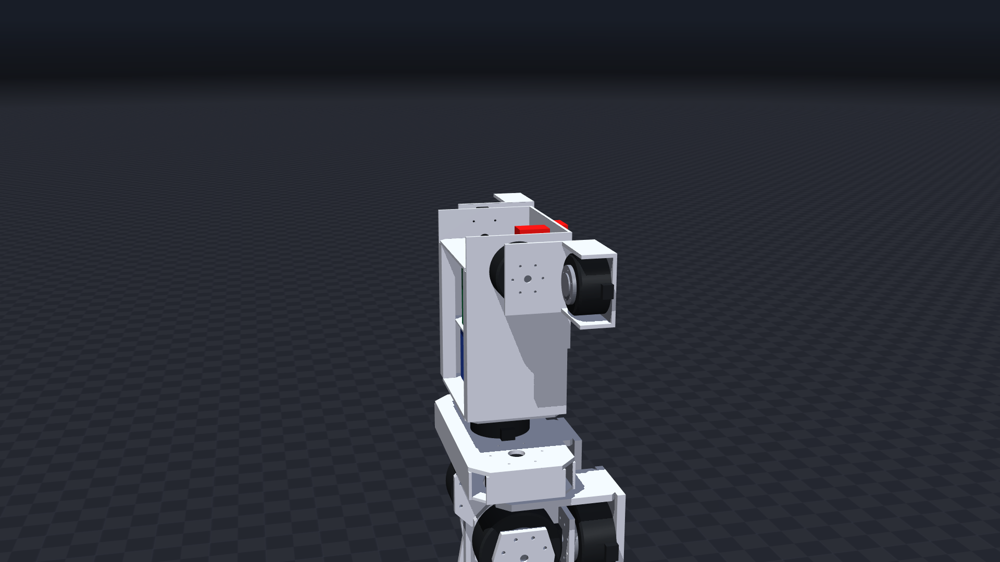

- **Parts:** 2 × shoulder-pitch U-bracket (6061-T6, 5 mm), 2 × RobStride RS02 (shoulder roll: lifts the arm out to
  the side, −10° to +150°).
- **Do:** bolt the U-bracket to the shoulder-pitch output flange, then bolt the roll actuator into the bracket with its
  axis pointing forward.

### Step 18 — Shoulder-yaw actuators (L 23, R 53)

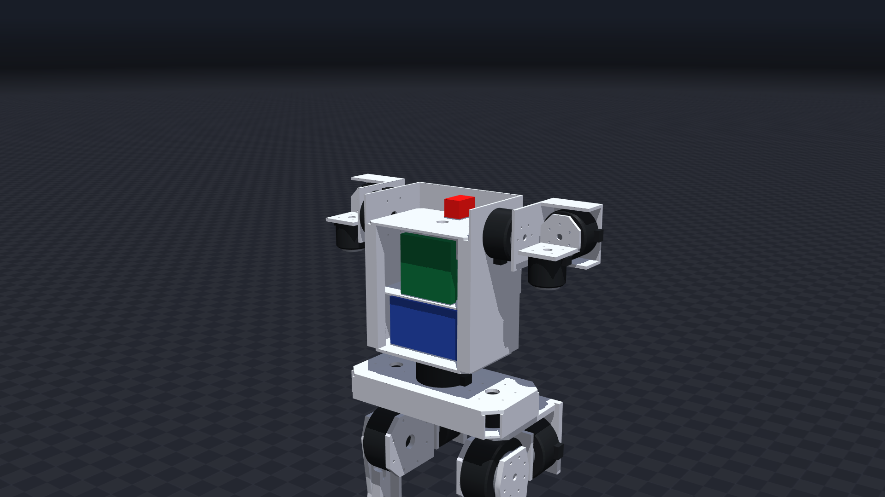

- **Parts:** 2 × shoulder-roll L-bracket (6061-T6, 6 mm), 2 × RobStride RS00 (14 N·m; twists the arm about its own
  length, ±90°).
- **Do:** L-bracket onto the roll output flange, then the yaw actuator into the L-bracket, axis pointing down the arm.

### Step 19 — Upper arms and elbows (L 24, R 54)

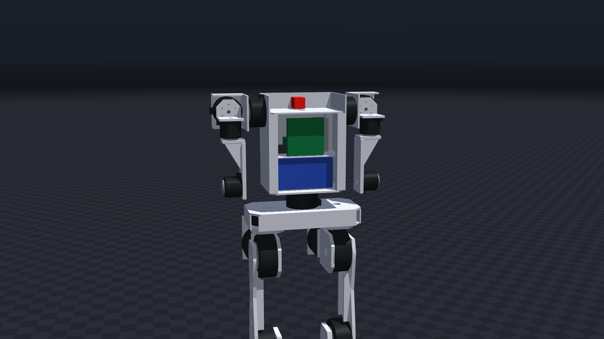

- **Parts:** 2 × upper arm (6061-T6 10 mm + 8 mm plates with two 6 mm gussets, bolted or TIG-welded) and 2 × RobStride
  RS00 elbow (−135° to +5°).
- **Do:** bolt the upper arm to the shoulder-yaw output flange. Then bolt the elbow housing to its lower end.
- *The first 6 mm upper-arm design failed the FEA (1.34 / 1.08). This one passes easily (5.99 / 4.84). Don't thin it
  down.*

### Step 20 — Forearms and grippers

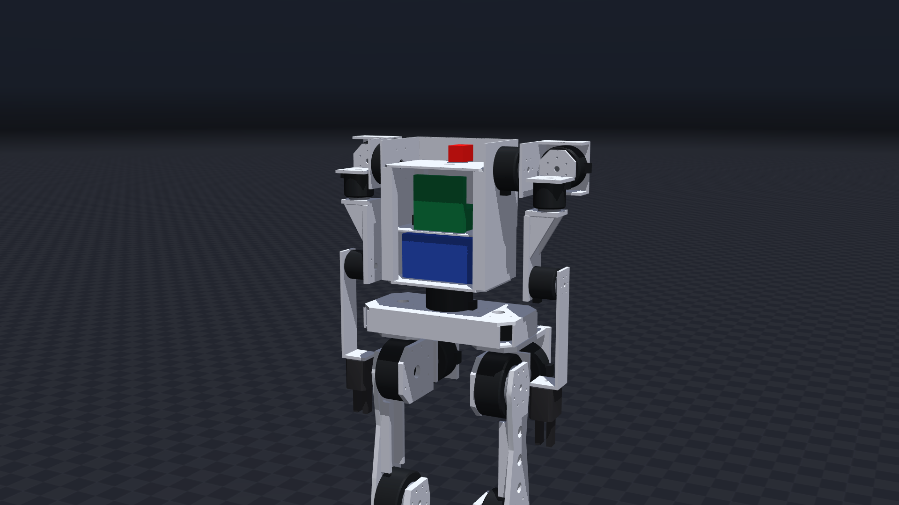

- **Parts:** 2 × forearm (6061-T6 6 mm plates, bolted), 2 × gripper (3D-printed PA-CF body with TPU pads). The gripper
  servo is deferred to a later phase.
- **Do:** bolt the forearm to the elbow output flange and the gripper to the end of the forearm.
- **Check:** move each arm through its range by hand. With the arm raised overhead, the hand must not go behind the
  head: the software limits that combination (open issue [OI-16](open_issues.md), checked in MuJoCo on the CAD shapes).

---

## Part D — Head

### Step 21 — Neck

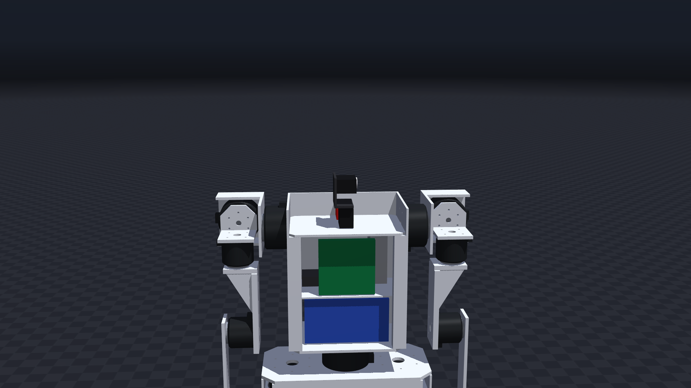

- **Parts:** 2 × Waveshare ST3215 serial bus servos (yaw, then pitch), horns, and the neck bracket (3D-printed PA-CF,
  solid).
- **Do:** yaw servo onto the torso top deck, bracket onto the yaw horn, pitch servo into the bracket. The 3-wire servo
  cable (7.4 V + data) goes through the Ø20 hole in the deck.

### Step 22 — Head and stereo camera

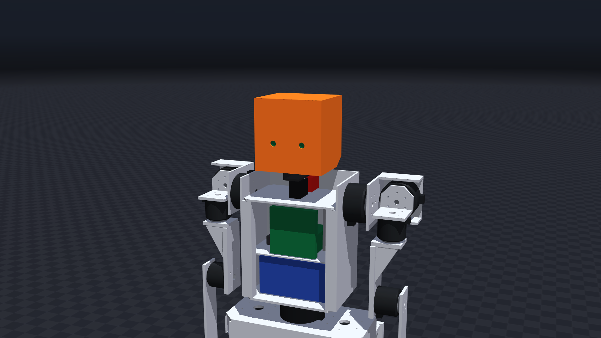

- **Parts:** head shell (3D-printed PETG-CF, 3 walls, 25 % gyroid, about 12 h on a Bambu P1S) and a Waveshare IMX219-83
  stereo camera (the robot's eyes, 2 × 8 MP).
- **Do:** camera into the front of the shell, CSI ribbon cable down to the Jetson. Then bolt the shell onto the pitch
  servo horn.

**JX1 is assembled: 87 parts, 23 joints, 1.23 m, 33.6 kg.**

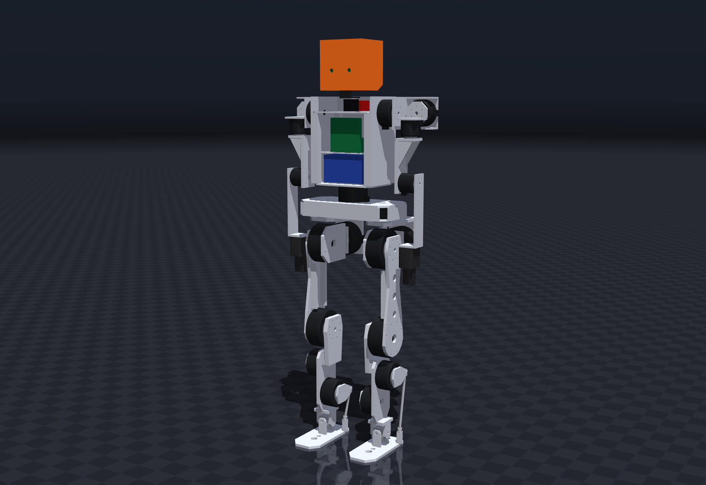

---

## Part E — After the assembly: first power-on (the safe order)

Do these in order. Don't skip ahead. Details: [electrical wiring §6](electrical_wiring.md#6-bring-up-checklist-electrical)
and [safety architecture](safety_architecture.md).

1. **Harness check without power:** check every power trunk for continuity and for shorts to the frame. Fit the 58 V
   fuses. (32 V car fuses are **not** safe on this bus.) Across CAN-H/CAN-L you should measure 60 Ω with the power off.
   That means both 120 Ω terminators are in place.
2. **First power through a current-limited supply,** not the battery. Watch the current as you connect each actuator.
3. **E-stop test:** press it. The motor power must drop, and both hubs must report `estop` and switch every joint to
   damping. Test this **before** a leg ever moves under power.
4. **Robot on a gantry or harness with its feet off the ground.** Move one joint at a time, at low gains. Record the
   zero offsets at the zero pose. Check every joint limit against `simulation/joint_map.yaml` and every motor direction
   against the firmware config (`firmware/hub/jx1_hub/config_hub_{a,b}.h`, generated from the CAD).
5. **Feet down, still on the harness:** damping mode → PD stand → weight shifts → slow walking. Use the learned
   policy (`rl/policies/jx1_walk_rough`) through `ros2 launch jx1_hw hardware.launch.py`. It was checked end-to-end
   against an emulated hub first ([rl/README.md](../rl/README.md)).

If anything is unclear or doesn't fit, it goes into [open issues](open_issues.md). That list is how this design gets
better.
