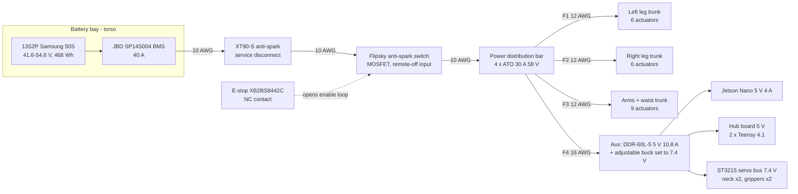

# JX1 electrical wiring (v0.4, 2026-09-24)

Scope: power distribution, CAN harness, logic power, E-stop circuit, hub pin map and harness routing. Architecture and
safety rationale: [architecture.md](architecture.md), [safety_architecture.md](safety_architecture.md). Actuator
connector facts are VERIFIED from the RobStride manuals (rev. 260713): **one XT30 power input** (board XT30APW-M, cable
XT30UW-F) and **one JST-GH 1.25 2-pin CAN connector (CAN-H, CAN-L; no ground pin — reference via the power return)** per
actuator. Nothing here has been built; wire gauges and fuse sizes are CALCULATED from the power budget
(`calculations/results/iter1_B_knee_and_pitch_RS04/power_budget.json`).

## 1. Power tree

| Segment | Current basis | Conductor | Protection | Label |
|---|---|---|---|---|
| Pack → BMS → XT90-S → switch → bar | 23 A peak (967 W at 41.6 V, fast gait), 40 A BMS continuous limit | 10 AWG silicone, ≤ 250 mm | BMS 40 A electronic | CALCULATED |
| Leg trunk F1 / F2 | ≤ 11 A per leg at the fast-gait peak (≈ 45 % of 967 W); transients to 30 A | 12 AWG silicone trunk | ATO 30 A **58 V** (Littelfuse 0891030.NXS) | CALCULATED |
| Arms + waist trunk F3 | 4 × RS02 + 4 × RS00 + RS06; ≤ 6 A typical, 20 A worst transient | 12 AWG | ATO 30 A 58 V | CALCULATED |
| Actuator drop (trunk splice → XT30UW-F) | single actuator DC current ≤ 15 A (RS04 ≈ 600 W mechanical at 42 V) | 16 AWG, ≤ 300 mm | trunk fuse | CALCULATED |
| Aux F4 | DDR-60L-5 60 W + 7.4 V servo buck ≤ 40 W → ≤ 3 A at 41.6 V | 16 AWG | ATO 30 A 58 V (conductor-limited: fit 5 A) | CALCULATED |

Rules: 32 V automotive fuses are **not** acceptable on the 54.6 V bus; every trunk is a spliced daisy chain (solder +
adhesive heat-shrink, or Wago-style 221 splices inside the pelvis/torso only); drops are strain-relieved at the actuator
with a P-clip to the bracket; all 48 V wiring is silicone-insulated (flex at joints) with red/black colour coding.

## 2. CAN harness (6 buses, classic CAN 1 Mbit/s, 29-bit IDs)

| Hub / bus | Nodes in chain order (CAN ID) | Chain length | Termination |
|---|---|---|---|
| A / CAN1 | L hip yaw (11) → L hip roll (12) → L hip pitch (13) | ≈ 0.6 m | 120 Ω on the hub board + 120 Ω at L hip pitch |
| A / CAN2 | L knee (14) → L ankle A (15) → L ankle B (16) | ≈ 1.1 m | hub + L ankle B |
| A / CAN3 | waist (31) → L shoulder pitch (21) → roll (22) → yaw (23) → elbow (24) | ≈ 1.0 m | hub + L elbow |
| B / CAN1 | R hip yaw (41) → R hip roll (42) → R hip pitch (43) | ≈ 0.6 m | hub + R hip pitch |
| B / CAN2 | R knee (44) → R ankle A (45) → R ankle B (46) | ≈ 1.1 m | hub + R ankle B |
| B / CAN3 | R shoulder pitch (51) → roll (52) → yaw (53) → elbow (54) | ≈ 0.9 m | hub + R elbow |

IDs, bus assignment, motor signs and limits are generated from the kinematic contract and the verified CAD
(`tools/gen_firmware_config.py` → `firmware/hub/jx1_hub/config_hub_{a,b}.h`). Twisted pair (≈ 33 twists/m, 26 AWG), stub from
the trunk to each GH1.25 ≤ 0.15 m. **Ground reference:** the RobStride CAN connector has no ground pin, so the hub board's
logic ground is tied to the battery negative at a single star point on the power bar (keeps the TJA1462 common-mode range
−12…+12 V). Bus load at 500 Hz with ≤ 3 leg joints per bus ≈ 45 % (5 arm joints: ≈ 75 %, arms run at 250 Hz).

## 3. Hub board (JX1 carrier PCB, 2 × Teensy 4.1)

| Signal | Teensy 4.1 pin | Hub A | Hub B | Notes |
|---|---|---|---|---|
| CAN1 TX/RX | 22 / 23 | left hip | right hip | TJA1462AT, 120 Ω jumper |
| CAN2 TX/RX | 1 / 0 | left knee + ankle | right knee + ankle | TJA1462AT |
| CAN3 TX/RX | 31 / 30 | left arm + waist | right arm | TJA1462AT (CAN-FD capable controller, used as classic CAN) |
| E-stop sense | 2 (INPUT_PULLUP) | ✓ | ✓ | E-stop auxiliary NC contact to GND: **HIGH = pressed or wire broken → damping** (fail-safe) |
| IMU BNO085 | SPI0 10/11/12/13 + INT 9 | ✓ | — | 400 Hz rotation vector |
| Servo bus | Serial1 1-wire half duplex via SmartElex bus-servo driver | — | ✓ | ST3215 neck yaw/pitch (+ grippers, phase 3) at 7.4 V |
| FSR foot pads | A0–A3 (+ A4–A7 hub B) | ✓ | ✓ | phase 2, 4 per foot |
| Host | native USB 480 Mbit/s | ✓ | ✓ | to the Jetson (binary protocol with CRC16, `firmware/hub/jx1_hub/jx1_hub.ino`) |

## 4. E-stop circuit (fail-safe, two independent paths)

1. **Power path:** the XB2BS8442C NC contact is wired in series with the Flipsky anti-spark switch's remote on/off loop — pressing
   (or a broken wire) opens the loop and the switch removes the 48 V motor bus. The logic rail (DDR-60L-5 on F4, upstream of
   the switch? **no** — F4 is fed from the bar **downstream** of the switch only for the servo buck; the Jetson/hub 5 V supply is
   fed **upstream** of the switch through its own 5 A fuse so that logging and state estimation survive an E-stop).
2. **Signal path:** a second NC contact block on the same operator (XB2 accepts stacked contact blocks) drives both hubs' pin 2;
   the firmware switches every joint to damping (Kd = 2 N·m·s/rad) and latches until the host re-arms.

Expected behaviour: the robot goes limp within one 2 ms bus period (signal path) and loses motor power within the switch's
turn-off time (power path). **All bring-up happens on a gantry/harness** ([safety_architecture.md](safety_architecture.md)).

## 5. Routing through joints

| Joint | Cable path | Provision |
|---|---|---|
| Hip yaw (±45°) | trunk passes through the Ø24 bore in the pelvis top plate above each hip | 90 mm service loop, spiral wrap |
| Hip roll / pitch | along the back of the hip-yaw bracket keel, then down the hip-roll back plate | loops sized for −25…45° roll and −115…35° pitch; P-clips on the aluminium plates |
| Knee (0…120°) | along the thigh's back flange, loop behind the knee housing (connector zones face backwards) | ≥ 100 mm loop; no cable in the knee pinch zone |
| Ankle | along the shin web to motors A/B; nothing crosses the ankle joint (motors are on the shin) | — |
| Waist (±90°) | centre Ø30 bore in the pelvis top plate / Ø14 in the torso bottom plate | clock-spring loop, 1.5 turns |
| Shoulders / elbows | along the shoulder brackets and upper-arm plates | spiral wrap; loops sized for the full CAD ranges |
| Neck | through the deck Ø20 hole to the ST3215 chain | 7.4 V + half-duplex data 3-wire servo cable |

## 6. Bring-up checklist (electrical)

1. Continuity + insulation test of every trunk before any actuator is connected; verify 58 V fuses fitted.
2. Pack on the bench through the BMS with a current-limited supply for the first power-up of the power bar.
3. One actuator at a time on the bench USB-CAN adapter (Waveshare USB-CAN-A): set CAN ID, read feedback, check fault flags.
4. Hub A with one bus populated; confirm 120 Ω termination (60 Ω measured across CAN-H/CAN-L with power off).
5. E-stop test: both paths (motor bus drops, hubs report `estop` and damping) before any leg is powered on the robot.
