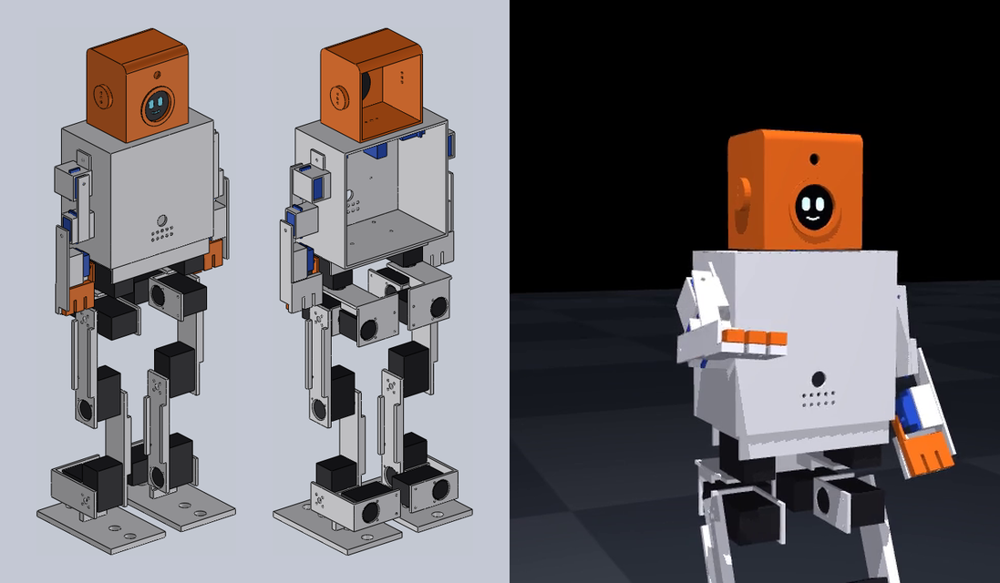
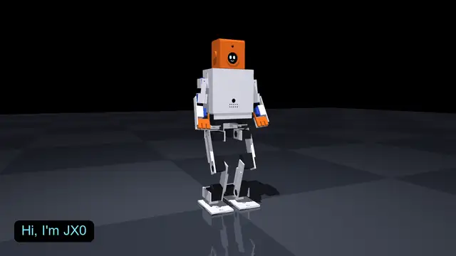
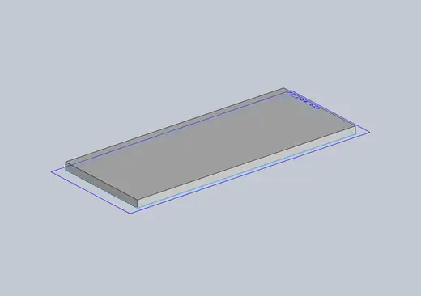

<p align="center">
  
</p>

<h1 align="center">JX0: a walking, talking humanoid for under ₹50,000</h1>

<p align="center">
  <b>52 cm · 2.07 kg · 21 servos · walks, turns, side-steps · talks (Claude) · round-screen face · two gripper hands ·
  ₹47,106 in parts</b><br>
  3D-printed PETG, hobby servos and a Raspberry Pi. Full SolidWorks CAD, a verified walking simulation, the robot
  program and a parts list with Indian suppliers are all in this folder.
</p>

<p align="center">
  <a href="docs/build_guide.md"><b>Build guide</b></a> ·
  <a href="bom/jx0_bom.csv"><b>Parts list</b></a> ·
  <a href="bom/JX0_cost_estimate.pdf"><b>Cost estimate (PDF)</b></a> ·
  <a href="docs/wiring.md"><b>Wiring</b></a> ·
  <a href="docs/bringup.md"><b>Bring-up</b></a> ·
  <a href="docs/software_setup.md"><b>Software</b></a> ·
  <a href="#try-it-on-your-pc">Try it on your PC</a>
</p>

---

## Watch it

<p align="center">
  <a href="results/images/jx0_demo.mp4"></a><br>
  <sub><b><a href="results/images/jx0_demo.mp4">Demo film (MP4, 33 s)</a></b>: the real robot program (<code>software/jx0bot</code>, the
  same code that runs on the Pi) drives the CAD robot in MuJoCo. It waves, looks around, takes and gives with its gripper
  hands, nods, walks and turns, and never tips: the body stays within 0.9° of upright, apart from the deliberate 8° bow
  for "yes".</sub>
</p>

<p align="center">
  <br>
  <sub>Built in SolidWorks by script (<code>cad/build_cad.py</code>, <code>cad/build_assembly.py</code>). Timelapses:
  <a href="../media/jx0_cad_timelapse.mp4">all parts + assembly</a> ·
  <a href="../media/jx0_cad_timelapse_hands_face.mp4">the hands and face upgrade</a>.</sub>
</p>

## Why JX0 exists

[JX1](../README.md) is the full-size robot (1.23 m, about ₹7 lakh in parts), well beyond a student budget. JX0 is the
**minimum viable humanoid**: small enough to print at home, cheap enough to build on a student budget, and able to show
what the project is about. It walks, talks, has a face, and uses its hands. It reuses JX1's design pipeline (gait
planner, inverse dynamics, servo sizing, simulation), so the work carries over when there is money for JX1.

## Honest status

| | Status |
|---|---|
| SolidWorks CAD: 23 printed parts + 46-component assembly | **done**, every part rebuilt by script, no errors |
| Servo sizing (every leg joint, 5 gaits + static cases) | **passes**; tightest is hip roll with a 1.89× margin |
| Walking in simulation, on the CAD masses and a hobby-servo model | **14 of 14 gaits pass** (forward 0.067 m/s, backward, turns, side-steps) |
| Robot program (voice, Claude brain, face, all actions) | **written and run in simulation**; not yet on hardware |
| Parts list | ₹47,106, prices checked 2026-09-24 |
| Physical robot | **not built yet**: this is what the funding is for |

Unverified until the robot is built (and the first things to check): the servo stiffness setting, the M2 screw
fit in the printed holes, the GC9A01 display driver on the Pi, the I2S audio overlay, and battery life (about 20–30 min
of walking, ESTIMATED).

## What it can do

| Ask it… | It… |
|---|---|
| "Hi!" / any question | answers out loud in one to three sentences (Claude), and the mouth on its screen moves with its voice |
| "Wave at me" | raises an arm and waves with the hand open, with happy ^ ^ eyes |
| "Walk forward five steps" / "go back" / "step left" | plays the gait blocks verified in simulation, with IMU balance on the stance leg |
| "Turn around" | repeats 10° turn blocks until the IMU says it has turned far enough (in simulation 40° → 39°, −90° → −89°) |
| "Take this" / "give it back" | holds out its hand, opens it, waits 3 s, grips, carries; or holds out and lets go |
| "Look left" / "yes or no?" | turns its head; bows for yes, shakes its head for no |

## JX0 at a glance

| | |
|---|---|
| Height, mass | 51.7 cm, 2.07 kg (CAD) |
| Legs | 6 joints each (hip yaw, roll, pitch, knee, ankle pitch, roll): **Feetech ST3215-C018 12 V** serial bus servos, 30 kg·cm stall |
| Arms | shoulder pitch and roll, elbow, **gripper hand** (three-finger claw): **MG90S** micro servos |
| Head | neck yaw (MG90S), **1.28" round GC9A01 screen as the face**, OV5647 camera |
| Brain | Raspberry Pi 4 (2 GB): gaits at 50 Hz, MPU6050 balance, Vosk speech recognition, Piper voice, Claude over Wi-Fi |
| Power | 3S 2200 mAh LiPo; leg servos straight off the pack, 5 V converters for the Pi and the micro servos |
| Structure | PETG, 23 printed pieces, 379 g |

## What it costs

| Group | ₹ |
|---|---|
| Servos: 12 × ST3215 + 9 × MG90S | 30,144 |
| Electronics: Pi 4, microSD, servo driver, button, wiring | 9,219 |
| Power: LiPo, charger, converters, switch, wire, alarm | 3,187 |
| Structure: PETG, screws, inserts, rubber | 3,072 |
| Face: round display + camera | 788 |
| Voice: microphone, amplifier, speaker | 569 |
| Sensors: IMU | 127 |
| **Total** | **47,106** |

Line by line with store links: [bom/jx0_bom.csv](bom/jx0_bom.csv). The 12 leg servos are 62 % of the cost. The
sizing needs 1.56 N·m of peak torque at the hip roll (with the 1.5× margin), which rules out MG996R-class hobby servos,
and the serial bus servos also report their position, which the calibration and the balance loop use.

## How it works, in plain words

- **Walking.** A planner (the same one designed for JX1) works out where the body's balance point must be at every
  instant for a given step length and speed, then computes the 12 joint angles 50 times a second. Those trajectories
  were run on a physics model of this exact robot, with a model of how hobby servos really behave (they bend a little
  under load and slow down when pushed hard). Only the gaits that passed are shipped in `software/jx0bot/gaits/`. On the
  robot, the IMU corrects the ankles and hips as it walks.
- **Talking.** A button (or "hey robot") starts listening. Vosk turns speech into text on the Pi itself. Claude writes
  a short spoken reply and can call the robot's actions as tools. Piper speaks the reply, sentence by sentence, while
  the face's mouth follows the loudness.
- **Hands.** Each forearm ends in a palm with three fingers, and an MG90S swings a matching three-finger claw against
  it. It is enough to hold a pen, a paper ball or a small toy (about 4 N of grip, ESTIMATED).

## Try it on your PC

No hardware needed. Install the packages, then talk to the simulated robot by typing:

```bash
pip install -r jx0/software/requirements-pc.txt
```

```bash
cd jx0/software && python -m jx0bot.main --sim --text
```

(It needs an `ANTHROPIC_API_KEY`. Without one, `python jx0/sim/demo_jx0.py` still renders the demo film, and
`python jx0/sim/walk_jx0.py` reruns every walking check.)

## How it was designed and checked

| Step | Tool | Result |
|---|---|---|
| Design point: sizes, masses, joint ranges | [design_point.yaml](design_point.yaml) | every value labelled VERIFIED / CALCULATED / ESTIMATED / ASSUMED |
| Servo sizing | [analysis/sizing.py](analysis/sizing.py) → [results/sizing.md](results/sizing.md) | peak ×1.5 ≤ stall, RMS ×1.3 ≤ rated, inside the torque-speed line: **all pass** |
| CAD | [cad/geometry.py](cad/geometry.py) → SolidWorks by script | 23 printed parts, 46-component assembly, masses fed back into the design point |
| Walking | [sim/walk_jx0.py](sim/walk_jx0.py) → [results/walking.json](results/walking.json) | 14/14 gaits: tilt ≤ 0.8°, final position error ≤ 7 mm, servo peaks ≤ 79 % of stall |
| Whole robot program | [sim/demo_jx0.py](sim/demo_jx0.py) | every action runs on the simulated robot; body tilt ≤ 0.9° (apart from the 8° bow) |

| Gait | Speed | Distance plan → sim | Heading error | Max tilt | Peak servo load |
|---|---|---|---|---|---|
| forward (10 steps) | 0.067 m/s | 0.340 → 0.341 m | −0.1° | 0.8° | 78 % |
| forward slow | 0.050 m/s | 0.195 → 0.198 m | 0.0° | 0.8° | 76 % |
| backward | 0.042 m/s | 0.163 → 0.156 m | 0.0° | 0.8° | 76 % |
| turn left 70° / right 70° | — | — | −1.1° / +1.0° | 0.8° | 76 % |
| side-step left | — | 0.075 → 0.074 m | 0.0° | 0.8° | 74 % |

## Folder map

| Path | What |
|---|---|
| `design_point.yaml` | the numbers everything else reads |
| `analysis/` | servo sizing |
| `cad/` | geometry, SolidWorks build scripts, `parts/*.SLDPRT`, `JX0_Robot.SLDASM`, `stl/` for printing |
| `sim/` | MuJoCo model, walking checks, demo film |
| `software/jx0bot/` | the robot program (see [software_setup.md](docs/software_setup.md)) |
| `bom/` | parts list |
| `docs/` | build guide, wiring, bring-up, software setup |
| `results/` | sizing and walking results, images and films |
