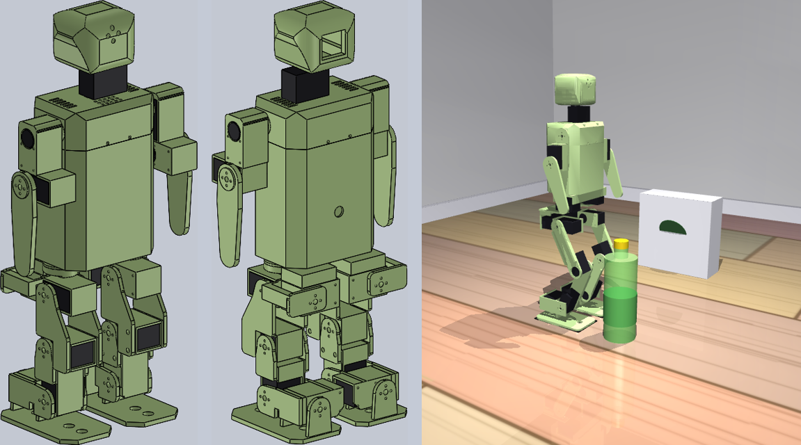
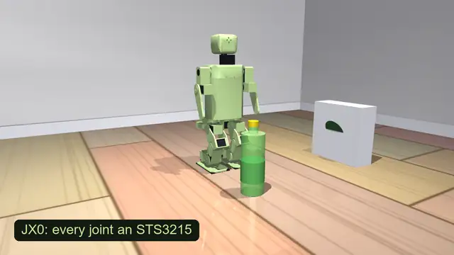
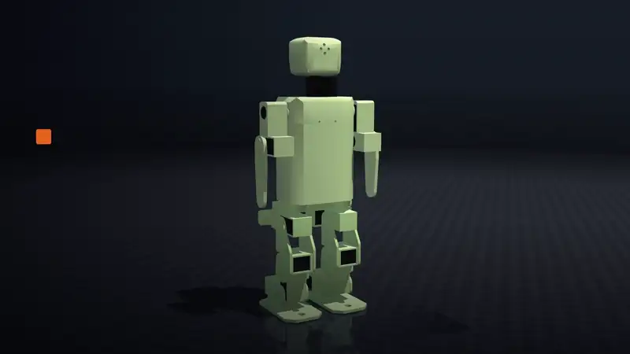
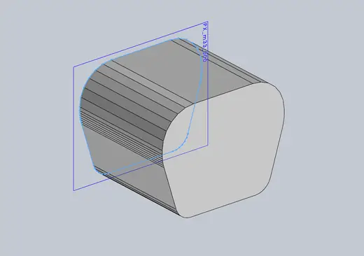
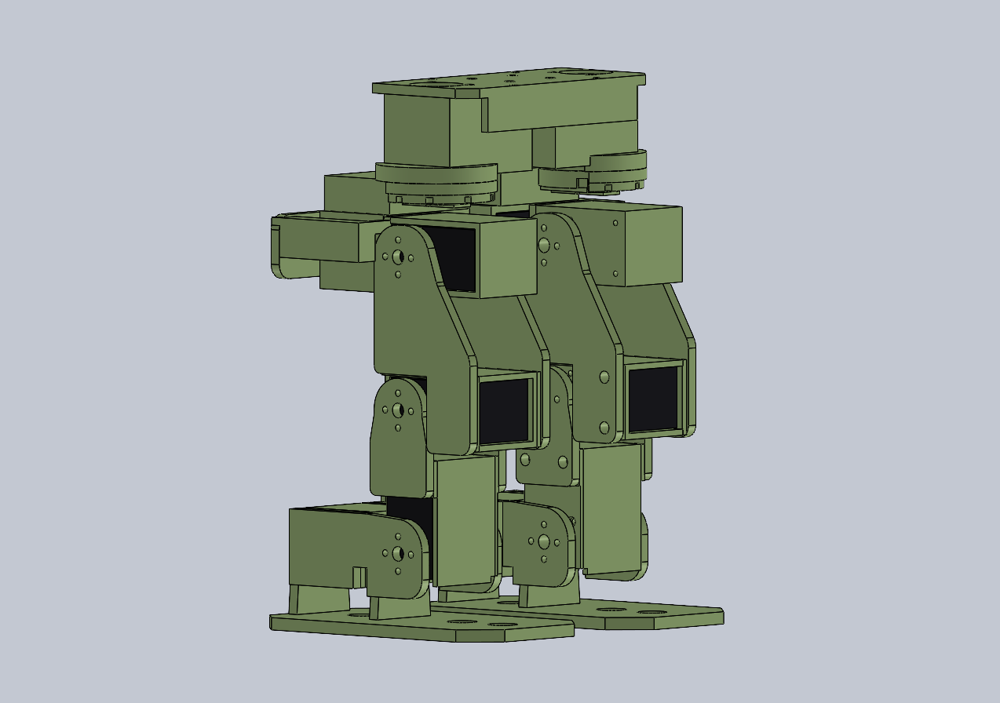

<p align="center">
  
</p>

<h1 align="center">JX0: a walking, talking STS3215 humanoid you can build at home</h1>

<p align="center">
  <b>46 cm · 2.88 kg · 17 joints, every one a Feetech STS3215 12 V · double-sided leg joints · walks with its arms
  swinging · talks (Claude) · ₹58,215 in parts</b><br>
  3D-printed in pastel green, styled after a friend's working STS3215 robot. Full SolidWorks CAD, a verified walking
  simulation, a strength check of every leg part, the robot program and a parts list with Indian suppliers are all in
  this folder.
</p>

<p align="center">
  <a href="docs/build_guide.md"><b>Build guide</b></a> ·
  <a href="bom/jx0_bom.csv"><b>Parts list</b></a> ·
  <a href="bom/JX0_cost_estimate.pdf"><b>Cost estimate (8-page PDF)</b></a> ·
  <a href="../media/jx0_assembly.mp4"><b>Assembly film</b></a> ·
  <a href="docs/wiring.md"><b>Wiring</b></a> ·
  <a href="docs/bringup.md"><b>Bring-up</b></a> ·
  <a href="docs/software_setup.md"><b>Software</b></a> ·
  <a href="results/verification.md"><b>Verification</b></a> ·
  <a href="#try-it-on-your-pc">Try it on your PC</a>
</p>

---

## Watch it

<p align="center">
  <a href="results/images/jx0_demo.mp4"></a><br>
  <sub><b><a href="results/images/jx0_demo.mp4">Demo film (MP4)</a></b>, staged like the reference video: JX0 walks on
  a wooden floor with its arms swinging, waves, takes a hard 0.96 N·s shove from the side and keeps going (in the
  <a href="results/verification.md">verification</a> it stays up through all 48 such shoves, timed across a whole
  step), and bumps a plastic bottle out of its way. The robot's own program (<code>software/jx0bot</code>, the same code that runs
  on the Pi) drives the SolidWorks robot in MuJoCo; the push and the bottle are plain physics.</sub>
</p>

## Watch it go together

<p align="center">
  <a href="../media/jx0_assembly.mp4"></a><br>
  <sub><b><a href="../media/jx0_assembly.mp4">Assembly film (MP4, 67 s)</a></b>: every SolidWorks part of JX0 flies into
  place in the order of the <a href="docs/build_guide.md">build guide</a>, 13 steps from the pelvis to the head, then the
  finished robot walks its verified gait. Rendered from the real part meshes (<code>tools/media/assembly_film_jx0.py</code>,
  MuJoCo) with HyperFrames titles (<code>media/jx0-assembly-film</code>), like the JX1 film. A still of every step:
  <code>docs/assembly/</code>.</sub>
</p>

<p align="center">
  <br>
  <sub>Built in SolidWorks by script (<code>cad/build_cad.py</code>, <code>cad/build_assembly.py</code>). The timelapses
  show the earlier single-sided legs: <a href="../media/jx0_cad_timelapse_v03.mp4">v0.3 (81 s)</a> ·
  <a href="../media/jx0_cad_timelapse.mp4">every version up to v0.3 (117 s)</a>.</sub>
</p>

## The legs: double-sided, like the reference robot

<p align="center">
  
</p>

A servo joint can hold the next part in two ways:

- **Single-sided** (JX0 v0.3): the next part is one plate screwed to the servo's output horn. Every step bends that
  plate and the servo's output shaft. The plate is a cantilever, and printed plastic tires quickly when it is bent
  back and forth.
- **Double-sided** (v0.4, the reference robot): the STS3215 has a second, passive hub on its back face. The next part
  is a **U-bracket** with one arm on the horn and one on the rear hub, and the servo's body sits in a **cage** on the
  part before. The bending becomes a pair of forces in two arms 43 mm apart, and the servo's shaft is not bent at all.

The check (`verify/verify_strength.py`, `verify/verify_fea.py`) uses the loads from the walking simulation, every
10 ms, including 48 hard pushes and 42 walks on a randomly wrong robot model:

| | v0.3 single-sided plates | v0.4 U-brackets |
|---|---|---|
| Printed plate stress, walking | 30–85 MPa | 2–5 MPa |
| Fatigue safety factor (PETG ~15 MPa at 10⁶ cycles, ASSUMED) | **0.21–0.48: would crack** | **4.4–7.5** (beam model) |
| Servo output shaft bending (worst) | 2.3–3.6 N·m at every joint | none at the U-brackets; 0.55 N·m at the hip yaw (keeper) |
| Finite elements, every printed leg part | — | fatigue safety factor **2.1 or more**, strength **3.0 or more** |

The **hip yaw** cannot be a U-bracket: its servo stands under the body, as on the reference robot, with the hip-roll
servo right below it. So the pelvis holds the yaw disc from both sides instead:
- a **thrust ring** above the disc;
- a printed **keeper** below it, one per leg, whose lip runs under the disc's 3 mm flange. Four M2 screws clamp it to a
  boss on the pelvis.

The ring and the keeper take the leg's weight and bending as two pushes on the disc's rim, instant by instant
(`robustness.keeper_split`). The yaw servo's shaft is left with:

| | Normal walking | Hardest pushes |
|---|---|---|
| Thrust ring alone | 1.2 N·m | 2.6 N·m |
| Thrust ring + keeper | **0.10 N·m** | **0.55 N·m** |

This assumes the keeper has no play: layers of PTFE tape under the flange set it at assembly
([build guide](docs/build_guide.md), step 2). The keeper, the disc and the pelvis passed their own finite-element
checks (fatigue / strength: keeper 2.1 / 5.2, disc 2.4 / 3.6, pelvis 2.4 / 5.1). The hip yaw turns ±12°, more than
twice what the gaits use.

## The reference robot

JX0 copies a friend's robot: a small biped printed in pastel green with **every joint a 12 V STS3215**, a faceted
body, an exposed neck servo under a soft rounded head, and flat blade arms that swing as it walks. It walks steadily,
takes a shove, and knocks over a bottle on the way. JX0 matches that:

| On the reference robot | On JX0 v0.4 |
|---|---|
| 12 V STS3215 in every joint | 17 × Feetech STS3215 12 V (Evelta lists it as ST3215-C018, dual shaft), all on one serial bus |
| leg servos held on both faces: caged servo bodies, wide angled U-brackets, cross-pattern horn screws | the same: every leg pitch and roll joint is a cage + U-bracket on the horn and the rear hub |
| short legs under a wide body, hip servos hidden under it | 62 mm thigh, 58 mm shin; a skirt on the torso hides the hip-yaw servos |
| chamfered foot plates | chamfered 124 × 70 mm soles with a 1 mm rubber pad |
| pastel green print | eSun PLA-Matte Mint Green for the body; green PETG for the leg parts, which carry every step |
| faceted torso, vents on top, seam below the shoulders | octagonal torso with chamfered vertical edges; lower shell + chest cap with chamfered top edges, vent slots and a speaker grille |
| black neck servo exposed under the head | neck STS3215 standing on the chest cap |
| soft rounded head with four holes | rounded head, narrower at the chin, four holes in a diamond (the microphone listens through them) |
| shoulder servo in a bracket outside the chest, flat tapered arm | shoulder STS3215 in a hood outside the chest, elbow STS3215 in a box below it, a flat 6 mm paddle blade |
| walks with the arms swinging, takes a shove | gaits verified with a 1.6× counter-swing; stays up through every push up to 0.96 N·s ([verification](results/verification.md)) |
| runs off a 12.6 V bench supply | 3S LiPo, or a 12.6 V bench supply on the same XT60 |

## Honest status

| | Status |
|---|---|
| SolidWorks CAD: 22 printed parts + all 17 servos in the assembly | **done**, every part rebuilt by script, one body each, no errors |
| Parts colliding, standing or in motion (every gait frame and action, 1,373 poses; every joint over its full range) | **none** |
| Servo sizing (every leg joint, 5 gaits + 8 static cases), 2.88 kg robot | **passes**; the tightest is hip roll with a 1.46× margin |
| Strength of every printed leg part, finite elements under the simulated loads | **passes**: fatigue safety factor 2.1 or more, strength 3.0 or more (PETG data ASSUMED) |
| Walking in simulation, on the CAD masses and a servo model | **14 of 14 gaits pass** with arm swing (forward 0.05 m/s, backward, turns, side-steps) |
| Walking when the real robot differs from the model (servo stiffness, latency, backlash, IMU noise, mass, friction, slope) | **138 of 140** random walks pass (latency up to 20 ms) and **all 140 stay up**; with 40 ms latency 123 pass, all 140 stay up |
| The whole robot program, an 8-action mission, random realistic errors | **24 of 24** completed without a fall |
| Pushes mid-walk (48 timings each) | stays up through **every** push up to 0.96 N·s; 90 % at 1.2 N·s, 44 % at 1.44 N·s |
| Robot program (voice, Claude brain, walking, gestures) | **written, unit-tested (21 tests) and run in simulation**; not yet on hardware |
| Parts list | ₹58,215; STS3215 price and stock checked 2026-10-04 ([8-page cost estimate](bom/JX0_cost_estimate.pdf)) |
| Physical robot | **not built yet**: this is what the funding is for |

All of it is in the **[verification report](results/verification.md)**: what was checked, what it found and fixed, and
the honest limits (`python jx0/verify/run_all.py` re-runs everything in about 45 minutes). Unverified until the robot
is built, and the first things to check: a test U-bracket on a servo (the rear hub's screw pattern is ASSUMED equal to
the horn's), the M2 screw fit in the printed holes, the servo stiffness setting and the I2S audio overlay. Battery life
is about 73 minutes of walking (CALCULATED: 1.45 A average for the servos and the Pi).

## What it can do

| Ask it… | It… |
|---|---|
| "Hi!" / any question | answers out loud in one to three sentences (Claude) |
| "Walk forward five steps" / "go back" / "step left" | plays the gait blocks verified in simulation, arms swinging, with IMU balance on the stance leg |
| "Turn around" | repeats 10° turn blocks until the IMU says it has turned far enough |
| "Wave at me" | raises an arm up in front and wags the blade |
| "Look left" / "yes or no?" | turns its head; bows for yes, shakes its head for no |

## JX0 at a glance

| | |
|---|---|
| Height, mass | 46.0 cm, 2.88 kg (CAD) |
| Joints | 17 Feetech STS3215 12 V serial bus servos: 6 per leg, shoulder pitch and elbow per arm, neck yaw |
| Brain | Raspberry Pi 4 (2 GB): gaits and balance at 100 Hz, MPU6050 IMU, Vosk speech recognition, Piper voice, Claude over Wi-Fi |
| Power | 3S 2200 mAh LiPo straight to the servo bus (12 V servos); a 5 V UBEC for the Pi; or a 12.6 V bench supply |
| Structure | 22 printed parts, 847 g: pelvis and leg parts in PETG, printed near-solid (554 g); body, head and arms in PLA (293 g) |

## What it costs

| Group | ₹ |
|---|---|
| Servos: 17 × STS3215 | 41,123 |
| Electronics: Pi 4, microSD, servo driver, button, wiring | 9,151 |
| Structure: PLA and PETG filament, screws, inserts, rubber, PTFE tape | 4,123 |
| Power: LiPo, charger, UBEC, switch, wire, alarm | 3,122 |
| Voice: microphone, amplifier, speaker | 569 |
| Sensors: IMU | 127 |
| **Total** | **58,215** |

Line by line with store links: [bom/jx0_bom.csv](bom/jx0_bom.csv). The 17 servos are 71 % of the cost. JX0 is
₹8,215 over the original ₹50,000 target because every joint is an STS3215, as on the reference robot. The walking
needs 2.0 N·m at the hip roll (with the 1.25–1.5× margins), which rules out MG996R-class hobby servos, and the serial
bus servos also report their position, which the calibration and the balance loop use.

## How it works, in plain words

- **Walking.** A planner (the same one designed for JX1) works out where the body's balance point must be at every
  instant for a given step length and speed, then computes the 12 leg joint angles 100 times a second. The arms
  counter-swing with the opposite leg, like the reference robot. Those trajectories were run on a physics model of this
  exact robot, with a model of how the servos really behave (they give a little under load and slow down when pushed
  hard). Only the gaits that passed are shipped in `software/jx0bot/gaits/`. On the robot, the IMU corrects the ankles
  and hips as it walks.
- **Talking.** A button, or saying "hey robot", starts listening. Vosk turns speech into text on the Pi itself. Claude
  writes a short spoken reply and can call the robot's actions as tools. Piper speaks the reply sentence by sentence
  through the speaker under the chest grille.
- **One bus.** All 17 servos are chained on one serial bus from a small driver board on the Pi's USB. There's no PWM
  wiring, and every joint reports its angle.

## Try it on your PC

No hardware needed. Install the packages, then talk to the simulated robot by typing:

```bash
pip install -r jx0/software/requirements-pc.txt
```

```bash
cd jx0/software && python -m jx0bot.main --sim --text
```

It needs an `ANTHROPIC_API_KEY`. Without one, you can still run these:
- `python jx0/sim/demo_jx0.py` renders the demo film.
- `python jx0/sim/walk_jx0.py` reruns every walking check.
- `python jx0/cad/preview.py` builds and renders the robot from the geometry, with no SolidWorks needed.
- `python jx0/verify/run_all.py` reruns the whole verification.

## How it was designed and checked

| Step | Tool | Result |
|---|---|---|
| Design point: sizes, masses, joint ranges | [design_point.yaml](design_point.yaml) | every value labelled VERIFIED / CALCULATED / ESTIMATED / ASSUMED |
| Servo sizing | [analysis/sizing.py](analysis/sizing.py) → [results/sizing.md](results/sizing.md) | peak ×1.5 ≤ stall, RMS ×1.3 ≤ rated, inside the torque-speed line: **all pass** |
| CAD | [cad/geometry.py](cad/geometry.py) → SolidWorks by script | 22 printed parts, assembly with all 17 servos, masses fed back into the design point |
| Walking | [sim/walk_jx0.py](sim/walk_jx0.py) → [results/walking.json](results/walking.json) | 14/14 gaits with arm swing at 100 Hz: tilt ≤ 1.4°, final position error ≤ 10 mm, servo peaks ≤ 55 % of stall |
| Collisions | [verify/verify_cad.py](verify/verify_cad.py) | 0 clashes in 741 part pairs and 1,373 moving poses; every joint limit inside its collision-free range |
| Robustness | [verify/robustness.py](verify/robustness.py) | 140/140 random-error walks stay up (139 pass); 24/24 whole-program missions; pushes up to 0.96 N·s: 100 % stay up |
| Joint strength | [verify/verify_strength.py](verify/verify_strength.py) | single-sided plates would crack (fatigue SF 0.18–0.51); U-brackets 4.7–8.0 |
| Leg parts, finite elements | [verify/verify_fea.py](verify/verify_fea.py) | every printed leg part: fatigue SF ≥ 2.1, strength SF ≥ 3.0 ([stress maps](results/images)) |
| Power and timing | [verify/verify_power.py](verify/verify_power.py) | 1.44 A walking (≈ 73 min per charge), 2.5 A peak; the 100 Hz loop uses ~2 of 10 ms on a Pi 4 |
| Software | [software/tests](software/tests/test_jx0bot.py) | 21 unit tests: servo protocol bytes vs the Feetech manual, config, gait files, kinematics vs the model, Claude tool loop |
| Whole robot program | [sim/demo_jx0.py](sim/demo_jx0.py) | every action runs on the simulated robot; it takes a hard side push and bumps a bottle out of its way |

| Gait | Speed | Distance plan → sim | Heading error | Max tilt | Peak servo load |
|---|---|---|---|---|---|
| forward (10 steps) | 0.050 m/s | 0.255 → 0.245 m | 0.0° | 1.4° | 54 % |
| forward slow | 0.050 m/s | 0.195 → 0.188 m | 0.0° | 1.4° | 54 % |
| backward | 0.033 m/s | 0.130 → 0.121 m | 0.0° | 1.4° | 54 % |
| turn left 70° / right 70° | — | — | −3.4° / +3.4° | 1.4° | 55 % |
| side-step left | — | 0.060 → 0.057 m | 0.0° | 1.3° | 54 % |

## Folder map

| Path | What |
|---|---|
| `design_point.yaml` | the numbers everything else reads |
| `analysis/` | servo sizing |
| `cad/` | geometry, SolidWorks build scripts, `preview.py`, `render_cad.py`, `parts/*.SLDPRT`, `JX0_Robot.SLDASM`, `stl/` for printing |
| `sim/` | MuJoCo model, walking checks, demo film |
| `verify/` | collisions, robustness, strength, finite elements, power and timing checks; `run_all.py` writes [results/verification.md](results/verification.md) |
| `software/jx0bot/` | the robot program (see [software_setup.md](docs/software_setup.md)) |
| `bom/` | parts list and the cost PDF |
| `docs/` | build guide, wiring, bring-up, software setup |
| `results/` | sizing, walking and verification results, images and films |
