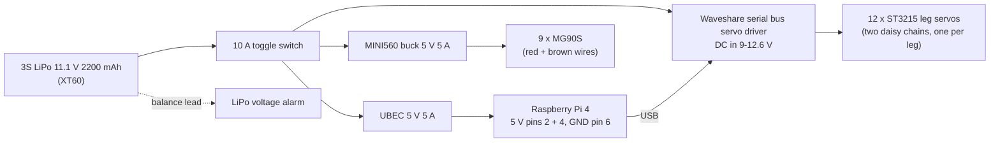

# JX0 wiring

One 3S LiPo powers everything. The 12 leg servos run straight off the pack (they are 12 V servos). Two 5 V
converters feed the Raspberry Pi and the 9 small arm, gripper and neck servos. **Connect every ground together**: the
Pi drives the small servos' signal wires, so they need a common ground.

## Power

| Run | Wire | Why |
|---|---|---|
| Battery → switch → servo driver | 16 AWG silicone | the 12 leg servos can pull several amps together while walking |
| Switch → UBEC, switch → MINI560 | 20 AWG | under 3 A each |
| UBEC → Pi 5 V (pins 2 and 4) and GND (pin 6) | 20 AWG | 5 V on the GPIO pins bypasses the Pi's input fuse, so double-check the polarity before you plug in |
| MINI560 → MG90S red (+) and brown (−) | 20 AWG to a small bus strip | 9 servos; a gripper holding something draws its stall current (about 0.7 A, ESTIMATED) |

- **Set the MINI560 to 5.0 V before connecting servos.** Some MINI560 boards are fixed-voltage and some are
  adjustable: measure the output with a multimeter first.
- Plug the voltage alarm into the balance lead and set it to about 3.5 V per cell. Stop when it beeps: running a LiPo
  flat ruins it.
- Charge with the B3 charger only, never unattended, and on a non-flammable surface.

## Leg servos (serial bus)

The ST3215s share one serial bus. Each has two identical connectors, so chain them: driver → hip yaw → hip roll →
hip pitch → knee → ankle pitch → ankle roll, once per leg. Every servo needs its own ID (IDs are in
`jx0/software/jx0bot/config.yaml`; set them with `calibrate.py set-id` **one servo at a time**, see
[bringup.md](bringup.md)).

| Leg | Hip yaw | Hip roll | Hip pitch | Knee | Ankle pitch | Ankle roll |
|---|---|---|---|---|---|---|
| Left | 1 | 2 | 3 | 4 | 5 | 6 |
| Right | 7 | 8 | 9 | 10 | 11 | 12 |

Connect the driver board to the Pi by USB (the Pi sees it as `/dev/ttyUSB0` or `/dev/ttyACM0`; set `bus.port` in
config.yaml). Set the board's mode jumper for USB/serial pass-through as the Waveshare wiki for the board describes.

## Raspberry Pi GPIO map (BCM numbers, physical pin in brackets)

| Function | GPIO (pin) | Connects to |
|---|---|---|
| 3.3 V | (1), (17) | MPU6050 VCC, INMP441 VDD, display VCC |
| 5 V in | (2), (4) | UBEC + |
| GND | (6), (9), (14), (20), (25), (30), (34), (39) | all grounds |
| I2C SDA / SCL | 2 (3) / 3 (5) | MPU6050 SDA / SCL |
| Left gripper MG90S | 4 (7) | orange signal wire |
| Left shoulder pitch / roll | 5 (29) / 6 (31) | MG90S signal |
| Left elbow | 12 (32) | MG90S signal |
| Right shoulder pitch / roll | 13 (33) / 16 (36) | MG90S signal |
| Right elbow | 22 (15) | MG90S signal |
| Neck yaw | 23 (16) | MG90S signal |
| Right gripper MG90S | 26 (37) | MG90S signal |
| Push-to-talk button | 17 (11) | button to GND (internal pull-up) |
| Display SPI MOSI / SCLK / CS | 10 (19) / 11 (23) / 8 (24) | GC9A01 SDA (DIN) / SCL (CLK) / CS |
| Display DC / RST / backlight | 25 (22) / 24 (18) / 27 (13) | GC9A01 DC / RST / BLK |
| I2S bit clock | 18 (12) | INMP441 SCK and MAX98357A BCLK |
| I2S word select | 19 (35) | INMP441 WS and MAX98357A LRC |
| I2S data in | 20 (38) | INMP441 SD (L/R pin to GND = left channel) |
| I2S data out | 21 (40) | MAX98357A DIN (Vin from 5 V, speaker on + / −) |
| Camera | CSI ribbon | OV5647 |

The small servos get their pulses from the `pigpio` daemon (hardware-timed DMA), so any GPIO works and no PCA9685
board is needed. The display, microphone and amplifier pins are the Pi's SPI0 and I2S (PCM) pins and cannot move.

## Where things sit

- Torso: Raspberry Pi on the 4 standoffs inside the front wall, servo driver and converters on the floor, battery at
  the back (open back, strap it in), speaker behind the front grille, push-to-talk button in the chest hole.
- Pelvis: the MPU6050, as close to the hip centre as you can, **x arrow forward, y arrow to the robot's left**
  (otherwise set `imu.mount` in config.yaml).
- Head: the round display pressed into the face window (hot glue on the PCB edge), the camera behind the lens hole
  above it, and the microphone behind the left ear vents. Take the cables down through the neck with a loop of slack
  for the ±80° neck turn.
