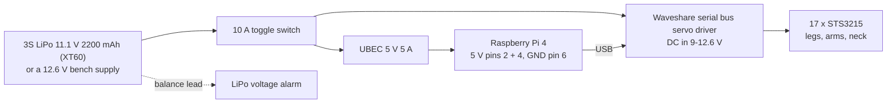

# JX0 wiring

All 17 joints are the same Feetech STS3215 12 V serial bus servo, like the reference robot, so the wiring is short:
one serial bus for every servo, one 5 V converter for the Raspberry Pi, and a few small audio and IMU modules.

## Power

```mermaid
flowchart LR
  BAT["3S LiPo 11.1 V 2200 mAh (XT60)<br/>or a 12.6 V bench supply"] --> SW["10 A toggle switch"]
  BAT -. balance lead .-> ALARM["LiPo voltage alarm"]
  SW --> DRV["Waveshare serial bus servo driver<br/>DC in 9-12.6 V"]
  DRV --> BUS["17 x STS3215<br/>legs, arms, neck"]
  SW --> UBEC["UBEC 5 V 5 A"] --> PI["Raspberry Pi 4<br/>5 V pins 2 + 4, GND pin 6"]
  PI -- USB --> DRV
```

| Run | Wire | Why |
|---|---|---|
| Battery → switch → servo driver | 16 AWG silicone | the servos together can pull a few amps while walking |
| Switch → UBEC | 20 AWG | under 2 A |
| UBEC → Pi 5 V (pins 2 and 4) and GND (pin 6) | 20 AWG | 5 V on the GPIO pins bypasses the Pi's input fuse, so double-check the polarity before you plug in |

- **Bench supply (how the reference robot is run):** set it to 12.6 V and a 3 A current limit, and plug it into the
  same XT60 instead of the battery. On the reference robot's supply display, a robot like this draws 0.6–1.5 A at 12.6 V
  (about 7–19 W) while walking. That lets you test for hours without charging.
- Plug the voltage alarm into the LiPo's balance lead and set it to about 3.5 V per cell. Stop when it beeps: running a
  LiPo flat ruins it.
- Charge with the B3 charger only, never unattended, and on a non-flammable surface.

## The servo bus

Every STS3215 has two identical 3-pin connectors, so the servos chain one into the next, and every servo on the bus
has its own ID, so one driver board runs all 17. The board has two servo ports (both are the same bus), so use two
chains:

| Port | Chain (bus ID) |
|---|---|
| 1 | left leg: hip yaw 1 → hip roll 2 → hip pitch 3 → knee 4 → ankle pitch 5 → ankle roll 6 |
| 2 | arms and neck, then the right leg: left shoulder 13 → left elbow 14 → neck 17 → right shoulder 15 → right elbow 16 → (a servo extension down through the torso floor) → right hip yaw 7 → hip roll 8 → hip pitch 9 → knee 10 → ankle pitch 11 → ankle roll 12 |

Feed the board's power through its green screw terminal with the 16 AWG wire, not the 5.5 × 2.1 mm barrel jack: in
simulation the 17 servos draw about 1 A on average while walking and about 2 A in short peaks, more when they push
hard.

The IDs are in `jx0/software/jx0bot/config.yaml`. Every servo ships as ID 1, so set them with `calibrate.py set-id`,
**one servo at a time** (see [bringup.md](bringup.md)). Connect the driver board to the Pi by USB; the Pi sees it as
`/dev/ttyUSB0` or `/dev/ttyACM0` (set `bus.port` in config.yaml). Set the board's mode jumper for USB/serial pass-through,
as the Waveshare wiki for the board describes.

Arm and neck cables: each shoulder servo hangs outside the chest in its arm's hood. Its cable and the elbow servo's run
together from the hood into the chest cap through the gap under the cap's side chamfer, with enough slack for the arm
to swing up in front (zip-tie them to the hood so the blade cannot catch them). The neck cable goes in through the gap
next to the neck servo. Leg cables: up the back of each leg, zip-tied to the brackets, into the torso through the slot
in its floor; leave a loop at every joint for its full range.

## Raspberry Pi GPIO map (BCM numbers, physical pin in brackets)

| Function | GPIO (pin) | Connects to |
|---|---|---|
| 3.3 V | (1), (17) | MPU6050 VCC, INMP441 VDD |
| 5 V in | (2), (4) | UBEC + |
| GND | (6), (9), (14), (20), (25), (30), (34), (39) | all grounds |
| I2C SDA / SCL | 2 (3) / 3 (5) | MPU6050 SDA / SCL |
| Push-to-talk button | 17 (11) | button to GND (internal pull-up) |
| I2S bit clock | 18 (12) | INMP441 SCK and MAX98357A BCLK |
| I2S word select | 19 (35) | INMP441 WS and MAX98357A LRC |
| I2S data in | 20 (38) | INMP441 SD (L/R pin to GND = left channel) |
| I2S data out | 21 (40) | MAX98357A DIN (Vin from 5 V, speaker on + / −) |

The servos need no GPIO at all: they're all on the USB servo bus.

## Where things sit

- **Lower torso:** the Raspberry Pi on the 4 standoffs on the back wall, the battery on the floor, the servo driver and
  the UBEC beside it. The push-to-talk button goes in the hole in the back wall, and the leg cables come up through the
  slot in the floor.
- **Chest cap:** the speaker under the round grille on top and the neck servo standing on top. The two shoulder
  servos are in the arms' hoods, their horns bolted to the pads on the cap's side walls.
- **Pelvis:** the MPU6050, as close to the hip centre as you can, **x arrow forward, y arrow to the robot's left**
  (otherwise set `imu.mount` in config.yaml).
- **Head:** the INMP441 microphone glued behind the four face holes. Its cable goes down through the hole in the head
  floor, with a loop of slack for the ±80° neck turn.
