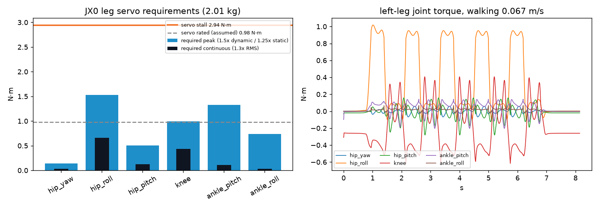

# JX0 servo sizing (CALCULATED (servo data and masses ASSUMED until measured))

Design `jx0/design_point.yaml`, total mass 2.01 kg, walking hip height 0.222 m. Servo: Feetech ST3215-C018 / Waveshare ST3215 12 V serial bus servo (30 kg·cm stall, 10 kg·cm rated at 12 V); stall 2.94 N·m, rated 0.98 N·m (assumed 1/3 of stall), no-load 4.72 rad/s.
Checks: 1.5 x dynamic peak (1.25 x static) <= stall; 1.3 x walking RMS <= rated; 1.5 x torque within the linear torque-speed line at every sample.

| Joint | Dynamic peak N·m (scenario) | Static peak N·m (case) | Required peak | Peak margin | Walking RMS | Continuous margin | Peak speed rad/s | Torque-speed use | Pass |
|---|---|---|---|---|---|---|---|---|---|
| hip_yaw | 0.094 (turn_10deg_per_step) | 0.0 (stand_deep_squat) | 0.141 | 20.78 | 0.025 | 29.57 | 0.73 | 5 % (turn_10deg_per_step) | yes |
| hip_roll | 1.018 (walk_nominal_0.067ms) | 1.188 (single_leg_cop_outer_edge) | 1.527 | 1.93 | 0.509 | 1.48 | 1.54 | 60 % (walk_nominal_0.067ms) | yes |
| hip_pitch | 0.337 (walk_fast_0.073ms) | 0.232 (single_leg_cop_heel) | 0.505 | 5.82 | 0.098 | 7.66 | 2.96 | 24 % (walk_fast_0.073ms) | yes |
| knee | 0.617 (walk_nominal_0.067ms) | 0.795 (single_leg_cop_inner_edge) | 0.994 | 2.96 | 0.334 | 2.26 | 3.66 | 39 % (walk_fast_0.073ms) | yes |
| ankle_pitch | 0.232 (walk_fast_0.073ms) | 1.061 (single_leg_cop_heel) | 1.326 | 2.22 | 0.083 | 9.05 | 2.78 | 15 % (walk_fast_0.073ms) | yes |
| ankle_roll | 0.091 (turn_10deg_per_step) | 0.592 (single_leg_cop_inner_edge) | 0.74 | 3.97 | 0.023 | 32.95 | 1.54 | 6 % (walk_nominal_0.067ms) | yes |

| Scenario | ZMP tracking error (mm) |
|---|---|
| walk_slow_0.05ms | 9.34 |
| walk_nominal_0.067ms | 9.34 |
| walk_fast_0.073ms | 9.34 |
| turn_10deg_per_step | 9.34 |
| squat_4.5cm_1.6s | 9.33 |

