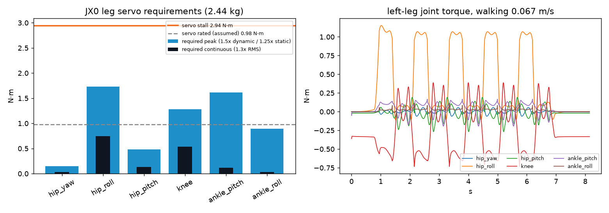

# JX0 servo sizing (CALCULATED (servo data and masses ASSUMED until measured))

Design `jx0/design_point.yaml`, total mass 2.88 kg, walking hip height 0.14 m. Servo: Feetech STS3215 12 V serial bus servo (ST3215-C018 / Waveshare ST3215; 30 kg·cm stall, 10 kg·cm rated at 12 V); stall 2.94 N·m, rated 0.98 N·m (assumed 1/3 of stall), no-load 4.72 rad/s.
Checks: 1.5 x dynamic peak (1.25 x static) <= stall; 1.3 x walking RMS <= rated; 1.5 x torque within the linear torque-speed line at every sample.

| Joint | Dynamic peak N·m (scenario) | Static peak N·m (case) | Required peak | Peak margin | Walking RMS | Continuous margin | Peak speed rad/s | Torque-speed use | Pass |
|---|---|---|---|---|---|---|---|---|---|
| hip_yaw | 0.094 (turn_10deg_per_step) | 0.0 (stand_double) | 0.142 | 20.75 | 0.017 | 45.4 | 0.73 | 5 % (turn_10deg_per_step) | yes |
| hip_roll | 1.331 (turn_10deg_per_step) | 1.608 (single_leg_cop_outer_edge) | 2.01 | 1.46 | 0.667 | 1.13 | 1.59 | 83 % (walk_brisk_0.055ms) | yes |
| hip_pitch | 0.247 (walk_brisk_0.055ms) | 0.188 (single_leg_cop_toe) | 0.371 | 7.93 | 0.093 | 8.07 | 3.52 | 19 % (walk_brisk_0.055ms) | yes |
| knee | 0.706 (turn_10deg_per_step) | 1.059 (single_leg_cop_inner_edge) | 1.323 | 2.22 | 0.386 | 1.95 | 4.01 | 68 % (walk_brisk_0.055ms) | yes |
| ankle_pitch | 0.259 (walk_brisk_0.055ms) | 1.291 (single_leg_cop_heel) | 1.614 | 1.82 | 0.093 | 8.09 | 3.57 | 25 % (walk_brisk_0.055ms) | yes |
| ankle_roll | 0.646 (turn_10deg_per_step) | 0.846 (single_leg_cop_inner_edge) | 1.058 | 2.78 | 0.304 | 2.48 | 1.59 | 45 % (turn_10deg_per_step) | yes |

| Scenario | ZMP tracking error (mm) |
|---|---|
| walk_slow_0.042ms | 2.05 |
| walk_nominal_0.05ms | 2.15 |
| walk_brisk_0.055ms | 2.3 |
| turn_10deg_per_step | 2.32 |
| squat_2.5cm_1.6s | 0.56 |

