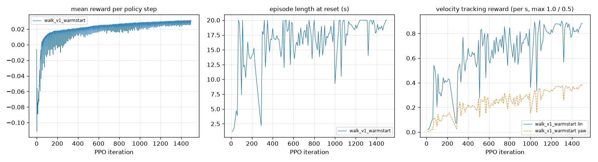
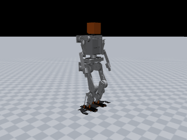
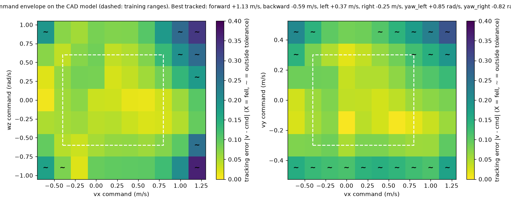

# JX1 walking policy: `jx1_walk_flat`

| | |
|---|---|
| trainer | rl/train.py (MuJoCo, rsl_rl-style PPO) |
| checkpoint | walk_v2_final/model_latest.pt, iteration 3000 |
| task config | run snapshot (config.yaml next to the checkpoint) |
| robot model | `simulation/mujoco/jx1.xml` (sha256 13e00221a0d0…), 33.61 kg |
| interface | 47 observations → 12 leg joint targets at 50 Hz; 11 joints held at the default pose |
| export check | ONNX max abs diff 1.9e-06 |

## Training

## Sim-to-sim on the full CAD model, flat floor

`simulation/mujoco/jx1.xml` as generated: CoACD mesh-hull collisions, 2 ms physics, nominal masses, CAN-hub target ramp on. All scenarios upright.

| scenario | command (vx, vy, wz) | result | mean velocity | RMSE | max tilt | peak torque / limit | peak speed / limit |
|---|---|---|---|---|---|---|---|
| stand | (+0.0, +0.0, +0.0) | upright | (-0.01, -0.04, -0.03) | (+0.02, +0.05, +0.04) | 4.8° | 55% left_hip_roll | 12% left_ankle_roll_joint |
| forward_0.5 | (+0.5, +0.0, +0.0) | upright | (+0.50, -0.03, -0.01) | (+0.02, +0.05, +0.02) | 5.6° | 75% right_ankle_pitch | 25% left_knee_joint |
| forward_0.8 | (+0.8, +0.0, +0.0) | upright | (+0.78, -0.06, -0.01) | (+0.04, +0.07, +0.06) | 5.2° | 90% left_ankle_pitch | 31% left_knee_joint |
| backward_0.3 | (-0.3, +0.0, +0.0) | upright | (-0.36, -0.03, -0.02) | (+0.07, +0.04, +0.03) | 8.1° | 56% left_ankle_pitch | 25% left_ankle_roll_joint |
| sidestep_0.2 | (+0.0, +0.2, +0.0) | upright | (-0.01, +0.18, -0.01) | (+0.02, +0.04, +0.03) | 4.8° | 62% right_hip_roll | 15% left_knee_joint |
| turn_0.5 | (+0.0, +0.0, +0.5) | upright | (-0.08, -0.01, +0.47) | (+0.09, +0.03, +0.06) | 6.1° | 58% right_ankle_pitch | 18% right_ankle_roll_joint |
| walk_turn | (+0.4, +0.0, +0.3) | upright | (+0.39, -0.01, +0.26) | (+0.02, +0.04, +0.05) | 6.7° | 74% right_ankle_pitch | 23% left_knee_joint |

## Sim-to-sim on the full CAD model, rough ground (rl/config/jx1_walk_rough.yaml heightfield)

`simulation/mujoco/jx1.xml` as generated: CoACD mesh-hull collisions, 2 ms physics, nominal masses, CAN-hub target ramp on. All scenarios upright.

| scenario | command (vx, vy, wz) | result | mean velocity | RMSE | max tilt | peak torque / limit | peak speed / limit |
|---|---|---|---|---|---|---|---|
| stand | (+0.0, +0.0, +0.0) | upright | (-0.01, -0.03, -0.03) | (+0.02, +0.05, +0.04) | 4.8° | 55% left_hip_roll | 11% left_knee_joint |
| forward_0.5 | (+0.5, +0.0, +0.0) | upright | (+0.50, -0.06, -0.02) | (+0.07, +0.08, +0.05) | 5.7° | 84% left_ankle_pitch | 24% left_knee_joint |
| forward_0.8 | (+0.8, +0.0, +0.0) | upright | (+0.77, -0.05, -0.03) | (+0.08, +0.09, +0.10) | 8.8° | 95% left_ankle_pitch | 34% left_knee_joint |
| backward_0.3 | (-0.3, +0.0, +0.0) | upright | (-0.37, +0.01, -0.02) | (+0.07, +0.09, +0.06) | 8.9° | 67% left_ankle_pitch | 27% left_ankle_roll_joint |
| sidestep_0.2 | (+0.0, +0.2, +0.0) | upright | (-0.01, +0.19, -0.01) | (+0.01, +0.03, +0.03) | 5.0° | 63% right_hip_roll | 16% left_ankle_pitch_joint |
| turn_0.5 | (+0.0, +0.0, +0.5) | upright | (-0.08, -0.01, +0.47) | (+0.08, +0.03, +0.06) | 6.2° | 58% left_hip_roll | 18% right_ankle_roll_joint |
| walk_turn | (+0.4, +0.0, +0.3) | upright | (+0.37, +0.02, +0.27) | (+0.13, +0.10, +0.07) | 14.4° | 75% right_ankle_pitch | 24% left_knee_joint |

## Command envelope

99/130 commands tracked, 0 falls (upright and |mean v - cmd| <= max(0.1, 20%) per axis (wz: max(0.15, 20%)); 6 s per command). Best tracked pure commands:

- forward +1.13 m/s (command +1.20, peak torque 100%), backward -0.59 m/s (command -0.60, peak torque 86%)
- left +0.37 m/s (command +0.45, peak torque 74%), right -0.25 m/s (command -0.30, peak torque 70%)
- yaw left +0.85 rad/s (command +0.90, peak torque 67%), yaw right -0.82 rad/s (command -0.90, peak torque 58%)

## Push recovery (0.1 s torso pulse while walking at 0.5 m/s, CAD model)

| direction | largest survived impulse | CoM velocity change |
|---|---|---|
| forward | 21.6 N·s | 0.64 m/s |
| backward | 14.5 N·s | 0.43 m/s |
| left | 12.7 N·s | 0.38 m/s |
| right | 17.8 N·s | 0.53 m/s |

## ROS 2 jazzy: separate node processes driven over `/cmd_vel`, measured from `/jx1/odom`

Same script on every path: forward 0.4 m/s for 10 s, turn 0.4 rad/s for 6 s (137.5° commanded), stop.

| started by | forward speed | turn | max tilt | upright |
|---|---|---|---|---|
| python -m (source tree) | 0.39 m/s | 123° | 5.7° | True |
| ros2 launch jx1_bringup mujoco_sim.launch.py (colcon install) | 0.38 m/s | 118° | 5.7° | True |
| ros2 launch jx1_bringup ros2_control.launch.py (colcon install) | 0.34 m/s | 108° | 5.9° | True |

| phase | command | distance | mean speed | yaw change | min pelvis z | max tilt |
|---|---|---|---|---|---|---|
| forward | (+0.4, +0.0, +0.0) | 3.01 m | 0.39 m/s | -6.7° | 0.583 m | 5.7° |
| turn | (+0.0, +0.0, +0.4) | 0.40 m | 0.07 m/s | +123.0° | 0.585 m | 5.7° |
| stop | (+0.0, +0.0, +0.0) | 0.18 m | 0.04 m/s | -6.8° | 0.588 m | 4.7° |

## Hardware-in-the-loop: policy → `hw_node` → hub protocol → hub-firmware twin → physics

`jx1_policy -> jx1_hw hw_node -> hub protocol over TCP -> fake_hub (firmware law) -> MuJoCo`. RUN accepted: True, upright: True, hub faults at the end: none.

| phase | command | distance | mean speed | yaw change | min pelvis z | max tilt |
|---|---|---|---|---|---|---|
| stand | (+0.0, +0.0, +0.0) | 0.16 m | 0.04 m/s | -8.8° | 0.586 m | 5.2° |
| forward | (+0.3, +0.0, +0.0) | 2.47 m | 0.25 m/s | -15.7° | 0.585 m | 5.4° |
| turn | (+0.0, +0.0, +0.3) | 0.28 m | 0.05 m/s | +64.0° | 0.588 m | 5.4° |
| stop | (+0.0, +0.0, +0.0) | 0.21 m | 0.05 m/s | -8.2° | 0.588 m | 4.7° |

Started as on the robot, `ros2 launch jx1_hw hardware.launch.py hil:=true (colcon install)`: forward 0.27 m/s at 0.3, turn 71° of 103° commanded, upright True, RUN accepted True.

## Watch items

- forward_0.8_rough: left_ankle_pitch reaches 95% of its effort limit
