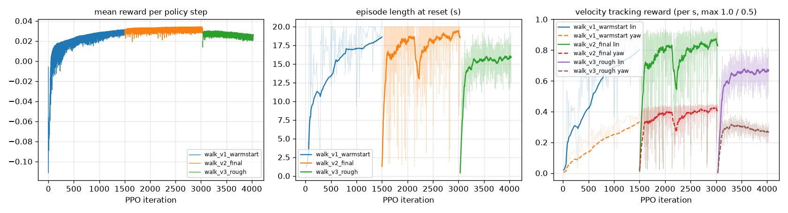
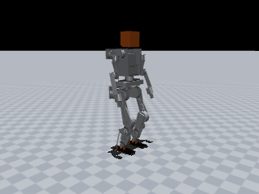
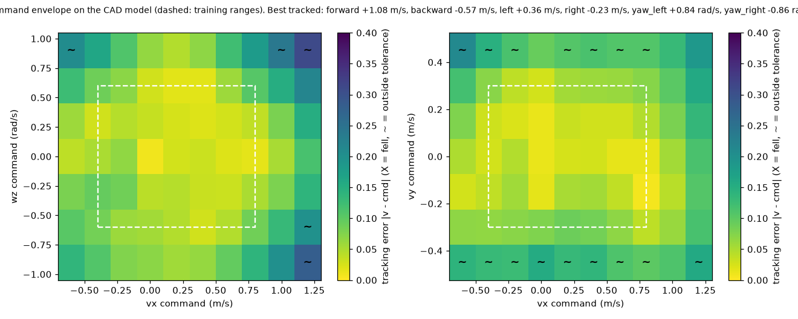
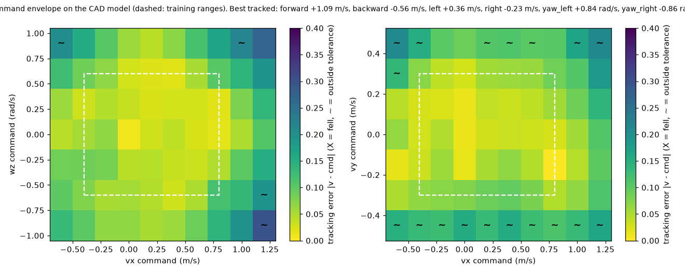

# JX1 walking policy: `jx1_walk_rough`

| | |
|---|---|
| trainer | rl/train.py (MuJoCo, rsl_rl-style PPO) |
| checkpoint | walk_v3_rough/model_latest.pt, iteration 4000 |
| task config | run snapshot (config.yaml next to the checkpoint) |
| robot model | `simulation/mujoco/jx1.xml` (sha256 13e00221a0d0…), 33.61 kg |
| interface | 47 observations → 12 leg joint targets at 50 Hz; 11 joints held at the default pose |
| export check | ONNX max abs diff 1.9e-06 |

## Training

## Sim-to-sim on the full CAD model, flat floor

`simulation/mujoco/jx1.xml` as generated: CoACD mesh-hull collisions, 2 ms physics, nominal masses, CAN-hub target ramp on. All scenarios upright.

| scenario | command (vx, vy, wz) | result | mean velocity | RMSE | max tilt | peak torque / limit | peak speed / limit |
|---|---|---|---|---|---|---|---|
| stand | (+0.0, +0.0, +0.0) | upright | (-0.01, -0.01, +0.01) | (+0.03, +0.05, +0.03) | 4.1° | 48% right_hip_roll | 17% left_ankle_roll_joint |
| forward_0.5 | (+0.5, +0.0, +0.0) | upright | (+0.52, -0.00, +0.01) | (+0.03, +0.05, +0.11) | 7.0° | 64% right_ankle_pitch | 25% right_knee_joint |
| forward_0.8 | (+0.8, +0.0, +0.0) | upright | (+0.79, -0.01, +0.01) | (+0.03, +0.05, +0.14) | 8.5° | 71% left_ankle_pitch | 35% right_knee_joint |
| backward_0.3 | (-0.3, +0.0, +0.0) | upright | (-0.34, -0.01, +0.06) | (+0.04, +0.04, +0.11) | 6.9° | 47% right_hip_roll | 28% left_ankle_roll_joint |
| sidestep_0.2 | (+0.0, +0.2, +0.0) | upright | (+0.02, +0.20, +0.01) | (+0.03, +0.04, +0.04) | 5.3° | 60% right_hip_roll | 19% left_ankle_pitch_joint |
| turn_0.5 | (+0.0, +0.0, +0.5) | upright | (-0.03, -0.01, +0.49) | (+0.03, +0.04, +0.07) | 5.4° | 54% right_ankle_pitch | 21% left_ankle_roll_joint |
| walk_turn | (+0.4, +0.0, +0.3) | upright | (+0.42, +0.00, +0.31) | (+0.03, +0.06, +0.10) | 7.1° | 59% right_hip_roll | 23% right_knee_joint |

## Sim-to-sim on the full CAD model, rough ground (rl/config/jx1_walk_rough.yaml heightfield)

`simulation/mujoco/jx1.xml` as generated: CoACD mesh-hull collisions, 2 ms physics, nominal masses, CAN-hub target ramp on. All scenarios upright.

| scenario | command (vx, vy, wz) | result | mean velocity | RMSE | max tilt | peak torque / limit | peak speed / limit |
|---|---|---|---|---|---|---|---|
| stand | (+0.0, +0.0, +0.0) | upright | (-0.01, -0.01, +0.01) | (+0.03, +0.05, +0.03) | 4.1° | 49% right_hip_roll | 16% left_ankle_roll_joint |
| forward_0.5 | (+0.5, +0.0, +0.0) | upright | (+0.53, -0.01, +0.01) | (+0.04, +0.05, +0.12) | 7.0° | 60% right_ankle_pitch | 25% right_knee_joint |
| forward_0.8 | (+0.8, +0.0, +0.0) | upright | (+0.80, -0.02, +0.01) | (+0.03, +0.06, +0.14) | 8.5° | 73% left_ankle_pitch | 36% right_knee_joint |
| backward_0.3 | (-0.3, +0.0, +0.0) | upright | (-0.34, -0.01, +0.06) | (+0.05, +0.04, +0.12) | 6.9° | 69% left_ankle_pitch | 28% left_ankle_roll_joint |
| sidestep_0.2 | (+0.0, +0.2, +0.0) | upright | (+0.02, +0.20, +0.01) | (+0.02, +0.04, +0.04) | 5.6° | 59% right_hip_roll | 19% left_ankle_pitch_joint |
| turn_0.5 | (+0.0, +0.0, +0.5) | upright | (-0.03, -0.01, +0.49) | (+0.03, +0.04, +0.07) | 5.3° | 54% right_ankle_pitch | 20% left_ankle_roll_joint |
| walk_turn | (+0.4, +0.0, +0.3) | upright | (+0.42, +0.00, +0.30) | (+0.04, +0.06, +0.11) | 8.5° | 61% right_ankle_pitch | 23% right_knee_joint |

## Command envelope

109/130 commands tracked, 0 falls (upright and |mean v - cmd| <= max(0.1, 20%) per axis (wz: max(0.15, 20%)); 6 s per command). Best tracked pure commands:

- forward +1.08 m/s (command +1.20, peak torque 85%), backward -0.57 m/s (command -0.60, peak torque 54%)
- left +0.36 m/s (command +0.45, peak torque 74%), right -0.23 m/s (command -0.30, peak torque 75%)
- yaw left +0.84 rad/s (command +0.90, peak torque 77%), yaw right -0.86 rad/s (command -0.90, peak torque 59%)

## Command envelope (rough ground)

108/130 commands tracked, 0 falls (upright and |mean v - cmd| <= max(0.1, 20%) per axis (wz: max(0.15, 20%)); 6 s per command). Best tracked pure commands:

- forward +1.09 m/s (command +1.20, peak torque 85%), backward -0.56 m/s (command -0.60, peak torque 70%)
- left +0.36 m/s (command +0.45, peak torque 74%), right -0.23 m/s (command -0.30, peak torque 75%)
- yaw left +0.84 rad/s (command +0.90, peak torque 76%), yaw right -0.86 rad/s (command -0.90, peak torque 58%)

## Latency sensitivity (CAD model, added sensing / actuation delay)

| sensing delay | actuation delay | turn 0.3 rad/s tracked | forward 0.3 m/s tracked |
|---|---|---|---|
| 0 ms | 0 ms | 101% | 110% |
| 10 ms | 0 ms | 98% | 104% |
| 20 ms | 0 ms | 96% | 99% |
| 0 ms | 10 ms | 98% | 104% |
| 10 ms | 10 ms | 96% | 99% |
| 20 ms | 10 ms | 94% | 94% |
| 30 ms | 10 ms | 91% | 90% |
| 40 ms | 20 ms | 89% | 88% |

## Push recovery (0.1 s torso pulse while walking at 0.5 m/s, CAD model)

| direction | largest survived impulse | CoM velocity change |
|---|---|---|
| forward | 32.8 N·s | 0.98 m/s |
| backward | 35.6 N·s | 1.06 m/s |
| left | 15.9 N·s | 0.47 m/s |
| right | 44.1 N·s | 1.31 m/s |

## ROS 2 jazzy: separate node processes driven over `/cmd_vel`, measured from `/jx1/odom`

Same script on every path: forward 0.4 m/s for 10 s, turn 0.4 rad/s for 6 s (137.5° commanded), stop.

| started by | forward speed | turn | max tilt | upright |
|---|---|---|---|---|
| python -m (source tree) | 0.41 m/s | 131° | 6.4° | True |
| ros2 launch jx1_bringup mujoco_sim.launch.py (colcon install) | 0.41 m/s | 131° | 6.4° | True |
| ros2 launch jx1_bringup ros2_control.launch.py (colcon install) | 0.37 m/s | 119° | 6.0° | True |

| phase | command | distance | mean speed | yaw change | min pelvis z | max tilt |
|---|---|---|---|---|---|---|
| forward | (+0.4, +0.0, +0.0) | 4.05 m | 0.41 m/s | +9.1° | 0.569 m | 6.4° |
| turn | (+0.0, +0.0, +0.4) | 0.19 m | 0.03 m/s | +131.2° | 0.573 m | 4.5° |
| stop | (+0.0, +0.0, +0.0) | 0.05 m | 0.01 m/s | +3.9° | 0.587 m | 3.5° |

## Hardware-in-the-loop: policy → `hw_node` → hub protocol → hub-firmware twin → physics

`jx1_policy -> jx1_hw hw_node -> hub protocol over TCP -> fake_hub (firmware law) -> MuJoCo`. RUN accepted: True, upright: True, hub faults at the end: none.

| phase | command | distance | mean speed | yaw change | min pelvis z | max tilt |
|---|---|---|---|---|---|---|
| stand | (+0.0, +0.0, +0.0) | 0.04 m | 0.01 m/s | +1.9° | 0.585 m | 4.2° |
| forward | (+0.3, +0.0, +0.0) | 2.85 m | 0.29 m/s | +18.0° | 0.574 m | 5.5° |
| turn | (+0.0, +0.0, +0.3) | 0.20 m | 0.03 m/s | +91.1° | 0.576 m | 3.9° |
| stop | (+0.0, +0.0, +0.0) | 0.08 m | 0.02 m/s | +3.5° | 0.588 m | 3.6° |

Started as on the robot, `ros2 launch jx1_hw hardware.launch.py hil:=true (colcon install)`: forward 0.29 m/s at 0.3, turn 94° of 103° commanded, upright True, RUN accepted True.
