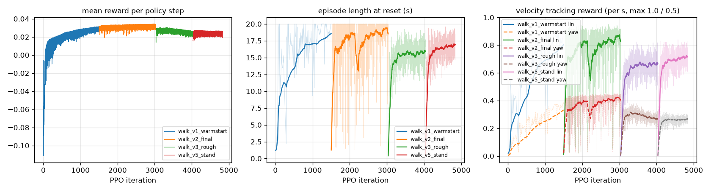
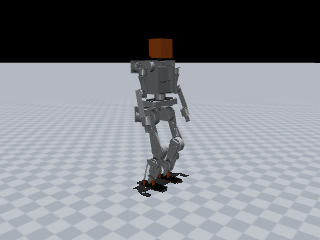
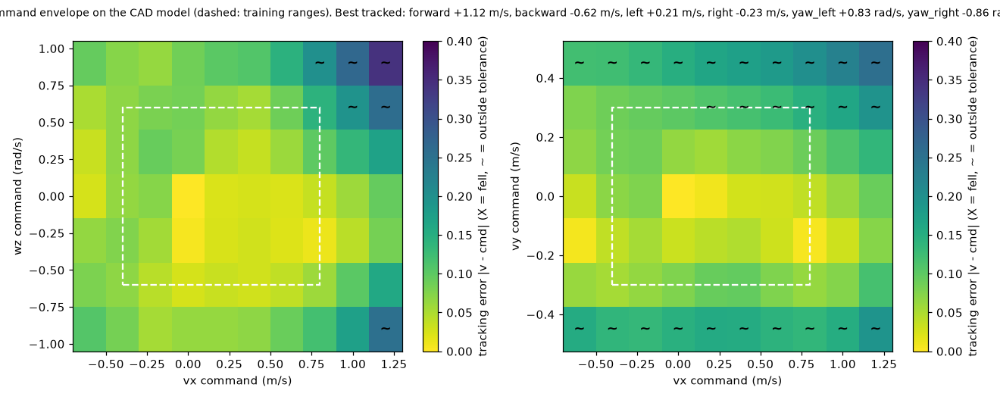
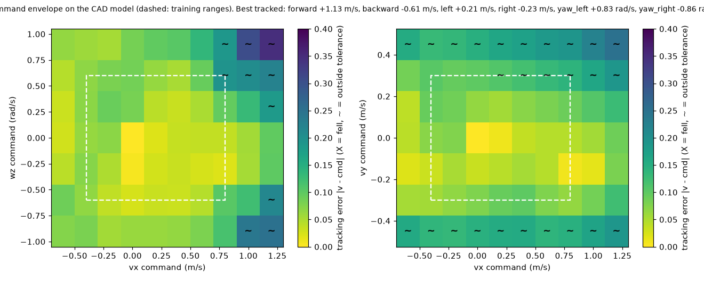

# JX1 walking policy: `jx1_walk_stand`

| | |
|---|---|
| trainer | rl/train.py (MuJoCo, rsl_rl-style PPO) |
| checkpoint | walk_v5_stand/model_latest.pt, iteration 4800 |
| task config | run snapshot (config.yaml next to the checkpoint) |
| robot model | `simulation/mujoco/jx1.xml` (sha256 13e00221a0d0…), 33.61 kg |
| interface | 47 observations → 12 leg joint targets at 50 Hz; 11 joints held at the default pose |
| export check | ONNX max abs diff 2.6e-06 |

## Training

## Sim-to-sim on the full CAD model, flat floor

`simulation/mujoco/jx1.xml` as generated: CoACD mesh-hull collisions, 2 ms physics, nominal masses, CAN-hub target ramp on. All scenarios upright.

| scenario | command (vx, vy, wz) | result | mean velocity | RMSE | max tilt | peak torque / limit | peak speed / limit | foot lift-offs |
|---|---|---|---|---|---|---|---|---|
| stand | (+0.0, +0.0, +0.0) | upright | (-0.00, -0.00, -0.00) | (+0.00, +0.00, +0.00) | 1.2° | 17% left_knee | 6% right_ankle_pitch_joint | 0.00/s |
| forward_0.5 | (+0.5, +0.0, +0.0) | upright | (+0.52, -0.02, -0.01) | (+0.03, +0.04, +0.12) | 7.7° | 62% right_ankle_pitch | 25% right_ankle_pitch_joint | 2.51/s |
| forward_0.8 | (+0.8, +0.0, +0.0) | upright | (+0.79, -0.04, -0.04) | (+0.03, +0.06, +0.18) | 9.6° | 83% right_ankle_pitch | 29% right_knee_joint | 2.51/s |
| backward_0.3 | (-0.3, +0.0, +0.0) | upright | (-0.37, -0.03, +0.01) | (+0.08, +0.03, +0.06) | 5.0° | 48% left_ankle_pitch | 26% right_ankle_roll_joint | 2.34/s |
| sidestep_0.2 | (+0.0, +0.2, +0.0) | upright | (-0.05, +0.14, -0.00) | (+0.05, +0.06, +0.06) | 5.5° | 55% right_hip_roll | 20% right_ankle_roll_joint | 2.34/s |
| turn_0.5 | (+0.0, +0.0, +0.5) | upright | (-0.07, -0.02, +0.46) | (+0.08, +0.03, +0.11) | 4.8° | 50% right_hip_roll | 19% left_ankle_roll_joint | 2.51/s |
| walk_turn | (+0.4, +0.0, +0.3) | upright | (+0.41, -0.00, +0.27) | (+0.02, +0.03, +0.13) | 7.6° | 56% right_ankle_pitch | 26% right_ankle_pitch_joint | 2.51/s |
| stand_walk_stand | (+0.0, +0.0, +0.0) at 0 s → (+0.5, +0.0, +0.0) at 3 s → (+0.0, +0.0, +0.0) at 7 s | upright | (+0.22, -0.01, -0.01) | (+0.09, +0.03, +0.10) | 7.2° | 71% right_ankle_pitch | 27% left_ankle_pitch_joint | 1.34/s (last 2 s: 0.00/s) |

Self-contact between robot bodies (CoACD hulls, whole rollout): none.

## Sim-to-sim on the full CAD model, rough ground (rl/config/jx1_walk_rough.yaml heightfield)

`simulation/mujoco/jx1.xml` as generated: CoACD mesh-hull collisions, 2 ms physics, nominal masses, CAN-hub target ramp on. All scenarios upright.

| scenario | command (vx, vy, wz) | result | mean velocity | RMSE | max tilt | peak torque / limit | peak speed / limit | foot lift-offs |
|---|---|---|---|---|---|---|---|---|
| stand | (+0.0, +0.0, +0.0) | upright | (-0.00, -0.00, -0.00) | (+0.00, +0.00, +0.00) | 1.2° | 17% left_knee | 5% left_ankle_roll_joint | 0.00/s |
| forward_0.5 | (+0.5, +0.0, +0.0) | upright | (+0.53, -0.02, -0.01) | (+0.04, +0.04, +0.13) | 7.8° | 62% right_ankle_pitch | 26% right_ankle_pitch_joint | 2.51/s |
| forward_0.8 | (+0.8, +0.0, +0.0) | upright | (+0.80, -0.04, -0.03) | (+0.03, +0.06, +0.17) | 9.6° | 86% right_ankle_pitch | 29% right_ankle_pitch_joint | 2.76/s |
| backward_0.3 | (-0.3, +0.0, +0.0) | upright | (-0.36, -0.03, +0.02) | (+0.07, +0.04, +0.07) | 5.8° | 49% left_ankle_pitch | 25% left_ankle_roll_joint | 2.34/s |
| sidestep_0.2 | (+0.0, +0.2, +0.0) | upright | (-0.05, +0.14, -0.00) | (+0.05, +0.06, +0.06) | 5.6° | 55% right_hip_roll | 20% left_ankle_pitch_joint | 2.34/s |
| turn_0.5 | (+0.0, +0.0, +0.5) | upright | (-0.07, -0.02, +0.47) | (+0.08, +0.03, +0.09) | 4.7° | 49% left_hip_roll | 20% left_ankle_roll_joint | 2.51/s |
| walk_turn | (+0.4, +0.0, +0.3) | upright | (+0.41, +0.00, +0.26) | (+0.03, +0.04, +0.15) | 8.4° | 58% right_ankle_pitch | 24% right_ankle_pitch_joint | 2.63/s |
| stand_walk_stand | (+0.0, +0.0, +0.0) at 0 s → (+0.5, +0.0, +0.0) at 3 s → (+0.0, +0.0, +0.0) at 7 s | upright | (+0.23, -0.01, -0.01) | (+0.09, +0.03, +0.10) | 7.1° | 73% right_ankle_pitch | 26% left_ankle_pitch_joint | 1.34/s (last 2 s: 0.00/s) |

Self-contact between robot bodies (CoACD hulls, whole rollout): none.

## Command envelope

98/130 commands tracked, 0 falls (upright and |mean v - cmd| <= max(0.1, 20%) per axis (wz: max(0.15, 20%)); 6 s per command). Best tracked pure commands:

- forward +1.12 m/s (command +1.20, peak torque 97%), backward -0.62 m/s (command -0.60, peak torque 64%)
- left +0.21 m/s (command +0.30, peak torque 55%), right -0.23 m/s (command -0.30, peak torque 53%)
- yaw left +0.83 rad/s (command +0.90, peak torque 68%), yaw right -0.86 rad/s (command -0.90, peak torque 52%)

Self-contact on the CAD hulls: 0/130 commands (0 inside the trained ranges).

## Command envelope (rough ground)

94/130 commands tracked, 0 falls (upright and |mean v - cmd| <= max(0.1, 20%) per axis (wz: max(0.15, 20%)); 6 s per command). Best tracked pure commands:

- forward +1.13 m/s (command +1.20, peak torque 99%), backward -0.61 m/s (command -0.60, peak torque 62%)
- left +0.21 m/s (command +0.30, peak torque 55%), right -0.23 m/s (command -0.30, peak torque 53%)
- yaw left +0.83 rad/s (command +0.90, peak torque 68%), yaw right -0.86 rad/s (command -0.90, peak torque 52%)

Self-contact on the CAD hulls: 0/130 commands (0 inside the trained ranges).

## Latency sensitivity (CAD model, added sensing / actuation delay)

| sensing delay | actuation delay | turn 0.3 rad/s tracked | forward 0.3 m/s tracked |
|---|---|---|---|
| 0 ms | 0 ms | 83% | 107% |
| 10 ms | 0 ms | 81% | 101% |
| 20 ms | 0 ms | 77% | 97% |
| 0 ms | 10 ms | 81% | 101% |
| 10 ms | 10 ms | 77% | 97% |
| 20 ms | 10 ms | 75% | 94% |
| 30 ms | 10 ms | 72% | 90% |
| 40 ms | 20 ms | 67% | 86% |

## Push recovery (0.1 s torso pulse while walking at 0.5 m/s, CAD model)

| direction | largest survived impulse | CoM velocity change |
|---|---|---|
| forward | 36.1 N·s | 1.07 m/s |
| backward | 38.4 N·s | 1.14 m/s |
| left | 22.5 N·s | 0.67 m/s |
| right | 55.8 N·s | 1.66 m/s |

Standing (zero command), largest survived impulse: forward 44.5 N·s, backward 27.7 N·s, left 37.5 N·s, right 47.8 N·s.

## Power (CAD model; electrical model of calculations/run_power_budget.py, no regeneration)

| scenario | command | mean | peak | mean current (nominal V) | runtime, 13S2P 50S (80 %) | foot lift-offs |
|---|---|---|---|---|---|---|
| stand | (+0.0, +0.0, +0.0) | 79 W | 79 W | 1.7 A | 4.73 h | 0.00/s |
| walk_0.3 | (+0.3, +0.0, +0.0) | 271 W | 329 W | 5.8 A | 1.38 h | 2.51/s |
| walk_0.5 | (+0.5, +0.0, +0.0) | 313 W | 414 W | 6.7 A | 1.20 h | 2.51/s |
| walk_0.8 | (+0.8, +0.0, +0.0) | 382 W | 563 W | 8.2 A | 0.98 h | 2.51/s |
| turn_0.5 | (+0.0, +0.0, +0.5) | 238 W | 336 W | 5.1 A | 1.58 h | 2.51/s |

Worst actuator RMS current vs rated: hip_yaw 38% (walk_0.8), hip_roll 68% (walk_0.3), hip_pitch 33% (walk_0.8), knee 60% (walk_0.8), ankle_motor 91% (walk_0.8)

Torque-speed envelope (|tau| / (peak torque * (1 - |omega| / no-load speed at 41.6 V)), linear stall-to-no-load line (conservative: the real curve is flat up to its corner speed); worst point per actuator): hip_yaw 31% (11.0 N·m at 0.1 rad/s, walk_0.8), hip_roll 50% (29.7 N·m at 0.0 rad/s, turn_0.5), hip_pitch 25% (28.8 N·m at 0.8 rad/s, walk_0.8), knee 45% (50.0 N·m at 1.2 rad/s, walk_0.8), ankle_motor 99% (35.1 N·m at 0.7 rad/s, walk_0.8).

## ROS 2 jazzy: separate node processes driven over `/cmd_vel`, measured from `/jx1/odom`

Same script on every path: forward 0.4 m/s for 10 s, turn 0.4 rad/s for 6 s (137.5° commanded), stop.

| started by | forward speed | turn | max tilt | upright |
|---|---|---|---|---|
| python -m (source tree) | 0.41 m/s | 116° | 7.0° | True |
| ros2 launch jx1_bringup mujoco_sim.launch.py (colcon install) | 0.41 m/s | 116° | 7.0° | True |
| ros2 launch jx1_bringup ros2_control.launch.py (colcon install) | 0.32 m/s | 107° | 7.1° | True |

| phase | command | distance | mean speed | yaw change | min pelvis z | max tilt |
|---|---|---|---|---|---|---|
| forward | (+0.4, +0.0, +0.0) | 4.06 m | 0.41 m/s | -7.9° | 0.561 m | 7.0° |
| turn | (+0.0, +0.0, +0.4) | 0.36 m | 0.06 m/s | +116.0° | 0.565 m | 4.1° |
| stop | (+0.0, +0.0, +0.0) | 0.03 m | 0.01 m/s | +0.9° | 0.570 m | 2.2° |

## Hardware-in-the-loop: policy → `hw_node` → hub protocol → hub-firmware twin → physics

`jx1_policy -> jx1_hw hw_node -> hub protocol over TCP -> fake_hub (firmware law) -> MuJoCo`. RUN accepted: True, upright: True, hub faults at the end: none.

| phase | command | distance | mean speed | yaw change | min pelvis z | max tilt |
|---|---|---|---|---|---|---|
| stand | (+0.0, +0.0, +0.0) | 0.01 m | 0.00 m/s | +0.0° | 0.585 m | 1.2° |
| forward | (+0.3, +0.0, +0.0) | 2.92 m | 0.29 m/s | -8.8° | 0.563 m | 6.5° |
| turn | (+0.0, +0.0, +0.3) | 0.31 m | 0.05 m/s | +77.4° | 0.564 m | 3.9° |
| stop | (+0.0, +0.0, +0.0) | 0.02 m | 0.01 m/s | +0.5° | 0.570 m | 1.9° |

At the top trained speed through the same chain (`hw_loop_check.py --fast`, hub torque caps 80 % of peak): 0.8 m/s commanded -> 0.70 m/s, max tilt 8.5°, upright True.

Started as on the robot, `ros2 launch jx1_hw hardware.launch.py hil:=true (colcon install)`: forward 0.29 m/s at 0.3, turn 77° of 103° commanded, upright True, RUN accepted True.
