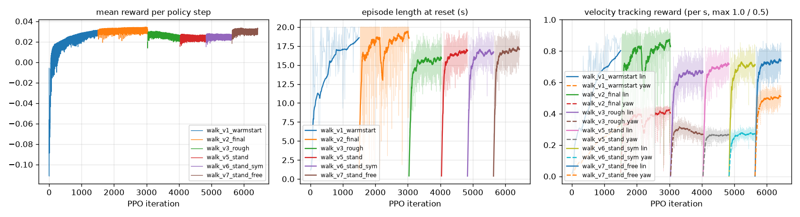
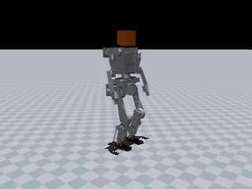
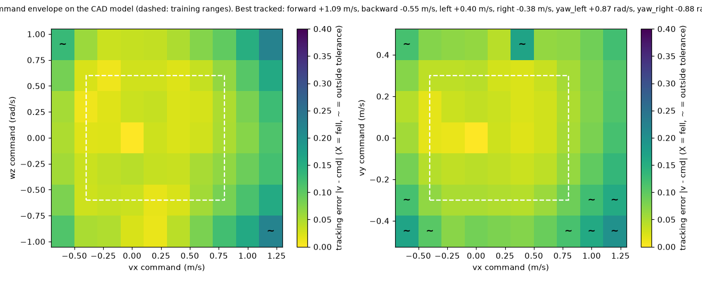
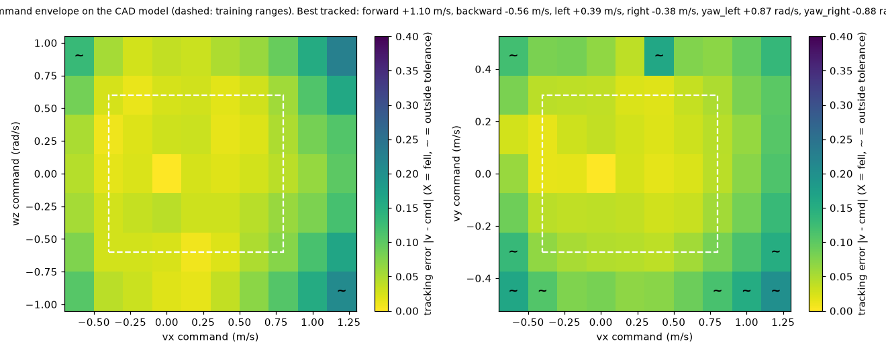

# JX1 walking policy: `jx1_walk_stand_v7`

| | |
|---|---|
| trainer | rl/train.py (MuJoCo, rsl_rl-style PPO) |
| checkpoint | walk_v7_stand_free/model_latest.pt, iteration 6400 |
| task config | run snapshot (config.yaml next to the checkpoint) |
| robot model | `simulation/mujoco/jx1.xml` (sha256 13e00221a0d0…), 33.61 kg |
| interface | 47 observations → 12 leg joint targets at 50 Hz; 11 joints held at the default pose |
| export check | ONNX max abs diff 2.1e-06 |

## Training

## Sim-to-sim on the full CAD model, flat floor

`simulation/mujoco/jx1.xml` as generated: CoACD mesh-hull collisions, 2 ms physics, nominal masses, CAN-hub target ramp on. All scenarios upright.

| scenario | command (vx, vy, wz) | result | mean velocity | RMSE | max tilt | peak torque / limit | peak speed / limit | foot lift-offs |
|---|---|---|---|---|---|---|---|---|
| stand | (+0.0, +0.0, +0.0) | upright | (-0.00, -0.00, -0.00) | (+0.00, +0.00, +0.00) | 0.8° | 15% right_knee | 8% right_ankle_pitch_joint | 0.00/s |
| forward_0.5 | (+0.5, +0.0, +0.0) | upright | (+0.48, +0.01, +0.01) | (+0.03, +0.03, +0.06) | 5.8° | 69% left_ankle_pitch | 28% right_ankle_pitch_joint | 2.51/s |
| forward_0.8 | (+0.8, +0.0, +0.0) | upright | (+0.75, +0.02, +0.01) | (+0.05, +0.04, +0.10) | 5.8° | 82% left_ankle_pitch | 27% right_ankle_pitch_joint | 2.51/s |
| backward_0.3 | (-0.3, +0.0, +0.0) | upright | (-0.30, +0.01, +0.02) | (+0.01, +0.02, +0.04) | 5.9° | 46% left_ankle_pitch | 25% left_knee_joint | 2.51/s |
| sidestep_0.2 | (+0.0, +0.2, +0.0) | upright | (-0.03, +0.18, -0.01) | (+0.04, +0.03, +0.02) | 6.4° | 48% left_hip_roll | 26% left_ankle_pitch_joint | 2.34/s |
| turn_0.5 | (+0.0, +0.0, +0.5) | upright | (-0.03, +0.01, +0.50) | (+0.03, +0.03, +0.06) | 4.8° | 45% right_hip_roll | 24% left_knee_joint | 2.34/s |
| walk_turn | (+0.4, +0.0, +0.3) | upright | (+0.38, +0.03, +0.30) | (+0.03, +0.04, +0.06) | 5.6° | 56% right_ankle_pitch | 24% right_ankle_pitch_joint | 2.51/s |
| stand_walk_stand | (+0.0, +0.0, +0.0) at 0 s → (+0.5, +0.0, +0.0) at 3 s → (+0.0, +0.0, +0.0) at 7 s | upright | (+0.21, +0.00, -0.01) | (+0.09, +0.03, +0.06) | 7.1° | 84% left_ankle_pitch | 24% right_knee_joint | 1.22/s (last 2 s: 0.00/s) |

Self-contact between robot bodies (CoACD hulls, whole rollout): none.

## Sim-to-sim on the full CAD model, rough ground (rl/config/jx1_walk_rough.yaml heightfield)

`simulation/mujoco/jx1.xml` as generated: CoACD mesh-hull collisions, 2 ms physics, nominal masses, CAN-hub target ramp on. All scenarios upright.

| scenario | command (vx, vy, wz) | result | mean velocity | RMSE | max tilt | peak torque / limit | peak speed / limit | foot lift-offs |
|---|---|---|---|---|---|---|---|---|
| stand | (+0.0, +0.0, +0.0) | upright | (-0.00, -0.00, -0.00) | (+0.00, +0.00, +0.00) | 0.8° | 16% right_knee | 7% right_ankle_pitch_joint | 0.00/s |
| forward_0.5 | (+0.5, +0.0, +0.0) | upright | (+0.48, +0.00, +0.02) | (+0.03, +0.03, +0.07) | 6.9° | 71% left_ankle_pitch | 26% right_ankle_pitch_joint | 2.51/s |
| forward_0.8 | (+0.8, +0.0, +0.0) | upright | (+0.77, +0.02, +0.01) | (+0.04, +0.04, +0.09) | 5.9° | 81% left_ankle_pitch | 28% right_ankle_pitch_joint | 2.51/s |
| backward_0.3 | (-0.3, +0.0, +0.0) | upright | (-0.30, +0.01, +0.02) | (+0.01, +0.02, +0.04) | 5.9° | 46% left_ankle_pitch | 26% left_ankle_roll_joint | 2.68/s |
| sidestep_0.2 | (+0.0, +0.2, +0.0) | upright | (-0.03, +0.18, -0.01) | (+0.04, +0.03, +0.02) | 6.4° | 49% left_hip_roll | 25% left_ankle_roll_joint | 2.51/s |
| turn_0.5 | (+0.0, +0.0, +0.5) | upright | (-0.03, +0.01, +0.50) | (+0.03, +0.03, +0.05) | 4.8° | 45% right_hip_roll | 24% left_knee_joint | 2.34/s |
| walk_turn | (+0.4, +0.0, +0.3) | upright | (+0.39, +0.02, +0.31) | (+0.02, +0.03, +0.07) | 5.5° | 68% left_ankle_pitch | 24% right_ankle_pitch_joint | 2.51/s |
| stand_walk_stand | (+0.0, +0.0, +0.0) at 0 s → (+0.5, +0.0, +0.0) at 3 s → (+0.0, +0.0, +0.0) at 7 s | upright | (+0.21, +0.00, -0.00) | (+0.09, +0.03, +0.06) | 7.2° | 79% left_ankle_pitch | 24% right_knee_joint | 1.22/s (last 2 s: 0.00/s) |

Self-contact between robot bodies (CoACD hulls, whole rollout): none.

## Command envelope

118/130 commands tracked, 0 falls (upright and |mean v - cmd| <= max(0.1, 20%) per axis (wz: max(0.15, 20%)); 6 s per command). Best tracked pure commands:

- forward +1.09 m/s (command +1.20, peak torque 86%), backward -0.55 m/s (command -0.60, peak torque 73%)
- left +0.40 m/s (command +0.45, peak torque 61%), right -0.38 m/s (command -0.45, peak torque 56%)
- yaw left +0.87 rad/s (command +0.90, peak torque 49%), yaw right -0.88 rad/s (command -0.90, peak torque 46%)

Self-contact on the CAD hulls: 5/130 commands (0 inside the trained ranges): left_shin_link|right_shin_link in 3 commands (worst +0.00,-0.45,+0.00: 0% of steps); left_shin_link|right_foot_link in 1 commands (worst +0.20,+0.45,+0.00: 1% of steps); left_foot_link|right_foot_link in 2 commands (worst +0.40,+0.45,+0.00: 10% of steps).

## Command envelope (rough ground)

119/130 commands tracked, 0 falls (upright and |mean v - cmd| <= max(0.1, 20%) per axis (wz: max(0.15, 20%)); 6 s per command). Best tracked pure commands:

- forward +1.10 m/s (command +1.20, peak torque 89%), backward -0.56 m/s (command -0.60, peak torque 72%)
- left +0.39 m/s (command +0.45, peak torque 61%), right -0.38 m/s (command -0.45, peak torque 56%)
- yaw left +0.87 rad/s (command +0.90, peak torque 50%), yaw right -0.88 rad/s (command -0.90, peak torque 46%)

Self-contact on the CAD hulls: 4/130 commands (1 inside the trained ranges): left_shin_link|right_shin_link in 2 commands (worst +0.00,-0.45,+0.00: 0% of steps); left_foot_link|right_foot_link in 2 commands (worst +0.40,+0.45,+0.00: 14% of steps).

## Latency sensitivity (CAD model, added sensing / actuation delay)

| sensing delay | actuation delay | turn 0.3 rad/s tracked | forward 0.3 m/s tracked |
|---|---|---|---|
| 0 ms | 0 ms | 102% | 92% |
| 10 ms | 0 ms | 97% | 87% |
| 20 ms | 0 ms | 95% | 85% |
| 0 ms | 10 ms | 98% | 87% |
| 10 ms | 10 ms | 95% | 85% |
| 20 ms | 10 ms | 90% | 80% |
| 30 ms | 10 ms | 88% | 77% |
| 40 ms | 20 ms | 82% | 73% |

## Push recovery (0.1 s torso pulse while walking at 0.5 m/s, CAD model)

| direction | largest survived impulse | CoM velocity change |
|---|---|---|
| forward | 53.4 N·s | 1.59 m/s |
| backward | 42.2 N·s | 1.25 m/s |
| left | 29.1 N·s | 0.86 m/s |
| right | 60.0 N·s | 1.78 m/s |

Standing (zero command), largest survived impulse: forward 55.3 N·s, backward 26.2 N·s, left 47.3 N·s, right 53.0 N·s.

## Power (CAD model; electrical model of calculations/run_power_budget.py, no regeneration)

| scenario | command | mean | peak | mean current (nominal V) | runtime, 13S2P 50S (80 %) | foot lift-offs |
|---|---|---|---|---|---|---|
| stand | (+0.0, +0.0, +0.0) | 73 W | 73 W | 1.6 A | 5.11 h | 0.00/s |
| walk_0.3 | (+0.3, +0.0, +0.0) | 234 W | 383 W | 5.0 A | 1.60 h | 2.51/s |
| walk_0.5 | (+0.5, +0.0, +0.0) | 274 W | 571 W | 5.9 A | 1.37 h | 2.51/s |
| walk_0.8 | (+0.8, +0.0, +0.0) | 347 W | 663 W | 7.4 A | 1.08 h | 2.51/s |
| turn_0.5 | (+0.0, +0.0, +0.5) | 225 W | 374 W | 4.8 A | 1.67 h | 2.38/s |

Worst actuator RMS current vs rated: hip_yaw 24% (walk_0.8), hip_roll 67% (walk_0.8), hip_pitch 26% (walk_0.8), knee 60% (walk_0.8), ankle_motor 84% (walk_0.8)

Torque-speed envelope (|tau| / (peak torque * (1 - |omega| / no-load speed at 41.6 V)), linear stall-to-no-load line (conservative: the real curve is flat up to its corner speed); worst point per actuator): hip_yaw 23% (8.4 N·m at 0.1 rad/s, turn_0.5), hip_roll 46% (27.0 N·m at 0.2 rad/s, turn_0.5), hip_pitch 19% (22.0 N·m at 0.5 rad/s, walk_0.8), knee 40% (47.1 N·m at 0.5 rad/s, walk_0.8), ankle_motor 100% (34.2 N·m at 2.0 rad/s, walk_0.8).

## ROS 2 jazzy: separate node processes driven over `/cmd_vel`, measured from `/jx1/odom`

Same script on every path: forward 0.4 m/s for 10 s, turn 0.4 rad/s for 6 s (137.5° commanded), stop.

| started by | forward speed | turn | max tilt | upright |
|---|---|---|---|---|
| python -m (source tree) | 0.37 m/s | 136° | 5.1° | True |
| ros2 launch jx1_bringup mujoco_sim.launch.py (colcon install) | 0.36 m/s | 133° | 5.9° | True |
| ros2 launch jx1_bringup ros2_control.launch.py (colcon install) | 0.31 m/s | 121° | 6.4° | True |

| phase | command | distance | mean speed | yaw change | min pelvis z | max tilt |
|---|---|---|---|---|---|---|
| forward | (+0.4, +0.0, +0.0) | 2.69 m | 0.37 m/s | +4.7° | 0.565 m | 4.4° |
| turn | (+0.0, +0.0, +0.4) | 0.10 m | 0.02 m/s | +136.5° | 0.561 m | 5.1° |
| stop | (+0.0, +0.0, +0.0) | 0.03 m | 0.01 m/s | -2.0° | 0.561 m | 3.0° |

## Hardware-in-the-loop: policy → `hw_node` → hub protocol → hub-firmware twin → physics

`jx1_policy -> jx1_hw hw_node -> hub protocol over TCP -> fake_hub (firmware law) -> MuJoCo`. RUN accepted: True, upright: True, hub faults at the end: none.

| phase | command | distance | mean speed | yaw change | min pelvis z | max tilt |
|---|---|---|---|---|---|---|
| stand | (+0.0, +0.0, +0.0) | 0.00 m | 0.00 m/s | -0.3° | 0.585 m | 0.8° |
| forward | (+0.3, +0.0, +0.0) | 2.53 m | 0.25 m/s | +6.6° | 0.564 m | 6.0° |
| turn | (+0.0, +0.0, +0.3) | 0.13 m | 0.02 m/s | +95.2° | 0.559 m | 4.9° |
| stop | (+0.0, +0.0, +0.0) | 0.01 m | 0.00 m/s | -0.2° | 0.564 m | 2.8° |

At the top trained speed through the same chain (`hw_loop_check.py --fast`, hub torque caps 80 % of peak): 0.8 m/s commanded -> 0.68 m/s, max tilt 6.0°, upright True.

Started as on the robot, `ros2 launch jx1_hw hardware.launch.py hil:=true (colcon install)`: forward 0.25 m/s at 0.3, turn 96° of 103° commanded, upright True, RUN accepted True.
