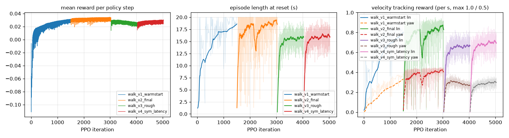
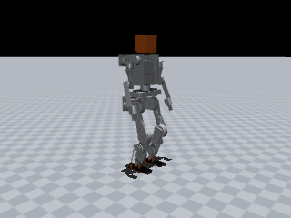
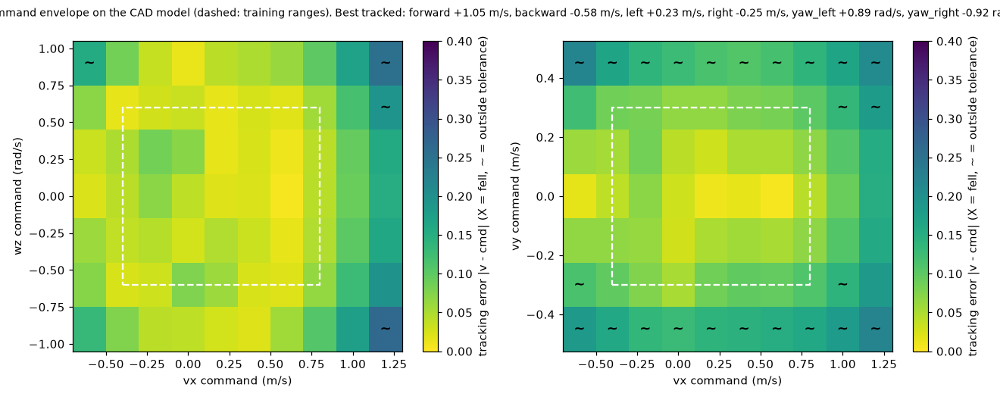
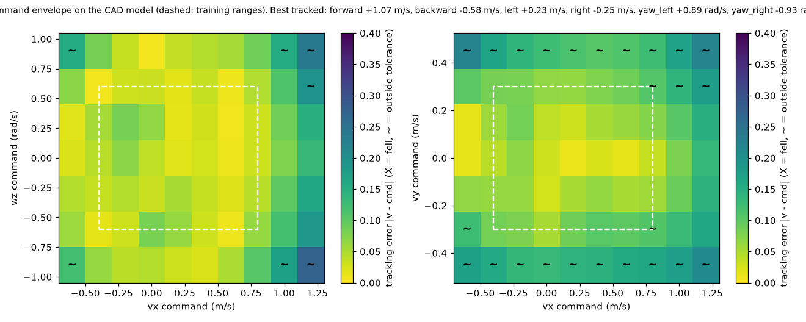

# JX1 walking policy: `jx1_walk_sym_latency`

| | |
|---|---|
| trainer | rl/train.py (MuJoCo, rsl_rl-style PPO) |
| checkpoint | walk_v4_sym_latency/model_latest.pt, iteration 5000 |
| task config | run snapshot (config.yaml next to the checkpoint) |
| robot model | `simulation/mujoco/jx1.xml` (sha256 13e00221a0d0…), 33.61 kg |
| interface | 47 observations → 12 leg joint targets at 50 Hz; 11 joints held at the default pose |
| export check | ONNX max abs diff 2.4e-06 |

## Training

## Sim-to-sim on the full CAD model, flat floor

`simulation/mujoco/jx1.xml` as generated: CoACD mesh-hull collisions, 2 ms physics, nominal masses, CAN-hub target ramp on. All scenarios upright.

| scenario | command (vx, vy, wz) | result | mean velocity | RMSE | max tilt | peak torque / limit | peak speed / limit |
|---|---|---|---|---|---|---|---|
| stand | (+0.0, +0.0, +0.0) | upright | (-0.03, -0.01, -0.03) | (+0.03, +0.05, +0.05) | 4.1° | 48% right_hip_roll | 12% right_ankle_pitch_joint |
| forward_0.5 | (+0.5, +0.0, +0.0) | upright | (+0.51, +0.00, -0.01) | (+0.03, +0.06, +0.05) | 7.0° | 54% right_ankle_pitch | 28% right_ankle_pitch_joint |
| forward_0.8 | (+0.8, +0.0, +0.0) | upright | (+0.76, -0.01, +0.01) | (+0.05, +0.06, +0.09) | 8.1° | 70% left_ankle_pitch | 32% right_knee_joint |
| backward_0.3 | (-0.3, +0.0, +0.0) | upright | (-0.36, -0.01, +0.00) | (+0.06, +0.03, +0.06) | 7.9° | 46% right_hip_roll | 23% right_ankle_roll_joint |
| sidestep_0.2 | (+0.0, +0.2, +0.0) | upright | (-0.02, +0.16, -0.03) | (+0.03, +0.06, +0.04) | 4.3° | 55% right_hip_roll | 20% left_ankle_pitch_joint |
| turn_0.5 | (+0.0, +0.0, +0.5) | upright | (-0.04, -0.01, +0.49) | (+0.04, +0.04, +0.06) | 5.0° | 49% right_hip_roll | 16% left_ankle_roll_joint |
| walk_turn | (+0.4, +0.0, +0.3) | upright | (+0.42, -0.00, +0.29) | (+0.04, +0.05, +0.05) | 6.5° | 55% right_hip_roll | 26% right_knee_joint |

## Sim-to-sim on the full CAD model, rough ground (rl/config/jx1_walk_rough.yaml heightfield)

`simulation/mujoco/jx1.xml` as generated: CoACD mesh-hull collisions, 2 ms physics, nominal masses, CAN-hub target ramp on. All scenarios upright.

| scenario | command (vx, vy, wz) | result | mean velocity | RMSE | max tilt | peak torque / limit | peak speed / limit |
|---|---|---|---|---|---|---|---|
| stand | (+0.0, +0.0, +0.0) | upright | (-0.03, -0.01, -0.03) | (+0.03, +0.05, +0.05) | 4.1° | 48% right_hip_roll | 12% right_ankle_pitch_joint |
| forward_0.5 | (+0.5, +0.0, +0.0) | upright | (+0.52, -0.00, -0.01) | (+0.03, +0.06, +0.05) | 7.0° | 57% left_ankle_pitch | 27% right_knee_joint |
| forward_0.8 | (+0.8, +0.0, +0.0) | upright | (+0.77, -0.01, -0.00) | (+0.04, +0.06, +0.09) | 8.2° | 72% left_ankle_pitch | 33% right_ankle_pitch_joint |
| backward_0.3 | (-0.3, +0.0, +0.0) | upright | (-0.36, +0.00, +0.01) | (+0.06, +0.03, +0.07) | 7.9° | 51% right_hip_roll | 22% right_ankle_roll_joint |
| sidestep_0.2 | (+0.0, +0.2, +0.0) | upright | (-0.02, +0.16, -0.04) | (+0.03, +0.06, +0.06) | 4.3° | 55% right_hip_roll | 20% left_ankle_pitch_joint |
| turn_0.5 | (+0.0, +0.0, +0.5) | upright | (-0.04, -0.01, +0.50) | (+0.05, +0.04, +0.06) | 5.1° | 49% right_hip_roll | 16% right_ankle_pitch_joint |
| walk_turn | (+0.4, +0.0, +0.3) | upright | (+0.42, -0.00, +0.29) | (+0.04, +0.05, +0.05) | 6.5° | 54% left_ankle_pitch | 26% right_knee_joint |

## Command envelope

102/130 commands tracked, 0 falls (upright and |mean v - cmd| <= max(0.1, 20%) per axis (wz: max(0.15, 20%)); 6 s per command). Best tracked pure commands:

- forward +1.05 m/s (command +1.20, peak torque 77%), backward -0.58 m/s (command -0.60, peak torque 68%)
- left +0.23 m/s (command +0.30, peak torque 60%), right -0.25 m/s (command -0.30, peak torque 56%)
- yaw left +0.89 rad/s (command +0.90, peak torque 47%), yaw right -0.92 rad/s (command -0.90, peak torque 57%)

## Command envelope (rough ground)

98/130 commands tracked, 0 falls (upright and |mean v - cmd| <= max(0.1, 20%) per axis (wz: max(0.15, 20%)); 6 s per command). Best tracked pure commands:

- forward +1.07 m/s (command +1.20, peak torque 80%), backward -0.58 m/s (command -0.60, peak torque 68%)
- left +0.23 m/s (command +0.30, peak torque 60%), right -0.25 m/s (command -0.30, peak torque 56%)
- yaw left +0.89 rad/s (command +0.90, peak torque 47%), yaw right -0.93 rad/s (command -0.90, peak torque 55%)

## Latency sensitivity (CAD model, added sensing / actuation delay)

| sensing delay | actuation delay | turn 0.3 rad/s tracked | forward 0.3 m/s tracked |
|---|---|---|---|
| 0 ms | 0 ms | 84% | 105% |
| 10 ms | 0 ms | 79% | 99% |
| 20 ms | 0 ms | 77% | 96% |
| 0 ms | 10 ms | 80% | 100% |
| 10 ms | 10 ms | 77% | 96% |
| 20 ms | 10 ms | 74% | 91% |
| 30 ms | 10 ms | 70% | 86% |
| 40 ms | 20 ms | 67% | 79% |

## Push recovery (0.1 s torso pulse while walking at 0.5 m/s, CAD model)

| direction | largest survived impulse | CoM velocity change |
|---|---|---|
| forward | 39.8 N·s | 1.19 m/s |
| backward | 26.7 N·s | 0.80 m/s |
| left | 11.7 N·s | 0.35 m/s |
| right | 28.1 N·s | 0.84 m/s |

## ROS 2 jazzy: separate node processes driven over `/cmd_vel`, measured from `/jx1/odom`

Same script on every path: forward 0.4 m/s for 10 s, turn 0.4 rad/s for 6 s (137.5° commanded), stop.

| started by | forward speed | turn | max tilt | upright |
|---|---|---|---|---|
| python -m (source tree) | 0.40 m/s | 128° | 6.4° | True |
| ros2 launch jx1_bringup mujoco_sim.launch.py (colcon install) | 0.39 m/s | 124° | 6.4° | True |
| ros2 launch jx1_bringup ros2_control.launch.py (colcon install) | 0.36 m/s | 107° | 5.8° | True |

| phase | command | distance | mean speed | yaw change | min pelvis z | max tilt |
|---|---|---|---|---|---|---|
| forward | (+0.4, +0.0, +0.0) | 3.00 m | 0.40 m/s | -7.4° | 0.570 m | 6.4° |
| turn | (+0.0, +0.0, +0.4) | 0.20 m | 0.03 m/s | +127.9° | 0.573 m | 4.6° |
| stop | (+0.0, +0.0, +0.0) | 0.14 m | 0.03 m/s | -4.6° | 0.586 m | 3.8° |

## Hardware-in-the-loop: policy → `hw_node` → hub protocol → hub-firmware twin → physics

`jx1_policy -> jx1_hw hw_node -> hub protocol over TCP -> fake_hub (firmware law) -> MuJoCo`. RUN accepted: True, upright: True, hub faults at the end: none.

| phase | command | distance | mean speed | yaw change | min pelvis z | max tilt |
|---|---|---|---|---|---|---|
| stand | (+0.0, +0.0, +0.0) | 0.11 m | 0.03 m/s | -5.9° | 0.587 m | 4.2° |
| forward | (+0.3, +0.0, +0.0) | 2.86 m | 0.29 m/s | -10.4° | 0.575 m | 4.7° |
| turn | (+0.0, +0.0, +0.3) | 0.23 m | 0.04 m/s | +74.0° | 0.577 m | 4.6° |
| stop | (+0.0, +0.0, +0.0) | 0.13 m | 0.03 m/s | -5.5° | 0.589 m | 3.9° |

Started as on the robot, `ros2 launch jx1_hw hardware.launch.py hil:=true (colcon install)`: forward 0.28 m/s at 0.3, turn 75° of 103° commanded, upright True, RUN accepted True.
